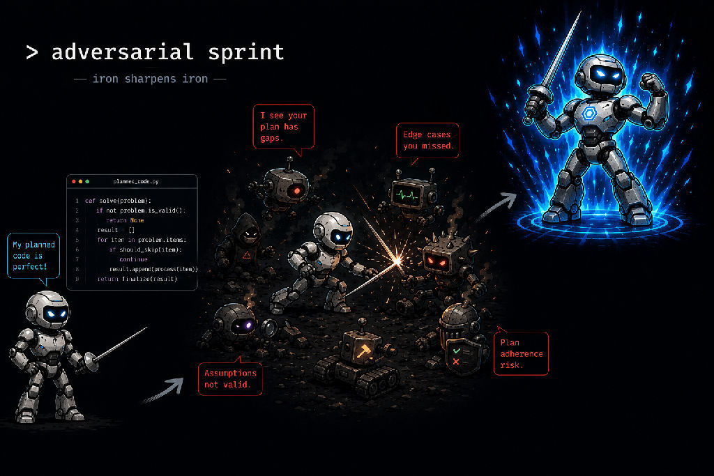

# Adversarial Sprint

*Multi-model adversarial planning, execution, and validation for agentic coding — built on Factory primitives.*

For months I ran an adversarial coding process by hand. One model plans. A different family attacks the plan. Both audit the test strategy. A cheap agent implements small chunks, and an independent agent validates each one. The quality was real — and so was the contradiction: a *manual* agentic workflow. I was the middleware, copy-pasting between frontier models, and at some point you notice that the human is the bottleneck the whole setup was supposed to remove.

This repo is that process, automated. It runs on Factory primitives today — `droid exec`, hooks, pinned model seats — but the platform sits behind a one-file vendor adapter ([`tools/adapters/`](./tools/adapters/)), so the gates assert on a vendor-neutral envelope shape and swapping in another CLI or API is a new adapter, not a rewrite.

Automating the process did something the manual practice never could: it made it **measurable**. And the first measurement cut against my own design — the deterministic gate outperformed the cross-family model panel I'd built the system around (finding 1 below).



## What the runs found

Four findings from live runs. Each has a repro or a committed artifact behind it; none is a claim about what "should" happen.

**1. Two frontier models, same failing test, opposite verdicts.**
A planted test-independence defect went to a cross-family panel. `grok-4.5` rejected it with correct attribution to the test. `gemini-3.1-pro-preview` looked at the identical failure and rationalized an ACCEPT. A single-validator configuration using gemini would have shipped it. The deterministic standalone gate caught it every time — not the hypothesis going in; the mechanical check outranked the model panel.
→ [`planning/phase-3.1/RESULTS.md`](./planning/phase-3.1/RESULTS.md)

**2. A forged transcript passed every gate — with zero real validation.**
Three aligned permissive defaults let a fake-pass envelope through: an unmatched `tool_use` yields `is_error=None`, which read as success. The fix is one line (`is True` → `is not False`). The forged input is committed as a fixture so the hole stays testable.
→ [`tools/KNOWN-ISSUES.md`](./tools/KNOWN-ISSUES.md) · [`tools/fixtures/rung7b-fakepass/`](./tools/fixtures/rung7b-fakepass/)

**3. The wrong model ran a five-chunk refactor, and nothing surfaced it.**
A live run filled the executor seat with `claude-haiku-4-5` — the cheapest model in the lineup — and the operator discovered it days later from the commit record. No log line made the seat assignment visible. The fix: the protocol banner now carries the model id, sourced from the invocation rather than self-reported.
→ [`planning/phase-5/DESIGN-ROLE-SPLIT-AND-SIGNALS.md`](./planning/phase-5/DESIGN-ROLE-SPLIT-AND-SIGNALS.md) §1, §3

**4. Five review rounds, and the panel never raised scope.**
The same live run went five rounds of review without any family flagging that the plan was mis-scoped; the operator caught it. Convergence is observable from *where* findings land across rounds, not from how many rounds have run. Breadth of defect is a scope signal.
→ [`planning/phase-5/DESIGN-ROLE-SPLIT-AND-SIGNALS.md`](./planning/phase-5/DESIGN-ROLE-SPLIT-AND-SIGNALS.md) §1, §4

## How it works

Quality in agentic coding doesn't come from a smarter model. It comes from **structural separation of roles across different model families**, with executable evidence — not self-assessment — deciding whether work is done. Four invariants, enforced rather than suggested:

1. **Family separation.** The plan reviewer isn't the planner's family. The validator isn't the executor's family. Two passes from one family are one opinion twice.
2. **Fresh review context.** The validator sees the approved spec, the diff, read-only repo state, and test evidence — never the executor's reasoning. (Finding 1 is what happens without this.)
3. **Independent test authorship.** The executor cannot write or modify the tests that judge it — locked by content hash, enforced by a PreToolUse hook. The enforcement was probed: seven bypasses filed, five fixed, two documented open in [`planning/phase-1/KNOWN-ISSUES.md`](./planning/phase-1/KNOWN-ISSUES.md).
4. **Valid RED before GREEN.** Behavior-changing work can't start until the intended assertion has run and failed *for the expected reason*. A syntax error is not a RED.

Because the findings above showed declarations don't hold, enforcement is layered: chunk close is gated by an HMAC-signed token bound to reviewer envelopes on disk, the author is never the verifier, and validators are checked for being more than each other's paraphrase ([`tools/OPERATING-RULES.md`](./tools/OPERATING-RULES.md) §20–§24).

## What it isn't

Not a replacement for Factory Missions, Spec Mode, custom Droids, hooks, or CI — it composes those around the workflow gap. And it makes no claim to be a correctness oracle: different model families are an independence control, not proof; tests are executable evidence, not truth; two reviewers agreeing means no known dispute, nothing more. The value is a governed process that makes assumptions, disagreements, and evidence **visible**.

## Layout

The build record is kept on purpose, and it is organized by **kind** rather than by phase: each phase's plans and prompts under `planning/`, its committed evidence under `evidence/`, its scripts under `tools/`. Every phase still has its README, its known-issues, and the evidence behind what it claimed — `planning/phase-3.2/` and `evidence/phase-3.2/` are two halves of one phase's record. Evidence a finding attests to is committed; only per-run scratch trees are ignored.

```
PRD.md                     full spec — problem, invariants, phases, evaluation design
tools/                     the code: sprint-loop.py runner, gates, adapters, OPERATING-RULES.md
tools/OPERATING-RULES.md   operating discipline §1–§24, each rule with the incident behind it
templates/                 canonical GROK → CHUNK → EXECUTE method + the per-pilot overlay
skills/                    agent-facing skill assets (digest + index + rehydration)
planning/                  per-phase plans, prompts and run records + the roadmap review
evidence/                  the build record: probes, envelopes, findings, signed chunk tokens
tests/                     239 tests over the gates, runner, plan lint, and repo layout
pilots/                    the method run against external tasks, validator outputs included
droid-wiki/                curated wiki: findings, method, probes, how to contribute
```

## Running it

The runner is invoked through the per-pilot overlay (`.adversarial-sprint/bin/run-sprint` in a pilot repo), not the framework CLI. `tools/sprint-loop.py --help` is the debugging surface. See [`skills/adversarial-sprint/SKILL.md`](./skills/adversarial-sprint/SKILL.md) for the agent-facing rules digest.

On a fresh clone the suite reports **233 passed, 6 skipped**. The skips are honest, not broken: `telemetry/runs.jsonl` is the system-of-record and is gitignored, so tests that assert on its contents have nothing to assert against outside a real run.

## CI

[`.github/workflows/adversarial-sprint-ci.yml`](./.github/workflows/adversarial-sprint-ci.yml) runs the evidence provider and the cross-family validator panel on every PR. CI is *just the runner* — it detects, classifies, and gates; a REJECT or STOP fails the job and blocks merge as a required status check. Validators consume the signed `EvidenceBundle` and never re-run the tests themselves, so the evidence a validator judges is the same artifact the gate hashes.

A security-scanning pipeline (Harness STO) runs alongside it as a second, independent tier — the deterministic half of the same argument this repo makes about model panels.

**A free personal account is sufficient for both.** Free-tier Harness CI/CD and STO is more than enough to run this — it does ask for a credit card at signup, but nothing charges without explicit authorisation. Nothing here requires a paid tier, and none of the gating logic is vendor-specific: the vendor sits behind the adapter in [`tools/adapters/`](./tools/adapters/), and the gates assert on a neutral envelope shape. That is deliberate — a quality bar that only works with paid tooling is not a quality bar, it is a budget.

Secrets the workflow expects:

| Secret | Required | Why |
|---|---|---|
| `EVIDENCE_SIGNING_KEY` | **yes** | Bounds the HMAC-SHA256 of the EvidenceBundle. Absent, the bundle is untrusted and the gate **fails closed** rather than passing. |
| Validator API key | yes | One per validator family in the panel. |
| `DROID_BIN_ENV` | no | Overrides the runner binary path for offline debugging. |

**Known limitation, recorded rather than papered over:** GitHub-hosted runners do not ship the `droid` binary, so this workflow assumes a self-hosted runner or a step that installs it. See [`planning/phase-4.5/CI-GATE.md`](./planning/phase-4.5/CI-GATE.md) and the phase's `KNOWN-ISSUES.md`.

---

**Status:** Phases 0–4.5 landed, each with named known-issues rather than clean-room claims · Phase 5 (chunk-adherence enforcement + role split) in progress
**Pilot repo:** [`Roderick-Clemente/quantum-bank`](https://github.com/Roderick-Clemente/quantum-bank), pinned at `2b70eae1`
**License:** [Apache-2.0](./LICENSE) — see [`NOTICE`](./NOTICE)
