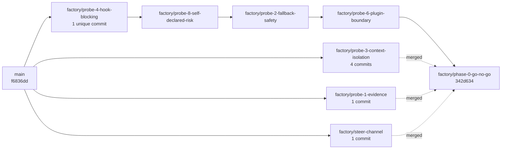

# By the numbers

Everything on this page was measured against `factory/phase-0-go-no-go` at commit `342d634`, after the probe branches were consolidated into it. The commands are listed at the bottom so the page can be refreshed rather than trusted.

One thing to keep in mind while reading: there is no application code yet, so "lines of code" is zero and every size figure below is documentation or captured evidence.

## Repository shape

| Measure | Value |
|---|---:|
| Files tracked on `factory/phase-0-go-no-go` | 197 |
| Of those, under `phase-0/` | 155 |
| Of those, under `droid-wiki/` | 37 |
| Of those, under `templates/` | 1 |
| Of those, at the repository root | 4 |
| Markdown files | 58 |
| Total tracked bytes | 851 KB |
| Of that, under `phase-0/` | 426 KB |
| Files tracked on `main` | 8 |
| Application source files | 0 |

The four root files are `.gitignore`, `AGENTS.md`, `PRD.md` and `README.md`. `main` carries the spec, the template, the conventions and three `README.md` files, and nothing else, because `AGENTS.md` requires review before anything lands there.

For scale: **Probe 3's evidence alone is 247 KB across 57 files**, which is more than half of all probe evidence by size and larger than the entire repository was before consolidation.

## The probe corpus

| Probe | Evidence files | Size | Raw capture files | `droid exec` calls in its scripts |
|---|---:|---:|---:|---:|
| 1 | 1 | 8 KB | 0 | 0 |
| 2 | 24 | 31 KB | 20 | 4 |
| 3 *(own branch only)* | 57 | 247 KB | 34 | 17 |
| 4 | 40 | 57 KB | 14 | 9 |
| 6 | 15 | 23 KB | 5 | 4 |
| 8 | 12 | 20 KB | 8 | 2 |

Probe 1 is the outlier in the other direction: one `README.md`, no raw captures. Its own record says so in the header, and lists the missing stdout under "Reproduction gaps". A record that admits it is thin is still a record.

Probe 4's 40 files span two verdicts — the superseded `phase-0/evidence/probe-4/README.md` and the current `phase-0/evidence/probe-4/reverify/README.md` — because the overturned record was kept rather than edited away. All 14 of its raw captures belong to the re-verification.

Aggregates across all six probe directories, both branches included:

| Measure | Value |
|---|---:|
| Total evidence files | 149 |
| JSON captures | 63 |
| Raw capture files (`raw/`, `raw-addendum/`, `reverify/raw/`) | 81 |
| `run.sh` reproduction scripts | 5 |
| Python files in probe rigs | 9 |
| Of those, hook implementations | 7 |
| `droid exec` invocations across all probe shell scripts | 36 |
| Lines of prose in the eight probe records and addenda | 1,206 |

Seven separate hook scripts were written to answer four probes: a family gate (Probe 2), a canary, two locked-path guards and their fixture (Probe 4's re-verification), a plugin-shipped canary (Probe 6), and an observe-only recorder (Probe 8). The design conclusion is that these collapse into one reference guard, which is a claim about the future — the measured present is seven.

Runs each record states it performed, as distinct from files on disk:

| Probe | Runs the record claims |
|---|---:|
| 2 | 9 |
| 3 (main record) | 12 |
| 4 (re-verification) | 11 |
| 8 | 7 |

## Documents

| File | Lines | Words |
|---|---:|---:|
| `templates/SPRINT-PLANNING-TEMPLATE.md` | 666 | 2,791 |
| `PRD.md` | 656 | 6,026 |
| `phase-0/README.md` | 166 | 2,677 |
| `phase-0/GO-NO-GO.md` | 148 | 1,825 |
| `README.md` | 46 | — |
| `AGENTS.md` | 42 | — |
| `phase-0/evidence/README.md` | 24 | — |

The two longest files are almost the same length and do different jobs: the PRD specifies the product, the template specifies the method the product packages. The evidence standard that governs every probe record fits in 24 lines.

Individual probe records, for comparison:

| Record | Lines |
|---|---:|
| `phase-0/evidence/probe-3/README.md` | 254 |
| `phase-0/evidence/probe-3/ADDENDUM-droid-search.md` | 178 |
| `phase-0/evidence/probe-4/README.md` *(superseded)* | 177 |
| `phase-0/evidence/probe-4/reverify/README.md` | 158 |
| `phase-0/evidence/probe-1/README.md` | 122 |
| `phase-0/evidence/probe-6/README.md` | 120 |
| `phase-0/evidence/probe-2/README.md` | 99 |
| `phase-0/evidence/probe-8/README.md` | 98 |

## Commits and branches

| Measure | Value |
|---|---:|
| Commits reachable from all refs | 33 |
| Commits dated 2026-08-02 | 27 |
| Commits dated 2026-08-03 | 6 |
| Elapsed time, first commit to last | 16 h 48 min |
| Local branches | 9 |
| Commits carrying a `Co-Authored-By` trailer | 32 |
| Of those, `factory-droid[bot]` | 26 |
| Of those, a Claude model | 6 |
| Commit subjects naming a probe | 21 |
| Commit subjects carrying a verdict word (`BLOCKED`, `PASS`, `GO`) | 8 |
| Total lines of commit message body | 683 |
| Longest single commit body | 48 lines |

Two calendar days, and under seventeen hours of wall clock between the first commit and the go/no-go. 683 body lines across 33 commits is roughly 21 lines of prose per commit, which is unusual and deliberate — several commits carry the finding itself, not a pointer to it. The longest is `Probe 3 addendum: droid search leaks the executor's withheld context` at 48 lines.

Thirty-two of thirty-three commits are agent co-authored. That is the reason `AGENTS.md` exists and the reason it binds agents and humans to the same rules; see [Patterns and conventions](./how-to-contribute/patterns-and-conventions.md).

### Branch layout

Every local branch follows the `<agent>/<topic>` convention from `AGENTS.md`, and every one of the nine is a `factory/` branch or `main`. Probes were chained during the run, then the three off-chain branches were merged in:



| Branch state | Count |
|---|---:|
| Local branches | 9 |
| Contained in `factory/phase-0-go-no-go` | 9 |
| Commits reachable from the consolidated tip | 27 |
| Of those, merge commits from consolidation | 4 |

Seven unique commits were merged in from four branches: four from probe 3, and one each from probe 1, probe 4 and the steering channel. Probes 2, 6 and 8 were already contained through the chain. Merges were used rather than a squash, so the per-commit handoff history survives. No branch was deleted, so any single probe's history is still readable on the branch that produced it.

Three further lines exist on the `origin` remote only: `factory/phase-0-probes`, `factory/phase-0-evidence-and-probes` and `codex/shared-protocol-bootstrap`. They account for the earlier parallel run of Phase 0 visible in the commit graph.

## How these were measured

Run from the repository root. Substitute branch names as needed.

```bash
# Repository shape
git ls-tree -r --name-only factory/phase-0-go-no-go | wc -l
git ls-tree -r --name-only factory/phase-0-go-no-go | awk -F/ 'NF>1{print $1}' | sort | uniq -c
git ls-tree --name-only factory/phase-0-go-no-go
git ls-tree -r --name-only factory/phase-0-go-no-go | grep -c '\.md$'
git ls-tree -r -l factory/phase-0-go-no-go | awk '{s+=$4} END {print int(s/1024)" KB, files="NR}'
git ls-tree -r --name-only main | wc -l

# Probe corpus (working tree is factory/phase-0-go-no-go)
for p in 1 2 4 6 8; do
  git ls-tree -r -l factory/phase-0-go-no-go -- phase-0/evidence/probe-$p |
    awk -v p=$p '{s+=$4} END {print "probe-"p": "int(s/1024)" KB, files="NR}'
done
git ls-tree -r -l factory/probe-3-context-isolation -- phase-0/evidence/probe-3 |
  awk '{s+=$4} END {print s/1024" KB, files="NR}'
find phase-0/evidence -name '*.json' | wc -l        # 39; add 24 from probe-3's branch
find phase-0/evidence -name 'run.sh' | wc -l        # 4; probe-3 adds a fifth
find phase-0/evidence -name '*.py' | wc -l
for d in $(find phase-0/evidence -type d -name 'raw*'); do echo "$d: $(find $d -type f | wc -l)"; done
grep -rho 'droid exec' --include='*.sh' phase-0/evidence | wc -l
git show factory/probe-3-context-isolation:phase-0/evidence/probe-3/run.sh | grep -c 'droid exec'

# Documents
wc -l PRD.md README.md AGENTS.md templates/SPRINT-PLANNING-TEMPLATE.md \
      phase-0/README.md phase-0/GO-NO-GO.md phase-0/evidence/README.md
wc -w PRD.md templates/SPRINT-PLANNING-TEMPLATE.md phase-0/README.md phase-0/GO-NO-GO.md
find phase-0/evidence -name '*.md' | xargs wc -l

# Commits and branches
git rev-list --all --count
git log --all --format='%ad' --date=short | sort | uniq -c
git log --all --format='%ai' | sort | sed -n '1p;$p'
git for-each-ref --format='%(refname:short)' refs/heads
git log --all --format='%H %B' | grep -c 'factory-droid\[bot\]'
git log --all --format='%B' | grep -ci 'Co-Authored-By: Claude'
git log --all --format='%b' | wc -l
git log --all --format='%H' | sort -u |
  while read c; do echo "$(git log -1 --format='%b' $c | wc -l) $(git log -1 --format='%s' $c)"; done | sort -rn
git log --all --format='%s' | grep -ci 'probe'
git log --all --format='%s' | grep -cE 'BLOCKED|PASS|GO'
git log --all --graph --oneline
```

Anything not derivable from a command above was left off this page on purpose. For what the numbers mean rather than what they are, start at the [Overview](./overview/index.md) and the [Probes index](./probes/index.md).
