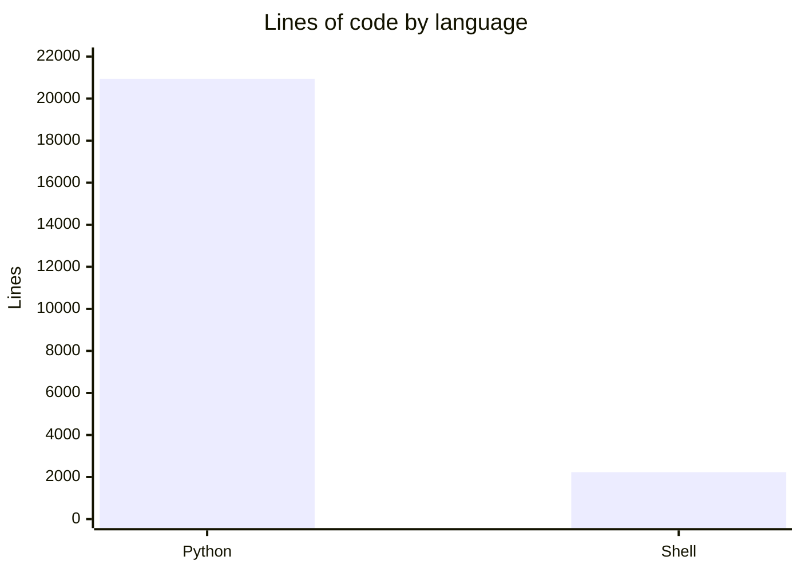

# By the numbers

Data collected on 2026-08-15. The repository spans 350+ commits over 13 days (Aug 2 to Aug 15), 88 Python files, 286 markdown files outside the wiki, and 233 passing tests with 3 skipped. It is an evidence repository that happens to have a growing code component — the code exists to produce and verify evidence, and the evidence is the point.

## Size

The codebase is 20,940 lines of Python and 2,232 lines of shell. GitHub Linguist reports the language split as 88.7% Python, 11.3% Shell.

The file inventory breaks down as follows:

| Category | Count |
|---|---|
| Python source (tools/) | 41 |
| Python tests (tests/) | 28 |
| Python elsewhere (evidence scripts, fixtures) | 19 |
| Config files (ini, yaml, toml) | 2 |
| Markdown files (excluding wiki) | 286 |

The markdown-to-Python ratio is 286 to 88 — roughly 3.3 markdown files per Python file. This is not a defect. The repository's primary output is reproducible evidence: plans, specs, review envelopes, gate verdicts, and findings. The code is the verification harness; the markdown is what it produces and what the framework is judged on. A library would have this ratio inverted. An evidence repository does not.

## Activity

All 350+ commits fall within the Aug 1 window. The repository did not exist before Aug 2 and has been under daily development since.

The most actively changed directories by file touch count since Aug 1:

| Directory | File touches |
|---|---|
| evidence/ | 1,101 |
| planning/phase-4.5/ | 255 |
| planning/ | 196 |
| tools/ | 192 |
| planning/phase-0/ | 179 |
| tests/ | 81 |
| planning/phase-4/ | 81 |

Evidence leads by a wide margin, which is consistent with the repository's purpose. The planning and tools directories follow, reflecting that the framework both plans and builds in the same tree.

## Bot-attributed commits

240 of 350+ commits carry a `Co-authored-by: factory-droid[bot]` trailer. This is a lower bound on AI-assisted work — it counts only commits where the bot authored or co-authored the change. Human-operated commits that relied on AI-generated plans, review envelopes, or gate verdicts are not captured in this number. The actual AI-assisted share is higher.

## Complexity

The largest source files by line count:

| File | Lines | Bytes |
|---|---|---|
| tests/test_sprint_loop.py | 1,990 | 81,594 |
| tools/sprint-loop.py | 1,543 | — |
| tools/plan-lint.py | 1,469 | — |
| tests/test_plan_lint.py | 1,095 | — |
| tests/test_layout_paths_chunk2a.py | 680 | — |
| tools/orchestrate-review.py | 592 | — |

The test suite has 20 test files producing 233 passing tests and 3 skipped. The test-to-source file ratio is 28 test files to 41 source files (0.68), and by line count the test suite is a substantial fraction of the codebase. The three skips are layout-path constants that were flipped by the D1 layout refactor; their replacements live in test files with `_chunk2` suffixes.

The two largest code files — `sprint-loop.py` and `plan-lint.py` — are the runner that executes the adversarial sprint and the linter that validates build plans before review. Together they account for 3,012 lines, about 14% of the Python total. Their test files are larger still, which reflects the framework's own rule: the test harness is written first, and it must fail before the code under test is allowed to pass.
