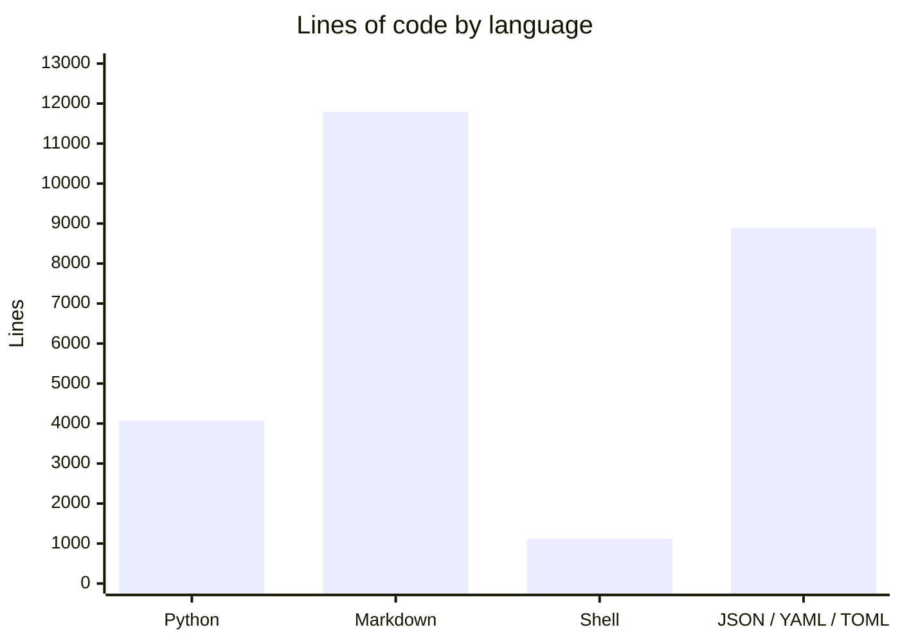
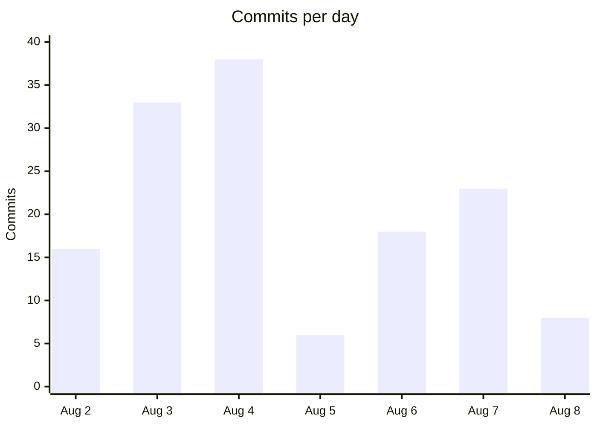

# By the numbers

Data collected on 2026-08-08. Measurements were taken from the working tree at `/Users/factory/work/adversarial-sprint-dev` on `main` at commit `7f9af3b`, after five days of intense work from 2026-08-03 to 2026-08-08. The commands used are listed at the bottom of the page so anyone can re-run them.

## Size

### Lines of code by language



Markdown dominates the line count because the project records its reasoning, evidence, and run history as first-class artifacts. Python is the largest executable language, followed by JSON, YAML, and TOML files used for configuration, telemetry, and evidence envelopes.

| Language | Files | Lines |
|---|---:|---:|
| Python | 33 | 4,077 |
| Markdown | 99 | 11,794 |
| Shell | 10 | 1,120 |
| JSON / YAML / TOML | 143 | 8,890 |
| **Total** | **285** | **25,881** |

### Source files vs test files

| Category | Count |
|---|---:|
| Total source, config, and documentation files | 285 |
| Explicitly test-related files | 12 |
| Non-test source and config files | 273 |

The "test-related" count includes prompt files like `chunk1-test-author.md` and guard scripts like `locked_test.py` and `protect_locked_test.py`. The project is not a traditional library with a `tests/` directory; instead, tests live as probes, gates, and fixtures scattered through the phases.

### File counts by directory

| Directory | Files | Lines | Average lines per file |
|---|---:|---:|---:|
| `phase-0/` | 106 | 5,243 | 49 |
| `tools/` | 39 | 4,251 | 109 |
| `phase-3.2/` | 21 | 8,681 | 413 |
| `phase-3.1/` | 38 | 1,547 | 41 |
| `phase-3/` | 27 | 1,484 | 55 |
| `phase-2/` | 13 | 1,158 | 89 |
| `phase-1/` | 17 | 941 | 55 |
| `build-evidence/` | 12 | 149 | 12 |
| `telemetry/` | 2 | 357 | 178 |
| `pilots/` | 4 | 282 | 70 |
| `templates/` | 1 | 666 | 666 |
| `phase-3.3/` | 1 | 130 | 130 |
| Root documents | 4 | 1,449 | 362 |

`phase-3.2/` has the highest average file size by far. Its evidence scripts, SPIKE documents, and reconciliation records are dense: a single directory contains roughly one-third of all lines in the repository.

## Activity

### Commits per day



August 4th was the busiest day with 38 commits. The six commits on August 5th look like a lull, but that day is when the project paused to consolidate and review rather than land new code. Across the five-day sprint window (August 3–8), the repository absorbed 118 commits, or roughly one commit every 61 minutes of waking hours.

| Date | Commits |
|---|---:|
| 2026-08-02 | 16 |
| 2026-08-03 | 33 |
| 2026-08-04 | 38 |
| 2026-08-05 | 6 |
| 2026-08-06 | 18 |
| 2026-08-07 | 23 |
| 2026-08-08 | 8 |
| **Total** | **142** |

### Most actively changed files

These files appear most often in commit diffs, excluding anything under `droid-wiki/`:

| File | Commit appearances |
|---|---:|
| `phase-0/README.md` | 12 |
| `PRD.md` | 11 |
| `phase-3.2/evidence/consumer.py` | 5 |
| `tools/conventions/model-discipline.md` | 4 |
| `phase-3.1/SPIKE.md` | 4 |
| `phase-1/hooks/locked-test-guard.py` | 4 |
| `phase-0/evidence/probe-1/README.md` | 4 |

The top two are the project overview and the product spec, which makes sense: as the framework evolved, the narrative and requirements documents were the first to be updated. `phase-3.2/evidence/consumer.py` is the most frequently edited implementation file, a sign that the review consumer was iterated on heavily during the final phase.

## Bot-attributed commits

| Measure | Value |
|---|---:|
| Total commits | 142 |
| Commits with `Co-authored-by: factory-droid[bot]` | 114 |
| Percentage bot-attributed | 80.3% |

More than four out of five commits carry the Factory Droid bot co-author trailer. The remaining ~20% are human or other-agent commits, mostly merge commits, review approvals, and steer notes that were relayed by hand.

## Complexity

### Largest files

| File | Lines | Language |
|---|---:|---|
| `PRD.md` | 816 | Markdown |
| `templates/SPRINT-PLANNING-TEMPLATE.md` | 666 | Markdown |
| `phase-2/README.md` | 559 | Markdown |
| `tools/orchestrate-review.py` | 462 | Python |
| `phase-3.2/evidence/local_backend.py` | 441 | Python |
| `phase-3.2/SPIKE.md` | 405 | Markdown |
| `tools/adapters/factory.py` | 313 | Python |
| `tools/README.md` | 279 | Markdown |
| `phase-1/hooks/locked-test-guard.py` | 276 | Python |
| `telemetry/aggregate.py` | 239 | Python |

The largest executable file is `tools/orchestrate-review.py`, which runs the multi-model review pipeline. The next largest Python file, `phase-3.2/evidence/local_backend.py`, is a backend mock used in the Phase 3.2 spike. The PRD and planning template remain the longest single documents because they carry the project's reasoning in prose.

### Largest Python files

| File | Lines |
|---|---:|
| `tools/orchestrate-review.py` | 462 |
| `phase-3.2/evidence/local_backend.py` | 441 |
| `tools/adapters/factory.py` | 313 |
| `phase-1/hooks/locked-test-guard.py` | 276 |
| `telemetry/aggregate.py` | 239 |
| `phase-3.2/evidence/consumer.py` | 222 |
| `phase-1/scripts/valid-red.py` | 159 |
| `tools/fixtures/rung7b-fakepass-gate.py` | 143 |
| `tools/fixtures/rung6-gate.py` | 142 |
| `phase-3.2/evidence/single-round-report.py` | 121 |

### Average file size by directory

| Directory | Average lines per file |
|---|---:|
| `templates/` | 666 |
| `phase-3.2/` | 413 |
| `telemetry/` | 178 |
| `pilots/` | 70 |
| `phase-2/` | 89 |
| `tools/` | 109 |
| `phase-1/` | 55 |
| `phase-3/` | 55 |
| `phase-0/` | 49 |
| `phase-3.1/` | 41 |
| `build-evidence/` | 12 |
| `phase-3.3/` | 130 |

Single-file directories (`templates/`, `phase-3.3/`) naturally inflate the average. After them, `phase-3.2/` is the densest directory, while `build-evidence/` is deliberately thin: it stores compact artifacts rather than prose.

## How these were measured

Run from the repository root. The first set excludes the wiki directory itself so the numbers do not count the page you are reading.

```bash
# Files by extension
find . \( -name '*.py' -o -name '*.sh' -o -name '*.md' -o -name '*.json' -o -name '*.yaml' -o -name '*.yml' -o -name '*.toml' \) | grep -v .git | grep -v droid-wiki | grep -v .venv | sed 's/.*\.//' | sort | uniq -c | sort -rn

# Lines by language
find . -name '*.py' | grep -v .git | grep -v droid-wiki | grep -v .venv | xargs wc -l 2>/dev/null | tail -1
find . -name '*.md' | grep -v .git | grep -v droid-wiki | xargs wc -l 2>/dev/null | tail -1
find . -name '*.sh' | grep -v .git | xargs wc -l 2>/dev/null | tail -1
find . -name '*.json' -o -name '*.yaml' -o -name '*.yml' -o -name '*.toml' | grep -v .git | grep -v droid-wiki | grep -v .venv | xargs wc -l 2>/dev/null | tail -1

# Test files
find . -type f \( -name 'test_*.py' -o -name '*_test.py' -o -name 'tests.py' -o -name 'test.sh' -o -name '*test*.md' \) | grep -v .git | grep -v .venv | grep -v droid-wiki

# Files and lines per directory
for dir in phase-0 phase-1 phase-2 phase-3 phase-3.1 phase-3.2 phase-3.3 pilots tools telemetry templates build-evidence; do
  count=$(find ./$dir -type f \( -name '*.py' -o -name '*.sh' -o -name '*.md' -o -name '*.json' \) 2>/dev/null | grep -v .venv | wc -l)
  lines=$(find ./$dir -type f \( -name '*.py' -o -name '*.sh' -o -name '*.md' -o -name '*.json' \) 2>/dev/null | grep -v .venv | xargs cat 2>/dev/null | wc -l)
  if [ "$count" -gt 0 ]; then
    avg=$((lines / count))
    echo "$count files, $lines lines, avg $avg — $dir"
  fi
done

# Commits and bot attribution
git log --all --oneline | wc -l
git log --all --format='%b' | grep -c 'factory-droid\[bot\]'
git log --all --format='%ad' --date=format:'%Y-%m-%d' | sort | uniq -c

# Most changed files, excluding wiki
git log --all --name-only --format='' | grep -v '^droid-wiki' | grep -v '^\.git' | sort | uniq -c | sort -rn | head -15

# Largest files
find . -name '*.py' -o -name '*.sh' -o -name '*.md' | grep -v .git | grep -v droid-wiki | grep -v .venv | xargs wc -l 2>/dev/null | sort -rn | head -10
```
