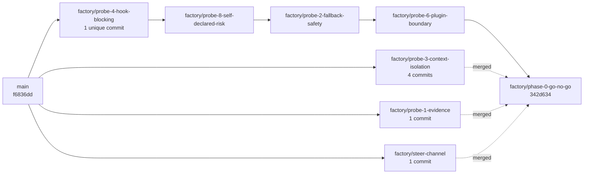

# By the numbers

Everything on this page was measured against `main` at commit `292d3be`, after Phase 0 and the 0.180.0 canary were merged and every probe branch was pruned. The commands are listed at the bottom so the page can be refreshed rather than trusted.

One thing to keep in mind while reading: there is no application code yet, so "lines of code" is zero and every size figure below is documentation or captured evidence.

## Repository shape

| Measure | Value |
|---|---:|
| Files tracked on `main` | 208 |
| Of those, under `phase-0/` | 161 |
| Of those, under `droid-wiki/` | 39 |
| Of those, under `templates/` | 1 |
| Of those, under `tools/` | 3 |
| Of those, at the repository root | 4 |
| Markdown files | 69 |
| Total tracked bytes | 915 KB |
| Of that, under `phase-0/` | 457 KB |
| Commits on `main` | 44 |
| Application source files | 0 |

The four root files are `.gitignore`, `AGENTS.md`, `PRD.md` and `README.md`. `main` carries the spec, the template, the conventions and three `README.md` files, and nothing else, because `AGENTS.md` requires review before anything lands there.

For scale: **Probe 3's evidence alone is 247 KB across 57 files**, which is more than half of all probe evidence by size and larger than the entire repository was before consolidation.

## The probe corpus

| Probe | Evidence files | Size | Raw capture files | `droid exec` calls in its scripts |
|---|---:|---:|---:|---:|
| 1 | 1 | 8 KB | 0 | 0 |
| 2 | 24 | 31 KB | 20 | 4 |
| 3 *(own branch only)* | 57 | 247 KB | 34 | 17 |
| 4 | 40 | 57 KB | 14 | 9 |
| 6 | 15 | 23 KB | 5 | 4 |
| 8 | 12 | 20 KB | 8 | 2 |

Probe 1 is the outlier in the other direction: one `README.md`, no raw captures. Its own record says so in the header, and lists the missing stdout under "Reproduction gaps". A record that admits it is thin is still a record.

Probe 4's 40 files span two verdicts — the superseded `phase-0/evidence/probe-4/README.md` and the current `phase-0/evidence/probe-4/reverify/README.md` — because the overturned record was kept rather than edited away. All 14 of its raw captures belong to the re-verification.

Aggregates across all six probe directories, both branches included:

| Measure | Value |
|---|---:|
| Total evidence files | 149 |
| JSON captures | 63 |
| Raw capture files (`raw/`, `raw-addendum/`, `reverify/raw/`) | 81 |
| `run.sh` reproduction scripts | 5 |
| Python files in probe rigs | 9 |
| Of those, hook implementations | 7 |
| `droid exec` invocations across all probe shell scripts | 36 |
| Lines of prose in the eight probe records and addenda | 1,206 |

Seven separate hook scripts were written to answer four probes: a family gate (Probe 2), a canary, two locked-path guards and their fixture (Probe 4's re-verification), a plugin-shipped canary (Probe 6), and an observe-only recorder (Probe 8). The design conclusion is that these collapse into one reference guard, which is a claim about the future — the measured present is seven.

Runs each record states it performed, as distinct from files on disk:

| Probe | Runs the record claims |
|---|---:|
| 2 | 9 |
| 3 (main record) | 12 |
| 4 (re-verification) | 11 |
| 8 | 7 |

## Documents

| File | Lines | Words |
|---|---:|---:|
| `templates/SPRINT-PLANNING-TEMPLATE.md` | 666 | 2,791 |
| `PRD.md` | 656 | 6,026 |
| `phase-0/README.md` | 166 | 2,677 |
| `phase-0/GO-NO-GO.md` | 148 | 1,825 |
| `README.md` | 46 | — |
| `AGENTS.md` | 42 | — |
| `phase-0/evidence/README.md` | 24 | — |

The two longest files are almost the same length and do different jobs: the PRD specifies the product, the template specifies the method the product packages. The evidence standard that governs every probe record fits in 24 lines.

Individual probe records, for comparison:

| Record | Lines |
|---|---:|
| `phase-0/evidence/probe-3/README.md` | 254 |
| `phase-0/evidence/probe-3/ADDENDUM-droid-search.md` | 178 |
| `phase-0/evidence/probe-4/README.md` *(superseded)* | 177 |
| `phase-0/evidence/probe-4/reverify/README.md` | 158 |
| `phase-0/evidence/probe-1/README.md` | 122 |
| `phase-0/evidence/probe-6/README.md` | 120 |
| `phase-0/evidence/probe-2/README.md` | 99 |
| `phase-0/evidence/probe-8/README.md` | 98 |

## Commits and branches

| Measure | Value |
|---|---:|
| Commits reachable from all refs | 33 |
| Commits dated 2026-08-02 | 27 |
| Commits dated 2026-08-03 | 6 |
| Elapsed time, first commit to last | 16 h 48 min |
| Local branches | 9 |
| Commits carrying a `Co-Authored-By` trailer | 32 |
| Of those, `factory-droid[bot]` | 26 |
| Of those, a Claude model | 6 |
| Commit subjects naming a probe | 21 |
| Commit subjects carrying a verdict word (`BLOCKED`, `PASS`, `GO`) | 8 |
| Total lines of commit message body | 683 |
| Longest single commit body | 48 lines |

Two calendar days, and under seventeen hours of wall clock between the first commit and the go/no-go. 683 body lines across 33 commits is roughly 21 lines of prose per commit, which is unusual and deliberate — several commits carry the finding itself, not a pointer to it. The longest is `Probe 3 addendum: droid search leaks the executor's withheld context` at 48 lines.

Thirty-two of thirty-three commits are agent co-authored. That is the reason `AGENTS.md` exists and the reason it binds agents and humans to the same rules; see [Patterns and conventions](./how-to-contribute/patterns-and-conventions.md).

### Branch layout

Every branch followed the `<agent>/<topic>` convention from `AGENTS.md`. Probes were chained during the run, the three off-chain branches were merged in, and the whole set was then landed on `main` and pruned.

**This is a historical diagram.** None of the `factory/` branches below still exist. Each was deleted only after `git merge-base --is-ancestor <branch> main` passed, so the commits remain reachable from `main` and the labels are gone. The shape is preserved here because the per-probe history is itself evidence that the commits-as-baton handoff worked:



| Branch state | Then | Now |
|---|---:|---:|
| Local branches | 9 | 2 |
| Commits reachable from the tip | 27 | 44 |
| Merge commits from consolidation | 4 | 4 |
| `factory/` probe branches surviving | 9 | 0 |

The two remaining are `main` and `claude/ops-docs`. Everything else was pruned with `git branch -d`, never `-D`, so git would have refused any branch that was not genuinely contained.

Seven unique commits were merged in from four branches: four from probe 3, and one each from probe 1, probe 4 and the steering channel. Probes 2, 6 and 8 were already contained through the chain. Merges were used rather than a squash, so the per-commit handoff history survives. No branch was deleted, so any single probe's history is still readable on the branch that produced it.

Three further lines exist on the `origin` remote only: `factory/phase-0-probes`, `factory/phase-0-evidence-and-probes` and `codex/shared-protocol-bootstrap`. They account for the earlier parallel run of Phase 0 visible in the commit graph.

## How these were measured

Run from the repository root. Substitute branch names as needed.

```bash
# Repository shape
git ls-tree -r --name-only main | wc -l
git ls-tree -r --name-only main | awk -F/ 'NF>1{print $1}' | sort | uniq -c
git ls-tree --name-only main
git ls-tree -r --name-only main | grep -c '\.md$'
git ls-tree -r -l main | awk '{s+=$4} END {print int(s/1024)" KB, files="NR}'
git ls-tree -r --name-only main | wc -l

# Probe corpus (everything is on main now; the probe branches are pruned)
for p in 1 2 3 4 6 8; do
  git ls-tree -r -l main -- phase-0/evidence/probe-$p |
    awk -v p=$p '{s+=$4} END {print "probe-"p": "int(s/1024)" KB, files="NR}'
done
find phase-0/evidence -name '*.json' | wc -l
find phase-0/evidence -name 'run.sh' | wc -l
find phase-0/evidence -name '*.py' | wc -l
for d in $(find phase-0/evidence -type d -name 'raw*'); do echo "$d: $(find $d -type f | wc -l)"; done
grep -rho 'droid exec' --include='*.sh' phase-0/evidence | wc -l
git show main:phase-0/evidence/probe-3/run.sh | grep -c 'droid exec'

# Documents
wc -l PRD.md README.md AGENTS.md templates/SPRINT-PLANNING-TEMPLATE.md \
      phase-0/README.md phase-0/GO-NO-GO.md phase-0/evidence/README.md
wc -w PRD.md templates/SPRINT-PLANNING-TEMPLATE.md phase-0/README.md phase-0/GO-NO-GO.md
find phase-0/evidence -name '*.md' | xargs wc -l

# Commits and branches
git rev-list --all --count
git log --all --format='%ad' --date=short | sort | uniq -c
git log --all --format='%ai' | sort | sed -n '1p;$p'
git for-each-ref --format='%(refname:short)' refs/heads
git log --all --format='%H %B' | grep -c 'factory-droid\[bot\]'
git log --all --format='%B' | grep -ci 'Co-Authored-By: Claude'
git log --all --format='%b' | wc -l
git log --all --format='%H' | sort -u |
  while read c; do echo "$(git log -1 --format='%b' $c | wc -l) $(git log -1 --format='%s' $c)"; done | sort -rn
git log --all --format='%s' | grep -ci 'probe'
git log --all --format='%s' | grep -cE 'BLOCKED|PASS|GO'
git log --all --graph --oneline
```

Anything not derivable from a command above was left off this page on purpose. For what the numbers mean rather than what they are, start at the [Overview](./overview/index.md) and the [Probes index](./probes/index.md).

## Phase 0.5 — ladder numbers

Measured against `factory/rung5.5-fakepass-close` at tip `8e02da3`, after the rung-5.5 fix-up and the closed `tools/PHASE-0.5-CLOSE.md`. Numbers are replay-able via `tools/REPRODUCE.md`. The `tools/` tree is the canonical source; entries below quote it verbatim.

### Five-run ledger

| rung | tag | model_id | family | num_turns | input | output | cache_read | thinking | duration_ms | is_error | decision |
|------|-----|----------|--------|-----------:|------:|-------:|-----------:|---------:|------------:|----------|----------|
| 3  | rung-3 (LIVE)                | gpt-5.4-mini    | openai   |  2 | 13 612 | 1 661 | 9 216 | 1 449 |  17 071 | false | REJECT            |
| 7A | rung-7 Config A              | gpt-5.4-mini    | openai   |  3 | 15 465 | 3 179 | 22 016 | 2 842 | 32 414 | false | REJECT\*          |
| 7B | rung-7 Config B              | gpt-5.4-mini    | openai   |  1 | 7 178  | 363   | 0     | 330   |  4 207 | false | ACCEPT            |
| R4 | refactor-blind-v1 (Codex)    | gpt-5.3-codex   | GPT      | 26 | 90 050 | 13 616 | —     | —     | 171 000 | false | REJECT            |
| R5 | refactor-blind-v1 (Grok)     | grok-4.5        | xAI      | 12 | 58 881 | 21 694 | —     | —     | 369 300 | false | ACCEPT-WITH-NITS  |

\* The rung-7 Config A REJECT is **a false-REJECT via source-read**, not a genuine diff-driven finding. The validator read `api/llms_txt.py` directly despite an empty diff. Filed as `Issue: False-REJECT via source-read (isolation leak)` in `tools/KNOWN-ISSUES.md`.

R4 / R5 cache-read and thinking-token columns are `—` because the orchestrator's blind MEASUREMENT run only supplied `input_tokens` and `output_tokens`. The two rows are §13 refactor-validation rows; both reviewers found the same content dimensions and split on severity.

### Totals across the five runs

| metric          | sum       | notes                                  |
|-----------------|----------:|----------------------------------------|
| run count       | 5         | 3 ladder runs + 2 MEASUREMENT runs     |
| input tokens    | 185 186   |                                        |
| output tokens   |  40 513   |                                        |
| cache_read tok  |  31 232   | ladder runs only; R4 / R5 not supplied |
| thinking tok    |   4 621   | ladder runs only; R4 / R5 not supplied |
| duration_ms     | 593 992   | ≈ 9 min 54 s wall-clock for 5 runs     |

Average per run: ~119 s. The two MEASUREMENT runs skew the average; the three ladder runs alone average ~17.9 s. Tokens across input / output / cache_read / thinking sum to 77 311 across the three ladder runs only — unchanged from prior revisions.

### Operator-intervention count for Phase 0.5 = 1

One single human-relay action across the seven-rung ladder and the cleanup pass:

> Rod hand-relayed the BACKSTOP steer note into the session because `origin/orchestrator/steer` did not exist on this repository's remote. Surfaced verbatim in every rung and cleanup commit message; the ladder proceeded without further operator input.

That is the §13 reference: per-validation-loop operator-intervention count drops from N (~16 actions per loop under the prior hand-relay method, where the four hand-relayed model families Grok / Kimi / Codex / Opus were run serially with prompt + verdict copy per family) to 1 under the validation primitive. The same defect input reviewed by the four-family panel graded ACCEPT-WITH-NITS, while the ladder's `gpt-5.4-mini` validator graded REJECT — a model-calibration question, not a primitive failure (cross-referenced in `tools/fixtures/rung7-reconciliation.md` corrected analysis).

### Files added on the Phase-0.5 branch

| category                                | files on `factory/rung5.5-fakepass-close` |
|-----------------------------------------|---|
| ladder pages (committed under `tools/`) | `tools/PHASE-0.5-CLOSE.md`, `tools/RUN-LEDGER.md`, `tools/KNOWN-ISSUES.md`, `tools/README.md`, `tools/REPRODUCE.md` |
| gate logic                              | `tools/fixtures/rung3-gate.py`, `rung5-gate.py`, `rung6-gate.py`, `rung4-family-gate.py`, `rung3-extract-tool-calls.py`, `rung7b-fakepass-gate.py` |
| envelope adapters (seam)                | `tools/adapters/__init__.py`, `tools/adapters/factory.py`, `tools/adapters/README.md` |
| committed evidence (sanitised)          | `tools/fixtures/evidence/{rung3,rung7A,rung7B}-envelope.json`, `tools/fixtures/evidence/{rung3,rung7A,rung7B}-session.jsonl` |
| regression guard                        | `tools/fixtures/rung7b-fakepass/{fake-envelope.json,fake-session.jsonl}` |

The raw `build-evidence/` envelopes and un-publisher-side inner-session transcripts are **not** in the tree by design — they are untracked local captures whose paths (`/tmp/rung{n}-fresh-clone-…`, `~/.factory/sessions/-private-tmp-rung{n}-…`) point at ephemeral runtime directories that do not survive reboots. The committed evidence digests under `tools/fixtures/evidence/` are the durable form.
