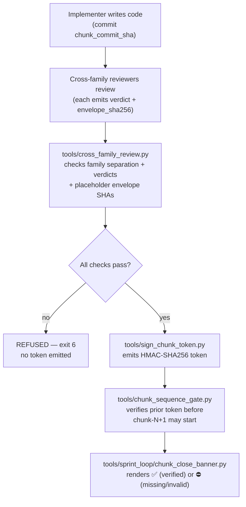

# Chunk token gates

Phase 5 replaced the chunk-close declaration with a bound verdict. A chunk is not closed because the implementer said so; it is closed because an HMAC-signed token exists and verifies. The token, not the verdict, is the durable artifact. This page covers the four components that enforce that contract and the incident that made them necessary.

## Why the gate exists

The chunk-14 incident is the prompt. Two same-family subagents reviewed chunk-14's code, reached ACCEPT-WITH-NITS, and the chunk closed on that self-declaration. There was no evidence the adversarial-sprint skill was even loaded into the reviewers' session context, and nothing in the close path checked that the reviewer families differed from the implementer family. The mechanism worked as designed; the gate did not exist yet. Phase 5 turns "the reviewers were independent" from a hope into a structural check that refuses at parse time.

## The flow

## The three components

### sign_chunk_token.py

`tools/sign_chunk_token.py` is the signing and verification primitive. It produces the token JSON that every other component consumes. A token contains:

- `chunk_id` and `chunk_commit_sha` (40-char hex, defaulting to `git rev-parse HEAD`)
- a `reviewers` list, each record carrying `family`, `model_id`, `verdict`, `envelope_sha256`, and `provider`
- `signed_at`, `signed_by`, and a `signature` block: `HMAC-SHA256` under `EVIDENCE_SIGNING_KEY`, with `key_id` and `algorithm`

The signature covers every other field via canonical JSON (sort keys, no whitespace, UTF-8). This is the same canonical-JSON + HMAC scheme used by the EvidenceBundle verifier in `tools/sprint_loop/per_chunk.py`, so one key and one verifier pattern serve both surfaces. No new key material is introduced.

Refusal-at-parse is the default. `build_token` raises `ValueError` on a missing `chunk_id`, a non-40-char `chunk_commit_sha`, a reviewer record missing any required field, or a verdict outside `ALLOWED_VERDICTS`. If `EVIDENCE_SIGNING_KEY` is unset, it exits with code 2 — no key, no token. `verify_token` is fail-closed: any malformed input, any missing field, an unset key, or an HMAC mismatch returns `False`. The caller decides what refusal looks like.

### cross_family_review.py

`tools/cross_family_review.py` is the refusal-at-parse gate that sits between the reviewers and the token. It refuses (exit 6) if any of the following hold:

- the reviewer list is empty or has fewer than two reviewers
- any reviewer's family equals the implementer's family (same-family review does not satisfy the cross-family invariant)
- any reviewer's family is `"unknown"` — the curated `MODEL_FAMILY_MAP` in `tools/sprint_loop/config.py` does not list it
- any reviewer verdict is not ACCEPT-class (`ACCEPT` or `ACCEPT-WITH-NITS`)

It also detects placeholder envelope SHAs. Build agents tend to type fixture-marker hashes like `555555...5501` — a 50-character homogeneous leading run. A real `hashlib.sha256` digest over raw model output has roughly uniform distribution across the first 50 characters, so a homogeneous run that long is effectively impossible (~2^-200). `envelope_is_placeholder` refuses on that pattern, on length mismatch, and on non-hex input. Only when every reviewer passes every check does the module call `sign_chunk_token.build_token` and emit the token. The token, not the verdict alone, is what the chunk-close path needs.

Family lookup is curated only — never inferred. `family_of` returns `("unknown", "unknown")` for any model ID not in `MODEL_FAMILY_MAP`, and the gate refuses on `unknown`. This mirrors `Config.provider_family` exactly so the gate and the runner cannot disagree on taxonomy.

### chunk_sequence_gate.py

`tools/chunk_sequence_gate.py` is the sequence enforcement. It refuses chunk-N+1 from starting when chunk-N's token is missing, unreadable, or HMAC-mismatched. Exit 6 on refusal — the same refusal exit `sign_chunk_token verify` uses, so a refused chunk leaves an observable artifact across both surfaces.

The gate composes `sign_chunk_token.verify_token` rather than re-implementing HMAC. The signature primitive is owned in one place. The optional `--check-current-head` flag goes further: it verifies the token's `chunk_commit_sha` matches `git rev-parse HEAD` in the supplied `--repo`. Without that flag, the gate is signature-only — useful when the token's commit SHA is consumed downstream but the gate's job is purely signature verification. With it, the binding between the token and the working tree is asserted, not assumed.

## The operator-eye signal

`tools/sprint_loop/chunk_close_banner.py` renders the visual signal at chunk close: ✅ when the token's HMAC verifies, ⛔ when the token is missing or invalid. The banner composes `sign_chunk_token.verify_token` so the emoji cannot render without a verified condition behind it. No decoration without verifiable state.

Absence is not "the skill is exhausted." Absence is a runtime contract violation. On refusal, the banner emits a troubleshooting checklist to stderr: read the token file, verify the signature against `EVIDENCE_SIGNING_KEY`, run `chunk_sequence_gate.py` directly, check `telemetry/runs.jsonl` for the run ID, inspect the build-evidence state JSON, and refresh `tools/install-skill.sh` — the canonical skill may not have been loaded into the agent's session context. That last step is the chunk-14 lesson in checklist form.

The banner owns the ✅/⛔ half of the project's four-tone visual signature (🤺👀✅⛔). The 🤺 and 👀 halves — plan-review rendered and validation-gate executed — are owned by other adapter points and wired through the same verify-then-emit gate.

## Cross-references

- The runner that orchestrates these gates: [sprint-loop-runner](../features/sprint-loop-runner.md)
- The evidence provider whose envelope SHAs the gate checks: [evidence-provider](../features/evidence-provider.md)
- Method overview: [method](../method.md)
