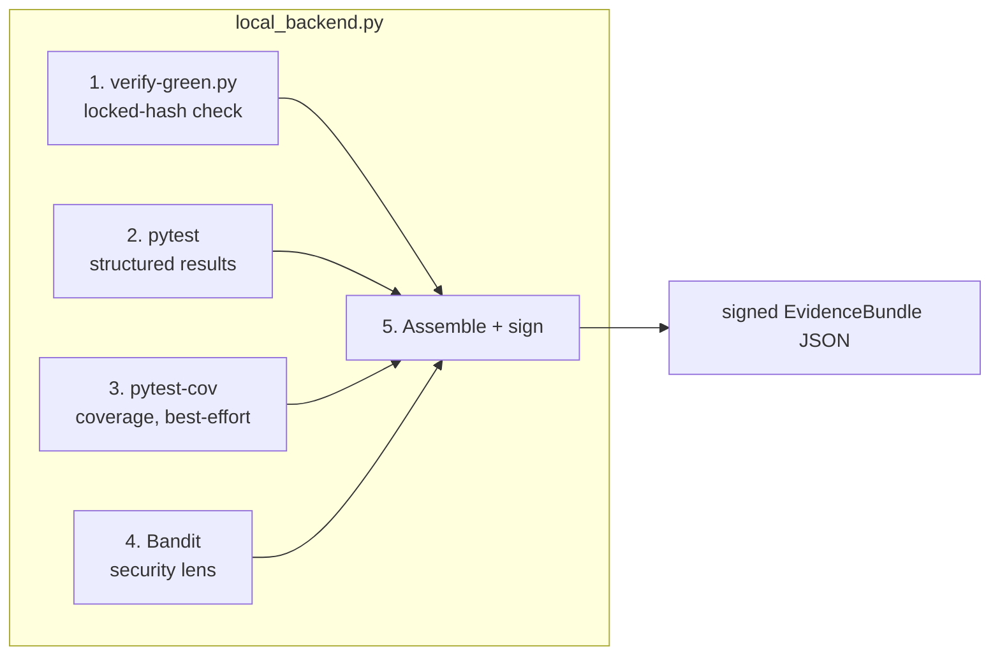

# Evidence provider

The evidence provider is the Phase 3.2 mechanism that externalizes the deterministic tier — pytest, locked-hash check, security scans — into a compact signed bundle that validators and the orchestrator consume instead of re-running pytest in-session. The design spec is in `phase-3.2/SPIKE.md`; the build record is in `phase-3.2/BUILD-NOTES.md`.

The core problem it attacks: in Phase 3, every validator re-ran pytest and ingested raw stdout to trust the green. Validators consumed ~84% of the total token spend (453,918 of 540,6k tokens across 12 role runs). The evidence provider runs the deterministic work once, emits a structured bundle, and the panel reads that instead. The hypothesis is that reading a compact bundle costs fewer tokens than ingesting raw test output, at equal acceptance quality.

For the pipeline that drives this end-to-end, see [orchestration](orchestration.md). For how the results are recorded, see [telemetry](telemetry.md).

## The EvidenceBundle schema

The bundle is defined by `phase-3.2/evidence/bundle_schema_v1.json` — a frozen JSON Schema (version `v1`, bumped only on breaking change). It is the only thing agents read instead of re-running pytest.

```
EvidenceBundle:
  bundle_schema_version   "v1" (frozen)
  producer                "local" | "harness" — recorded, never trusted-blind
  change:
    commit_sha                  the change under review (feature branch HEAD)
    locked_test_sha_observed    sha256 the producer actually hashed and ran
  tests:
    passed / failed / skipped   counts
    failures[]: {nodeid, assertion_line, short_message}  — NO full tracebacks
    suite_exit_code
  coverage (optional):
    lines_pct, changed_lines_covered, changed_lines_total
  security (optional, separate lens):
    findings[]: {rule_id, severity, file, line, short_message, is_new, scope}
  provenance:
    producer_run_id, started_at, finished_at, tool_versions
  signature:
    algorithm: "HMAC-SHA256", value: hex digest, key_id
```

Two design rules matter:

- **Compact by construction.** Failure records carry `{nodeid, assertion_line, short_message}` — never full tracebacks. The whole point is that the bundle is smaller than in-session stdout. A bundle that inlines raw pytest output has thrown away the win before the experiment runs.
- **The method depends on the capability, not on a vendor.** Any backend that can run the locked test and return this schema is admissible. The `producer` field records which backend ran, but the panel prompt names the bundle, not a vendor.

### Signature

The bundle is signed with HMAC-SHA256 over the canonical JSON of the bundle minus the `signature` field. This prevents spoofing inside an agent's context — a bundle without a valid signature is rejected by both consumers. The signing key is passed via the `EVIDENCE_SIGNING_KEY` environment variable. If the key is not set, the backend generates a random one and warns that the signature is valid for that process only.

## The local backend

`phase-3.2/evidence/local_backend.py` is the default backend — flavor (a) from SPIKE §2.2, zero CI. It composes tools the repo already has and runs on a developer machine with no network.



### What each step does

1. **Locked-hash check** — reuses `phase-1/scripts/verify-green.py` to recompute the test sha, compare it against the lock manifest, and refuse GREEN on mismatch. The observed sha becomes `locked_test_sha_observed` in the bundle.
2. **Pytest structured results** — runs `pytest -v --tb=line --no-header` and parses pass/fail/skip counts plus compact failure records (nodeid, assertion line, one-line message). With `--full-suite`, runs the entire regression suite instead of just the locked test.
3. **Coverage** — best-effort via `pytest-cov`. Returns `None` if the plugin is missing or fails. Not required.
4. **Security lens** — optional (`--security-scan`). Runs Bandit excluding `.venv`, `.git`, and `node_modules`. Applies the curated allowlist, then diffs against a baseline to mark findings as new or pre-existing. Only new findings enter the bundle — baseline debt is excluded so the signal is not drowned.
5. **Assemble + sign** — normalizes everything to the EvidenceBundle v1 schema, signs with HMAC-SHA256, writes to disk.

### Running the backend

```bash
export EVIDENCE_SIGNING_KEY="your-secret-key-here"

python3 phase-3.2/evidence/local_backend.py \
  --pilot-root /path/to/quantum-bank \
  --framework-root /path/to/adversarial-sprint-dev \
  --test-file test/test_profile_model.py \
  --lock-file phase-1/locks/test/test_profile_model.py.lock.json \
  --output phase-3.2/build-evidence/chunk1-bundle.json \
  --python /path/to/.venv/bin/python \
  --full-suite \
  --security-scan \
  --security-allowlist phase-3.2/evidence/security_allowlist.json \
  --security-baseline phase-3.2/build-evidence/bandit-baseline.json
```

The script exits 0 only if GREEN was accepted and there are no test failures.

## Consumers

`phase-3.2/evidence/consumer.py` provides two consumers, both of which read the bundle instead of re-running pytest:

### ValidatorConsumer (`validate` subcommand)

Verifies the signature, checks test results, and reaches an evidence verdict:

- **ACCEPT** — signature valid, `failed == 0`, `suite_exit_code == 0`, `passed > 0`.
- **REJECT** — bundle shows failures or non-zero exit.
- **FAIL_CLOSED** — signature invalid or bundle unreadable.

The evidence verdict is only the deterministic-evidence portion. The full validator verdict also includes the diff/spec review, which is not replaced by the bundle (SPIKE §4.3 — CI augments the panel, it does not replace it).

### OrchestratorGate (`gate` subcommand)

Verifies the signature, then cross-checks `locked_test_sha_observed` against the local lock manifest (SPIKE §4.1). This is the trust rule that prevents "CI says green" from being a silent-green defect in a new costume:

- Loads the lock manifest and compares `sha256` against the bundle's `locked_test_sha_observed`.
- **Fail closed** on mismatch, missing sha on either side, red bundle, or vacuous green (0 tests passed — all skipped or empty suite).
- **PASS** only when sha matches, suite is green, and at least one test passed.

```bash
# Validator consumes the bundle
python3 phase-3.2/evidence/consumer.py validate \
  --bundle phase-3.2/build-evidence/chunk1-bundle.json

# Orchestrator gate (locked-sha cross-check)
python3 phase-3.2/evidence/consumer.py gate \
  --bundle phase-3.2/build-evidence/chunk1-bundle.json \
  --lock-file phase-1/locks/test/test_profile_model.py.lock.json
```

Both subcommands require `EVIDENCE_SIGNING_KEY` to be set to the same value used by the backend.

## Token accounting

`phase-3.2/evidence/token_accounting.py` instruments the SPIKE §3.2 fairness rule. The rule is simple:

> The win is real only if `tokens(evidence bundle read) < tokens(in-session raw test output it replaces)`.

The script measures both sides:

- **Control arm** (`evidence_source=in-session`): the validator ran pytest and ingested raw stdout. `raw_test_output_tokens` = token count of that stdout.
- **Treatment arm** (`evidence_source=bundle`): the validator read the bundle. `treatment_bundle_read_tokens` = token count of the bundle JSON.

Token estimation uses `chars // 4` — the standard proxy for English/JSON text. The real experiment would use the provider's tokenizer, but the proxy is sufficient for directional numbers.

```bash
python3 phase-3.2/evidence/token_accounting.py \
  --raw-output phase-3.2/build-evidence/chunk1-raw-pytest-combined.txt \
  --bundle phase-3.2/build-evidence/chunk1-bundle.json \
  --output phase-3.2/build-evidence/chunk1-token-accounting.json
```

### Demo result

On the locked `/profile` model chunk (chunk 1):

- Bundle: 919 bytes (~229 tokens). 103 passed, 0 failed, 0 new security findings.
- Fairness rule **holds**: bundle read (229 tokens) < combined raw test output (511 tokens) = 55.2% saving on the test-output-read slice.

An important nuance: for the locked test alone (3 tests, all passing), raw pytest output is already so compact (222 tokens) that the bundle (229 tokens) is slightly larger — the fairness rule does not hold at that scope. The win materializes when the full regression suite (103 tests) is included, because raw output scales with test count while the bundle does not. This is directional data, not a definitive result: the SPIKE's own prediction was a "partial win" with the possibility of a null result (§3.5).

## Security allowlist

`phase-3.2/evidence/security_allowlist.json` suppresses specific known-false-positive findings. Entries are scoped to `(rule_id, file, line)` tuples — not whole files — so a real future secret in the same file still trips. A `line` of `0` acts as a wildcard for cases where the line number may shift between runs but the finding is known-public by design.

The allowlist exists because of a concrete lesson from the first real Harness run (SPIKE §4.4): Gitleaks flagged `SPLIT_CLIENT_KEY` (a Split.io client-side key, public by design — it ships in browser JS) as `generic-api-key` on a pure entropy heuristic. The scanner is not an oracle; a human or model still classifies.

## Key source files

| File | What it does |
|---|---|
| `phase-3.2/evidence/bundle_schema_v1.json` | Frozen EvidenceBundle v1 JSON Schema |
| `phase-3.2/evidence/local_backend.py` | Local backend: verify-green + pytest + coverage + Bandit, normalized + signed |
| `phase-3.2/evidence/consumer.py` | ValidatorConsumer (`validate`) and OrchestratorGate (`gate`) |
| `phase-3.2/evidence/token_accounting.py` | Fairness rule: raw output tokens vs bundle tokens |
| `phase-3.2/evidence/security_allowlist.json` | Curated `(rule_id, file, line)` allowlist for false positives |
| `phase-3.2/SPIKE.md` | Design spec for the evidence-provider abstraction |
| `phase-3.2/BUILD-NOTES.md` | What was built, how to run it, demo results |
| `phase-1/scripts/verify-green.py` | Locked-hash check reused by the backend |

## Related pages

- [Orchestration](orchestration.md) — the pipeline that calls the backend, runs validators, and reports the gate
- [Telemetry](telemetry.md) — how evidence source and token fields are recorded for the H-CI A/B
- [Silent green](../findings/silent-green.md) — the defect the locked-sha cross-check prevents
