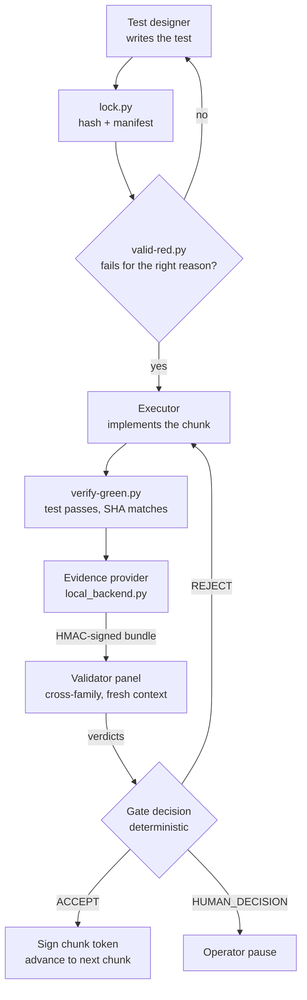

# Features

The framework is a set of composed primitives, not a monolith. Each capability is a thin layer over existing scripts, enforcing one structural invariant. This page maps the capabilities to what they do and where they live in the repo.

## Capability map

| Capability | What it does | Key code paths |
|---|---|---|
| Sprint loop runner | One command coordinates all five roles through the full adversarial loop: plan, attack, reconcile, chunk, test-first, validate, gate. | `tools/sprint-loop.py`, `tools/sprint_loop/` |
| Chunk token gates | HMAC-signed tokens bind chunk close to verified reviewer envelopes. No token, no advance. | `tools/sign_chunk_token.py`, `tools/chunk_sequence_gate.py`, `tools/sprint_loop/chunk_close_banner.py` |
| Evidence provider | Produces a signed bundle (test results, locked SHA, provenance) that validators inspect instead of re-running the suite. | `tools/phase-3.2-evidence/local_backend.py` |
| Plan lint | Structural checks on a plan before it enters the chunk cycle: scope bounds, observable criteria, rollback defined. | `tools/phase-1-scripts/`, `tools/sprint_loop/prompts/` |
| Cross-family review | Orchestrates a validator panel from distinct model families and produces a gate decision from their verdicts. | `tools/orchestrate-review.py`, `tools/sprint_loop/backends.py` |
| Telemetry | Append-only `runs.jsonl` rows, one per droid invocation, with full model attribution. | `tools/sprint_loop/droid.py`, `telemetry/SCHEMA.md` |
| Family guard | Pure-function check that no two separation-bearing seats share a model family. Runs at preflight and post-resolution. | `tools/sprint_loop/state.py` |
| Prompt rendering | Pluggable role-prompt templates, one per role, rendered per chunk with the chunk spec substituted in. | `tools/sprint_loop/prompts/` |

## How the pieces connect

The flow below traces one chunk from test design through the gate decision. The evidence producer signs the bundle; the validator panel reads the bundle (not the executor's reasoning); the gate decision is deterministic, derived from the panel verdicts.

The gate decision feeds back into the loop: ACCEPT signs a token and advances; REJECT routes feedback to the executor and retries up to a threshold; HUMAN_DECISION pauses for the operator. The token is the enforcement artifact — its absence or signature failure produces a ⛔, not a silent pass.

## Pages

- [Sprint loop runner](sprint-loop-runner.md) - the Phase 4.5 command-orchestrated runner
- [Chunk token gates](chunk-token-gates.md) - HMAC-signed enforcement at chunk close
- [Evidence provider](evidence-provider.md) - signed bundles as the validator's input
- [Plan lint](plan-lint.md) - structural checks before the chunk cycle

See [the method](../method.md) for the workflow these capabilities enforce, and [adopting the method](../how-to-contribute/adopting-the-method.md) for wiring them into a pilot repo.
