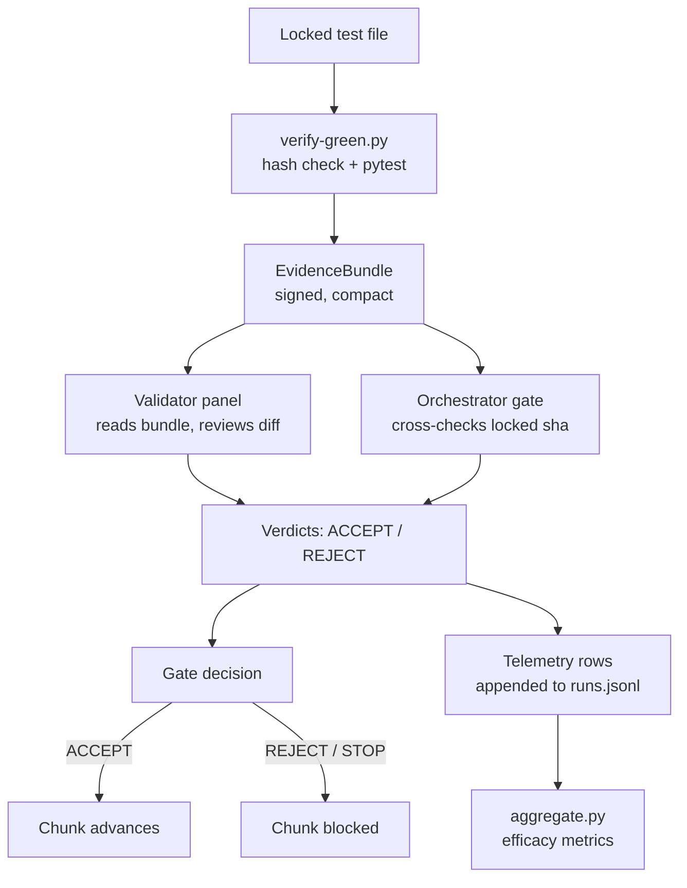

# Features

This page maps the framework's capabilities — what each piece does, where the code lives, and how the parts connect. The framework is a multi-model adversarial coding loop: different AI model families handle different roles (planner, executor, validator, test-designer), and the structural separation between them is what produces independent review rather than a single model checking its own work.

For the design principles behind these features, see [invariant #1](../method/invariants.md) and the [architecture overview](../overview/architecture.md). For how the phases were built, see the [lore timeline](../lore.md).

## Capability map

| Capability | What it does | Key code |
|---|---|---|
| **Locked behavioral tests** | Hash-locks a test file to prevent the executor modifying it. The verifier re-checks the hash before accepting GREEN, refusing if the test was tampered with. Known enforcement gaps are tracked in `phase-1/KNOWN-ISSUES.md`. | `phase-1/scripts/lock.py`, `phase-1/scripts/verify-green.py` |
| **Multi-model role separation** | Each role (planner, executor, validator, test-designer) runs on a different model family. Separation-bearing seats pin `--model` before the run so the provider cannot swap models. | `tools/run-with-model.sh`, `tools/adapters/factory.py` |
| **Cross-family review panel** | Validators from at least two distinct model families review the same diff. Any REJECT blocks the chunk. A single-family panel is refused by default. | `tools/orchestrate-review.py` |
| **Evidence provider** | A neutral producer runs the deterministic tier (pytest, locked-hash check, security scan) once and emits a compact signed bundle. Validators read the bundle instead of re-running pytest in-session. | [Evidence provider](evidence-provider.md) |
| **Mechanical review pipeline** | A scripted pipeline that produces evidence, runs validators, checks for stray writes, parses verdicts, appends telemetry, and reports the gate decision — all without ad hoc commands. | [Orchestration](orchestration.md) |
| **Telemetry and efficacy metrics** | Every `droid exec` invocation is logged to `runs.jsonl`. Findings and dispositions are tracked separately. The aggregator produces per-reviewer yield, fix-rate by severity, and cost-per-finding-fixed. | [Telemetry](telemetry.md) |
| **Security lens** | Bandit scans with new-vs-baseline comparison and a curated allowlist scoped to specific `(rule_id, file, line)` tuples. Only new findings enter the bundle; baseline debt is excluded. | `phase-3.2/evidence/security_allowlist.json` |
| **Token fairness accounting** | Measures whether reading a compact evidence bundle costs fewer tokens than ingesting raw pytest output. The win is real only if the bundle is smaller than what it replaces. | `phase-3.2/evidence/token_accounting.py` |

## How the pieces fit together

The flow above is the everyday path when the [orchestration pipeline](orchestration.md) runs. The [evidence provider](evidence-provider.md) produces the bundle, the panel consumes it, and [telemetry](telemetry.md) records what happened for later analysis.

## Feature pages

- [Evidence provider](evidence-provider.md) — the Phase 3.2 evidence provider: EvidenceBundle schema, local backend, consumers, token accounting
- [Orchestration](orchestration.md) — the mechanical review pipeline (`tools/orchestrate-review.py`)
- [Telemetry](telemetry.md) — telemetry system: SCHEMA.md v2, `aggregate.py`, `runs.jsonl`

## Key source files across all features

| File | Role |
|---|---|
| `phase-3.2/evidence/bundle_schema_v1.json` | Frozen EvidenceBundle v1 JSON Schema |
| `phase-3.2/evidence/local_backend.py` | Local evidence-provider backend (zero CI) |
| `phase-3.2/evidence/consumer.py` | Validator + orchestrator gate consumers |
| `phase-3.2/evidence/token_accounting.py` | Token fairness rule instrumentation |
| `phase-3.2/evidence/security_allowlist.json` | Curated security allowlist |
| `tools/orchestrate-review.py` | Mechanical review pipeline script |
| `telemetry/SCHEMA.md` | Telemetry schema (v2) |
| `telemetry/aggregate.py` | Efficacy metrics aggregator |
| `tools/OPERATING-RULES.md` | Operating discipline (scope-shift, silent-green, enforcement) |
| `phase-1/scripts/verify-green.py` | Locked-hash check + pytest gate |
| `tools/run-with-model.sh` | Model-pinning enforcement wrapper |
