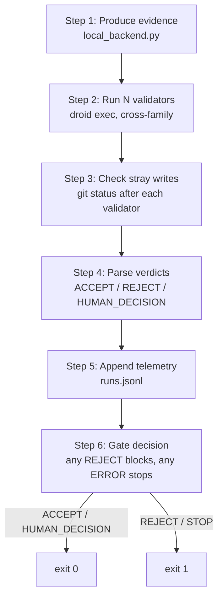

# Orchestration

`tools/orchestrate-review.py` is the script that makes the review process mechanical instead of ad hoc. Before it existed, the review cycle was run by an AI agent manually executing commands — produce evidence, run validators, parse verdicts, record telemetry. That worked, but it was a framework-level gap: a process that depends on an agent remembering to do every step is not a pipeline. The orchestration script runs the full cycle in six steps, stops only on error, and reports a gate decision the human reviews.

This gap and the decision to build the script inside Phase 3.2 is documented in `tools/OPERATING-RULES.md` §8 (scope-shift). The rule: when scope shifts mid-phase, name it, decide whether to absorb or push out, and record the decision. The orchestration gap was absorbed into 3.2 because it emerged naturally, but it is really an automation concern (PRD Act 2), not an evidence-tier concern.

For the evidence bundle the pipeline produces, see [evidence provider](evidence-provider.md). For how the results are recorded, see [telemetry](telemetry.md).

## The six-step pipeline



### Step 1 — Produce evidence

Calls `phase-3.2/evidence/local_backend.py` to produce a signed EvidenceBundle. This step is optional: if `--evidence-output` is not passed, step 1 is skipped and validators run without a bundle (the in-session control arm). When the bundle is produced, the script prints the test counts, locked sha, and green status. If the backend exits non-zero, the pipeline stops immediately.

### Step 2 — Run validators

Runs each validator via `droid exec` with a pinned `--model`, `--auto` level, and a restricted tool set (`Read,Glob,Grep,LS,Execute` by default). Each validator gets the same prompt file and writes its output envelope to the review output directory. The script captures:

- `num_turns`, `input_tokens`, `output_tokens` from the envelope's `usage` field
- `is_error` flag from the envelope
- `duration_ms`
- The full result text

The script reads the envelope regardless of exit code — `droid exec` may exit non-zero but still write a valid envelope (e.g. `is_error=true` for a provider failure). It only fails if the file is missing or unparseable.

### Step 3 — Check stray writes

After each validator finishes, the script runs `git status --porcelain` and checks for unexpected file changes. The review output directory and the orchestrator script itself are excluded — those are written by the orchestrator, not by the validator. Any other change is a stray write, flagged as a KI-2 violation (a validator should not modify the working tree). Stray writes cause the gate to STOP in step 6.

### Step 4 — Parse verdicts

Extracts the verdict from each validator's result text using a regex that matches `ACCEPT-WITH-NITS`, `ACCEPT`, `REJECT_IMPLEMENTATION`, `REJECT_TEST`, `REJECT`, and `HUMAN_DECISION`. The script takes the last match — the verdict is on the last line per the prompt spec. If no verdict is found, the validator gets `UNKNOWN`, which causes the gate to STOP.

### Step 5 — Append telemetry

Appends one row per validator to `telemetry/runs.jsonl`. Each row includes:

- `schema_version: "v2"`, timestamp, run_id, phase, branch
- `role: "validator"`, model_id, provider, family, providerLock, apiProviderLock
- `num_turns`, `input_tokens`, `output_tokens`, `duration_ms`, `is_error`
- `decision` (the parsed verdict)
- `evidence_source` (`in-session` or `bundle`) so the H-CI A/B is attributable
- `envelope_path` for the audit trail

See [telemetry](telemetry.md) for the full schema.

### Step 6 — Gate decision

Aggregates the verdicts and reports the gate decision:

| Condition | Gate | Meaning |
|---|---|---|
| Any validator failed to run or errored | **STOP** | Something broke — do not proceed |
| Any REJECT | **REJECT** | At least one validator found a blocking problem |
| Any UNKNOWN verdict | **STOP** | Verdicts unparseable — cannot trust the result |
| Stray writes detected | **STOP** | KI-2 violation — a validator wrote to the tree |
| Any HUMAN_DECISION | **HUMAN_DECISION** | A validator escalated — human must rule |
| All ACCEPT | **ACCEPT** | Chunk advances |

The script exits 0 for `ACCEPT` or `HUMAN_DECISION`, and 1 for everything else. A summary JSON is written to the review output directory with each validator's label, model, family, verdict, token counts, and stray-write status.

## Cross-family enforcement

Before running validators, the script checks that the panel has at least two distinct model families (PRD §17.2). A single-family panel is refused by default. The `--allow-single-family` flag overrides this, but it is not recommended — the entire method rests on independent review from different model families. Two passes from one family are one opinion twice.

## Running the pipeline

```bash
python3 tools/orchestrate-review.py \
  --framework-root /path/to/adversarial-sprint-dev \
  --pilot-root /path/to/quantum-bank \
  --pilot-python /path/to/quantum-bank/.venv/bin/python \
  --test-file test/test_profile_model.py \
  --lock-file phase-1/locks/test/test_profile_model.py.lock.json \
  --prompt-file phase-3.2/reviews/review-prompt.md \
  --review-output-dir phase-3.2/reviews/ \
  --validators grok-4.5:xai:grok-family,gemini-3.1-pro-preview:google:gemini-family \
  --evidence-output phase-3.2/build-evidence/chunk1-bundle.json \
  --full-suite \
  --security-scan \
  --security-allowlist phase-3.2/evidence/security_allowlist.json \
  --security-baseline phase-3.2/build-evidence/bandit-baseline.json \
  --auto-level high \
  --enabled-tools Read,Glob,Grep,LS,Execute \
  --evidence-source bundle
```

The `--validators` argument is a comma-separated list of `model_id:provider:family[:label]` entries. The label is optional and defaults to the model_id. The `--evidence-source` flag controls the telemetry field: `in-session` (default, control arm) or `bundle` (treatment arm).

## Key source files

| File | What it does |
|---|---|
| `tools/orchestrate-review.py` | The six-step mechanical review pipeline |
| `phase-3.2/evidence/local_backend.py` | Evidence producer called by step 1 |
| `tools/adapters/factory.py` | Vendor shim (Factory now, others later) |
| `tools/run-with-model.sh` | Enforcement wrapper — refuses to run without `--model` |
| `tools/OPERATING-RULES.md` | Operating discipline including §8 scope-shift |
| `telemetry/runs.jsonl` | Where step 5 appends telemetry rows |

## Related pages

- [Evidence provider](evidence-provider.md) — the bundle that step 1 produces
- [Telemetry](telemetry.md) — the schema for the rows step 5 appends
- [Features index](index.md) — all framework capabilities
