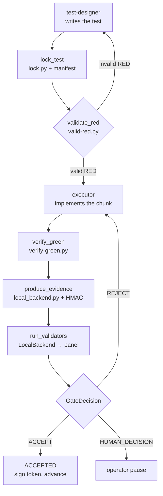

# Sprint loop runner

The Phase 4.5 product. One command coordinates all five roles — planner, plan reviewer, test designer, executor, validator — through the full adversarial loop: plan, attack, reconcile, chunk, test-first cycle, cross-family validation, gate decision. The runner is thin orchestration: every "what does this step do" is delegated to existing primitives. The runner's own work is the state machine, the human gates, retry accounting, and branch plus commit creation at the end.

## Package structure

The `sprint_loop` package lives under `tools/sprint_loop/`. Each module owns one concern.

| Module | Responsibility |
|---|---|
| `tools/sprint_loop/config.py` | `Config` dataclass (all knobs), `MODEL_FAMILY_MAP` (curated provider/family provenance), seven layout roots (`EVIDENCE_ROOT`, `PLANNING_ROOT`, `TOKENS_ROOT`, `PROMPTS_ROOT`, `SCRIPTS_ROOT`, `LOCKS_ROOT`, `EVIDENCE_CODE_ROOT`), `build_config` parser (JSON file plus CLI overrides) |
| `tools/sprint_loop/state.py` | `RunState`, `ChunkState`, `Role` enum (five roles), `RunStatus` and `ChunkStatus` enums, `GateDecision` enum, `Finding` dataclass, `FamilyGuardOutcome` and `check_family_separation` (the §17.2 separation check) |
| `tools/sprint_loop/droid.py` | `invoke_droid` wrapper (routes through `tools/run-with-model.sh` per §14), `RunRecord` dataclass (normalised envelope), `parse_envelope` (via `tools/adapters/factory.py`), `append_run_record` (telemetry row), transient-API retry loop |
| `tools/sprint_loop/backends.py` | `ValidationBackend` protocol, `LocalBackend` (shells out to `tools/orchestrate-review.py`), `CIBackend` stub (raises `NotImplementedError`), `build_backend` factory |
| `tools/sprint_loop/per_chunk.py` | The inner loop: `lock_test`, `validate_red`, `verify_green`, `produce_evidence`, `run_validators`, `invoke_test_designer`, `invoke_executor`, prompt rendering |
| `tools/sprint_loop/chunk_close_banner.py` | Operator-eye ✅/⛔ signal. Composes `sign_chunk_token.verify_token` — emits ✅ when the chunk token's HMAC verifies, ⛔ when the token is missing or signature fails |

## State machine

Two status enums drive flow control. `RunStatus` tracks the run-level phase (`PENDING` → `PLANNING` → `PLAN_REVIEWING` → `AWAITING_RECONCILIATION` → `CHUNKING` → `RUNNING_CHUNKS` → `COMPLETED` or `STOPPED` or `PAUSED`). `ChunkStatus` tracks the per-chunk phase (`PENDING` → `TEST_DESIGNING` → `LOCKING` → `VALIDATING_RED` → `EXECUTING` → `VERIFYING_GREEN` → `EVIDENCING` → `VALIDATING` → `ACCEPTED` or `RETRYING` or `HUMAN_DECISION`).

Pause and resume work through a checkpoint JSON. `write_checkpoint` serialises `RunState` to disk; `load_checkpoint` reads it back. The operator can close the laptop mid-run and resume with `--resume-from <path>`. The checkpoint is the spine of the "durable runner" design — the runner emits an honest narrative that this claim holds once pilots exercise the resume path.

## Per-chunk inner loop

One chunk runs the full ADR cycle. The flow is in `tools/sprint_loop/per_chunk.py`:



Each step asserts on reality (§7): the lock manifest SHA is read from disk, not stdout; `verify-green.py` exit is checked and the bundle's `locked_test_sha_observed` is cross-checked against the lock manifest; the bundle's HMAC signature is verified against the same key the backend used before forwarding it to validators. An unsigned or mismatched bundle is fail-closed — STOP, not a silent pass.

Retry policy (§5.7): REJECT feeds findings back to the executor and retries up to `retry_threshold` (default 1). Above that, the gate returns `HUMAN_DECISION` and the chunk pauses.

## Run modes

Three modes, each with a distinct contract:

- **Real** (default): operator in seat. The reconcile gate pauses on stdin for accept/reject/amend. Per-chunk `HUMAN_DECISION` gates pause for operator input. Git commits land on a branch; no auto-merge (invariant #8).
- **`--dry-run`**: wiring test. No `droid exec` fired, no git commits. The runner writes fake envelopes and simulated manifests so downstream code paths exercise their parsing. Costs zero model credits.
- **`--unattended`**: live pipeline with checkpoints. The reconcile gate auto-decides after running §5.3 preconditions. On §5.3 refusal, the runner writes a checkpoint and exits with code 4 or 5. The operator resumes with `--resume-from`. The pipeline stays live — this is not a simulation.

`--gate-auto-decide` is a fourth, narrower flag: it auto-decides the reconcile gate only, without the checkpoint-on-refusal behaviour of `--unattended`.

## Entry point

`tools/sprint-loop.py` (1,544 lines) is the CLI entry point. It is kept thin — the package does the work. Invoked via a per-pilot overlay:

```
python3 tools/sprint-loop.py --config <cfg.json> [overrides]
```

The JSON config is the canonical human-maintained surface; CLI flags override specific keys for ad-hoc runs. See `templates/overlay/sprint-loop-config.template.json` for the schema. The overlay pattern keeps the framework repo's evidence tree clean — each pilot points its `--evidence-output-dir` elsewhere.

## Key source files

| File | Role |
|---|---|
| `tools/sprint-loop.py` | CLI entry point, state machine driver, human gates, git branch + commit |
| `tools/sprint_loop/config.py` | Config dataclass, model family map, layout roots, config parser |
| `tools/sprint_loop/state.py` | RunState, ChunkState, Role/RunStatus/ChunkStatus enums, FamilyGuard |
| `tools/sprint_loop/droid.py` | invoke_droid wrapper, RunRecord, envelope parsing, telemetry append |
| `tools/sprint_loop/backends.py` | ValidationBackend protocol, LocalBackend, CIBackend stub |
| `tools/sprint_loop/per_chunk.py` | Per-chunk inner loop: lock, valid-RED, verify-GREEN, evidence, validators |
| `tools/sprint_loop/chunk_close_banner.py` | Operator-eye ✅/⛔ signal bound to HMAC verification |
| `tools/sprint_loop/prompts/` | Pluggable role-prompt templates, one per role |

The runner composes [chunk token gates](chunk-token-gates.md) for enforcement, the [evidence provider](evidence-provider.md) for signed bundles, and [plan lint](plan-lint.md) for structural pre-checks. See [the method](../method.md) for the workflow this runner automates, and [adopting the method](../how-to-contribute/adopting-the-method.md) for wiring it into a pilot.
