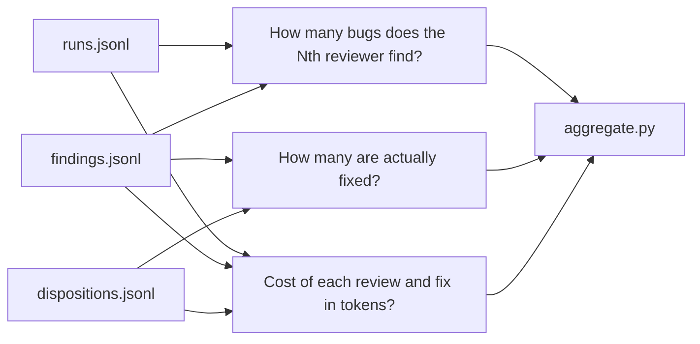

# Telemetry

The telemetry system records what happened during each run so the §13 efficacy evaluation can measure cost, quality, and finding yield. The schema lives in `telemetry/SCHEMA.md` (public, part of the convention); the data rows live in `telemetry/runs.jsonl` and friends (gitignored — they stay on the build machine and move to a private repo or DuckDB later). The aggregator (`telemetry/aggregate.py`) reads the rows and prints the three tables that feed the evaluation.

The schema is at version v2, bumped in Phase 3.2 to add the `test-designer` role and four evidence-tier fields for the H-CI fairness rule. v1 rows are still readable for back-compat.

For how rows get appended during a review pipeline run, see [orchestration](orchestration.md). For the evidence bundle whose token cost the new fields measure, see [evidence provider](evidence-provider.md).

## The three data files

All three are JSONL, append-only, and live in the telemetry data directory (default `./telemetry`, overridable via `--data-dir` or `$TELEMETRY_DATA_DIR`).

### runs.jsonl — one row per `droid exec` invocation

Every model invocation gets a row. The fields that matter:

| Field | Type | Required | Notes |
|---|---|---|---|
| `schema_version` | string | yes | `"v2"` for Phase 3.2+ rows, `"v1"` for legacy |
| `ts` | ISO-8601 UTC | yes | When the row was appended |
| `run_id` | string | yes | Stable id; same id appears in the commit-body `Telemetry-row:` line |
| `phase` | string | yes | `phase-0`, `phase-1`, `phase-3.2`, … |
| `branch` | string | yes | Branch the run executed against |
| `role` | enum | yes | `planner` / `executor` / `validator` / `reviewer` / `test-designer` |
| `model_id` | string | yes | The `--model` value passed |
| `provider` | string | yes | openai / google / xai / anthropic / … |
| `family` | string | yes | openai-family / gemini-family / grok-family / … |
| `providerLock` | string | yes | Observed provider lock from the inner session |
| `apiProviderLock` | string | yes | Observed API provider lock |
| `num_turns` | int | yes | From the envelope |
| `input_tokens` | int | yes | `usage.input_tokens` |
| `output_tokens` | int | yes | `usage.output_tokens` |
| `cache_read_tokens` | int | no | Often zero/missing |
| `thinking_tokens` | int | no | Often zero/missing |
| `duration_ms` | int | yes | Wall clock |
| `is_error` | bool | yes | Run-level error (not per-tool) |
| `decision` | string | no | `ACCEPT` / `ACCEPT-WITH-NITS` / `REJECT` / `null` |
| `evidence_source` | enum | no | `in-session` (control) vs `bundle` (treatment). Required for Phase 3.2+ validator rows. |
| `mcp_call_tokens` | int | no | MCP request cost (treatment only) |
| `mcp_payload_tokens` | int | no | Bundle-read cost — the replacement for raw test output |
| `raw_test_output_tokens` | int | no | In-session pytest-output cost (control only) — the `size(2)` ceiling |

### findings.jsonl — one row per finding surfaced in a review pass

| Field | Type | Required | Notes |
|---|---|---|---|
| `finding_id` | string | yes | `F-<short-hash>` |
| `phase` | string | yes | |
| `surface` | string | yes | `file:line` or section pointer |
| `category` | enum | yes | `correctness` / `security` / `performance` / `readability` / `spec-deviation` / `other` |
| `severity` | enum | yes | `blocking` / `major` / `minor` / `nit` |
| `source_role` | string | yes | `validator` / `reviewer` |
| `source_run_id` | string | yes | Links to `runs.jsonl` |
| `source_model_id` | string | yes | The model that surfaced it |
| `source_family` | string | yes | |
| `first_seen_in_panel_position` | int | yes | 1..N (1 = first reviewer). 0 = caught by all identically. |

### dispositions.jsonl — one row per finding closed or explicitly not-closed

| Field | Type | Required | Notes |
|---|---|---|---|
| `finding_id` | string | yes | Matches `findings.jsonl` |
| `disposition` | enum | yes | `fixed` / `wontfix-with-reason` / `deferred` / `wontfix` / `reverted` |
| `disposition_commit_sha` | string | yes | The commit that closed or tracked it |
| `disposition_model_id` | string | yes | The model that wrote the fix |
| `disposition_tokens_input` | int | no | Total tokens spent on the fix |
| `disposition_tokens_output` | int | no | |
| `disposition_at` | ISO-8601 | yes | |

## The v1 → v2 migration (Phase 3.2)

The v2 bump added three things, all backward-compatible:

1. **`test-designer` added to the `role` enum.** The Phase 3 `runs.jsonl` rows already used `role: "test-designer"` ahead of the schema — v2 makes the schema match the data. No backfill needed.

2. **Four new optional fields on `runs.jsonl`** for the H-CI fairness rule (SPIKE §3.2):
   - `evidence_source` — marks which arm of the A/B a validator row belongs to.
   - `mcp_call_tokens` — the MCP request cost (treatment only).
   - `mcp_payload_tokens` — the bundle-read cost, the replacement for raw test output.
   - `raw_test_output_tokens` — the in-session pytest-output cost (control only).

   All four are optional. Legacy v1 rows omit them; the aggregator treats missing as "not applicable."

3. **`schema_version` front-matter** bumped from `"v1"` to `"v2"`.

The aggregator continues to read v1 rows. It refuses to read rows with a `schema_version` higher than the one it was written against, so old aggregates can be re-run for back-compat.

## The aggregator

`telemetry/aggregate.py` reads the three JSONL files and prints three tables:

### Per-reviewer yield

Groups findings by `first_seen_in_panel_position` and `severity`, counting how many findings each panel position surfaces. Token cost is summed **once per unique `source_run_id`** — a reviewer run contributes its cost once regardless of how many findings it surfaced. (An earlier version double-counted by adding tokens per finding; this was fixed in a round-1 cross-family review.)

### Fix rate by severity

Joins `findings.jsonl` with `dispositions.jsonl` on `finding_id`. For each severity level, reports how many findings were surfaced and how many were fixed, with the fix rate as a percentage.

### Cost per finding fixed

Two cost paths:
- **Review cost**: sum of `cohort_total_tokens(run)` over unique `source_run_id`s in findings. Each reviewer run contributes once.
- **Fix cost**: sum of `disposition_tokens_input + disposition_tokens_output` per disposition where `disposition=fixed`.

`cohort_total_tokens` includes `input_tokens + output_tokens + cache_read_tokens + thinking_tokens` — all four token fields, not just input and output.

### Running the aggregator

```bash
python3 telemetry/aggregate.py --data-dir telemetry

# Or via environment variable
TELEMETRY_DATA_DIR=telemetry python3 telemetry/aggregate.py

# Schema check only (no tables)
python3 telemetry/aggregate.py --schema-check
```

The `--schema-check` flag verifies that every row has the expected `schema_version` and stops without printing tables if any row is wrong. This is useful before running aggregates to catch data-entry mistakes.

### Known limitation

When `disposition_tokens_*` are absent on a disposition row, the canonical fallback is to join `dispositions ⨝ runs` on `disposition_commit_sha == run_id` and sum the run tokens. That fallback is documented in `telemetry/SCHEMA.md` but **not yet implemented** in `aggregate.py` — see `tools/conventions/model-discipline.md` for the migration gate.

## How the §13 efficacy questions read these files



- **How many bugs of given severity does the Nth reviewer find?** → `findings.jsonl ⨝ runs.jsonl` on `source_run_id`; group by `first_seen_in_panel_position`, count by `severity`.
- **How many of those are actually fixed?** → `findings.jsonl ⨝ dispositions.jsonl` on `finding_id`; `count(fixed) / count(surfaced)`, segmented by severity.
- **Cost of each review and fix in tokens?** → review cost from unique `source_run_id`s in findings → `runs.jsonl`; fix cost from `dispositions.jsonl` where `disposition=fixed`.

## Key source files

| File | What it does |
|---|---|
| `telemetry/SCHEMA.md` | Schema for all three JSONL files, including v1→v2 migration notes |
| `telemetry/aggregate.py` | Efficacy metrics aggregator (per-reviewer yield, fix rate, cost per finding) |
| `telemetry/runs.jsonl` | One row per `droid exec` invocation (gitignored) |
| `telemetry/findings.jsonl` | One row per finding surfaced in review (gitignored) |
| `telemetry/dispositions.jsonl` | One row per finding closed or not-closed (gitignored) |
| `tools/orchestrate-review.py` | Appends rows to `runs.jsonl` in step 5 |
| `tools/conventions/model-discipline.md` | Migration gate for the disposition-token fallback |

## Related pages

- [Evidence provider](evidence-provider.md) — the bundle whose cost `mcp_payload_tokens` measures
- [Orchestration](orchestration.md) — the pipeline that appends telemetry rows in step 5
- [Features index](index.md) — all framework capabilities
- [By the numbers](../by-the-numbers.md) — Phase 3 cost breakdown by role and model
