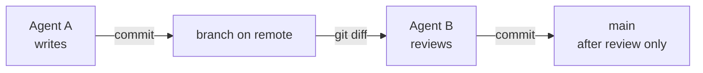
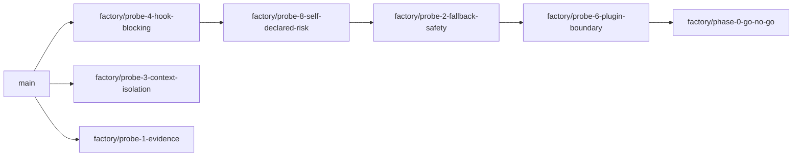

# Development workflow

Three agents work in this repository — Factory Droid, Codex, and Claude Code — plus a human. They share **one working tree**, so the workflow exists mainly to keep them from writing over each other and to keep authorship legible after the fact.

## Branch by author

The convention in `AGENTS.md` is `<agent>/<topic>`, with the prefix naming the agent that did the work: `factory/`, `codex/`, `claude/`.

```
factory/probe-4-hook-blocking
factory/phase-0-go-no-go
```

Three reasons it is author-first rather than topic-first:

- Authorship stays obvious in history without reconstructing it from commit messages.
- A bad run is one `git branch -D`, with no archaeology over which commits to keep.
- When a reviewer reads a diff, it knows immediately whether it is reviewing its own output — which it must not do.

## Commits are the baton

There is no shared scratchpad and no transcript passing between agents. Handoff happens through git:

- One agent commits.
- The next agent reads `git diff` and works from the diff, **not** from the other agent's reasoning.
- Push branches to the private remote as you go. The local machine is not a backup.



This mirrors the method the repository itself specifies: independent context, no transcript bleed. If it feels clumsy in practice, that is real signal about the design, and it belongs in `phase-0/README.md` under Notes rather than being quietly worked around.

Commit messages here are unusually long because they carry the reasoning a diff cannot — the verdict, the controlled comparison behind it, the caveat, the scope limit. Agent-authored commits carry a `Co-authored-by:` trailer.

## Role separation applies to the agents, too

The agent that authored a plan should not be the one that approves it, and the agent that wrote an implementation should not be the one that validates it. This is invariant #1 of the method applied to the agents-and-humans layer rather than only to the runtime. Roles are assigned deliberately, not by whichever agent happens to be open in a window.

## Convention and spec changes stay off feature branches

`AGENTS.md`, `PRD.md`, and the sprint template are the rules everything else is judged against. If a convention change rides along inside a probe branch, then reviewing the probe means reviewing the rules and the evidence at once, and the rules can land on the back of unreviewed work. So they go in their own commits, on their own branch, reviewed on their own terms.

## `main` is nearly empty, on purpose

Nothing lands on `main` without review, and Phase 0 was executed by a single agent, so almost nothing has landed. `main` carries the initial spec, `AGENTS.md`, the sprint template, the Phase 0 prep, and Probe 1 — eight commits. Every later probe and the go/no-go decision live on branches.

## The chained probe branches, and what they cost

Phase 0 recorded each probe on its own branch, then chained later probes onto earlier ones so results accumulated:



Chaining worked for the chain: `factory/phase-0-go-no-go` has the fullest record, because each probe could cite the one before it. What it cost is that **probe evidence is scattered across branches, and there is no single ref that has all of it**. Probe 3 was recorded off the chain and never merged into it, so its evidence exists only on `factory/probe-3-context-isolation`:

```bash
git show factory/probe-3-context-isolation:phase-0/evidence/probe-3/README.md
```

Anyone reading `factory/phase-0-go-no-go` and looking for `phase-0/evidence/probe-3/` finds nothing, while the go/no-go document cites Probe 3 throughout. That is a defect in the record, not a feature of the branching model. If you add a probe, chain it onto the current tip so the same gap is not created twice.

## History hygiene

A clean working tree is not enough, because git history travels with the repository.

**If anything sensitive is ever committed, squash or rewrite before the first push.** Do not add a follow-up "scrub" commit — that leaves the original blob reachable in history and advertises where to look.

In practice, this means scrubbing before staging, not after:

- Replace `/Users/<user>` with `~` in every raw capture. Probe records do this consistently.
- Filter secrets and tokens out of captured stdout before it lands in `raw/`.
- Check the diff, not just the files you meant to change: `git diff --cached` before committing.

## `STEER.md`, the async steering channel

`STEER.md` is a one-way instruction channel: the human appends dated instructions between probes, and agents re-read the file at the top of every probe and act on anything new before starting. An instruction is marked handled by noting it in the relevant commit or probe record, never by editing the human's text.

**It is deliberately kept out of the record.** It is live control input, not evidence — the same instruction restated in a commit message is the durable version. Note the current state accurately: the file declares itself gitignored, but `.gitignore` does not actually match it, so it is merely untracked. If you touch the workflow, either add the pattern or fix the file's header; do not commit it by accident in the meantime.

Anything in `STEER.md` that should survive belongs in a commit, a probe README, or `phase-0/README.md`.

## Before you commit

- Read [Patterns and conventions](./patterns-and-conventions.md) for the evidence standard your record must meet.
- If you added or changed a probe, confirm it re-runs from its own directory — see [Testing](./testing.md).
- Confirm nothing on the never-write list is in the diff. See [How to contribute](./index.md).
