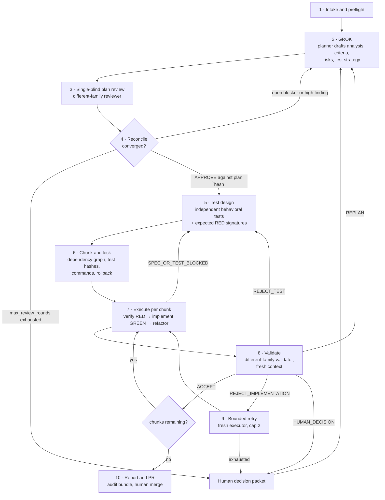
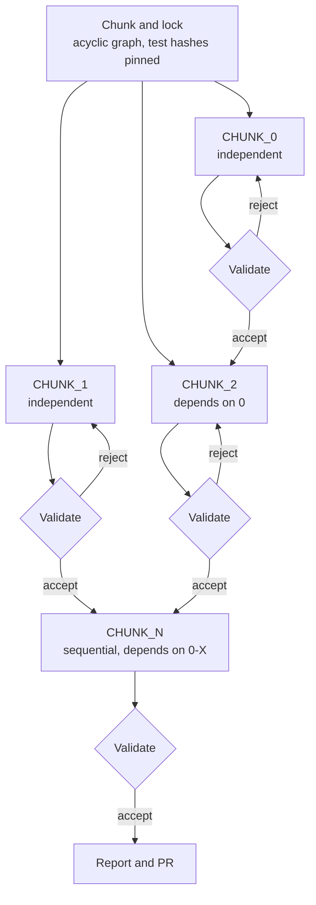

# The method

The GROK, CHUNK, EXECUTE sprint method is the core of the framework. The thesis is that code quality comes from structural independence across model families, not from a smarter model. No agent grades its own work, no reviewer sees the producer's reasoning, and a chunk is done only when a test written by someone else — locked by hash, observed failing for the right reason — now passes. This page is a summary; the full specification lives in `PRD.md` and `tools/OPERATING-RULES.md`.

## The thesis

Single-agent coding workflows fail in predictable ways: the author grades its own plan, the same agent writes tests and code, the reviewer inherits the author's framing, and a syntax error gets called "RED." Adversarial Sprint does not make any one agent smarter. It makes independence and evidence **structural properties of the run** — enforced by the runtime, not suggested by a prompt. Different model families are the independence control. Executable test evidence is the referee. A human approves the merge.

## The eight runtime invariants

These are enforced, not advisory. The full text is in `PRD.md` §4.

1. **Family separation** — planner ≠ plan reviewer family; test designer ≠ executor family; executor ≠ validator family.
2. **Fresh review context** — the validator gets the spec, diff, read-only repo, and test evidence. Never the executor's transcript or self-assessment.
3. **Independent test authorship** — the executor may not create or modify locked acceptance tests. A required test change goes back to test design.
4. **Valid RED before GREEN** — behavior-changing work cannot start until the intended assertion has run and failed for the expected reason.
5. **Immutable evidence** — the RED test content hash must match the GREEN test content hash. Any mutation invalidates the gate.
6. **Blocking validation** — a rejected chunk cannot be marked complete.
7. **Explicit degradation** — if family identity, context isolation, test locking, or artifact capture cannot be guaranteed, the run stops rather than silently weakening the method.
8. **Human merge** — the system may create a branch, commits, and a PR. A human approves the merge.

## The five roles

Each role has a model tier, a file-access scope, and a family constraint. The full role table is in `PRD.md` §8.

| Role | Model tier | Family constraint | File access |
|---|---|---|---|
| Planner | Frontier | — | Read-only |
| Plan reviewer | Frontier | ≠ planner family | Read-only |
| Test designer | Frontier or mid | ≠ executor family | Test files only |
| Executor | Cheap / fast | — | Implementation files |
| Validator | Mid or frontier | ≠ executor family | Read-only + test execution |

The executor is deliberately the cheapest tier — frontier models performing mechanical implementation is token waste. The cost thesis (PRD §4, H3) depends on pinning role-appropriate models and measuring actual spend.

## The end-to-end workflow

Every backward edge in that diagram is a gate doing its job. A run that only ever moves forward has not exercised the method.

INTAKE verifies the baseline: clean branch, passing or recorded-failing tests, resolvable model IDs, valid family separation, writable artifact directory. GROK is the planner's draft — root cause, risk table, acceptance criteria as observable outcomes, test strategy. BLIND REVIEW is single-blind: the reviewer sees the plan and repo evidence, but not the planner's private reasoning. RECONCILE loops on structured findings (JSON schema in `PRD.md` §5.3) until no blocker or high-severity finding remains and the reviewer returns APPROVE against the plan hash, capped at `max_review_rounds` (default 2). TEST DESIGN produces behavioral tests and expected RED signatures from a different family than the executor. CHUNK / LOCK freezes the dependency graph, test hashes, commands, and rollback. EXECUTE runs the test-first cycle per chunk. VALIDATE is a different-family validator working from the spec, diff, repo, and evidence — never the executor's reasoning. Rejection triggers bounded retry; exhaustion escalates to a human.

## Chunk dependencies

Parallelism is an option the graph permits, not a default it assumes. Chunks are sequential by default. Parallel execution requires clean file boundaries and no shared schema, configuration, generated artifact, migration order, API contract, or behavioral dependency. File-level disjointness alone is not sufficient.

## What the method does not claim

The framework is explicit about its limits, recorded in `PRD.md` §1 and §5.3:

- **Independence ≠ proof.** Different model families are a useful independence control, not a correctness guarantee. Correlated blind spots can survive cross-family review.
- **Tests ≠ truth.** Executable evidence is a stronger gate than self-reporting, but tests can encode the same bug as the implementation, which is why test authorship is separated from execution.
- **Agreement ≠ correctness.** Two reviewers converging means the absence of a known dispute, not evidence the plan is right. The reconciliation record treats consensus as a state, not a finding.
- **Single-blind, not double-blind.** The reviewer reads the plan, so it inherits the plan's framing and vocabulary. Calling it "blind review" would encourage the over-trust in independence the method exists to avoid.

## Where to go next

- `PRD.md` — the full specification, 1,124 lines
- `tools/OPERATING-RULES.md` — operating discipline learned from live runs
- `skills/adversarial-sprint/SKILL.md` — the canonical skill asset (digest + index + rehydration)
- `templates/SPRINT-PLANNING-TEMPLATE.md` — the planning template a sprint fires against
- [Overview](overview/index.md) — what the framework is and what the runs found
- [Findings](findings/index.md) — the headline discoveries from live runs
- [Features](features/index.md) — enforcement architecture and tooling
