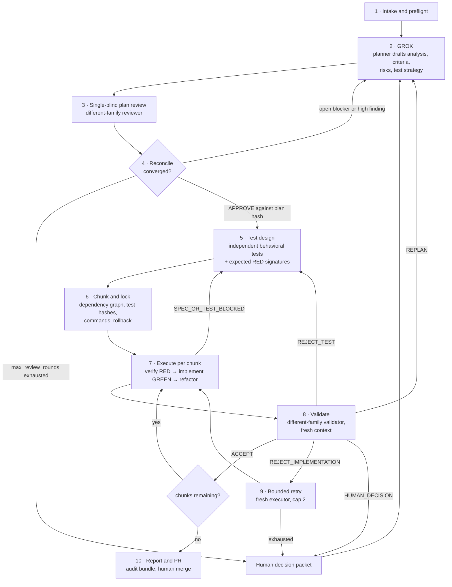
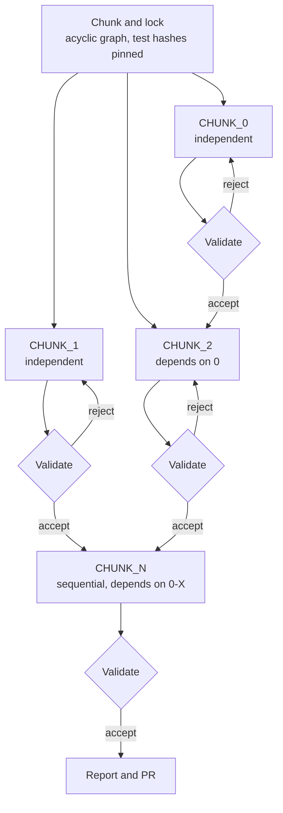

# Workflow

The end-to-end stage machine from PRD §5. Ten stages, each with a gate that must pass before the run leaves it. Stages are not advisory phases: the wrapper refuses the transition when the gate fails, and several gates route backwards rather than forwards.

Every backward edge in that diagram is a gate doing its job. A run that only ever moves forward has not exercised the method.

---

## 1. Intake and preflight

**Who runs it.** The orchestrator.

**Inputs.** A goal, possibly a single line. PRD §5.1 is explicit that execution cannot begin from an unreviewed one-line prompt, so intake's job is to turn it into something checkable.

**Outputs.** Preflight produces or verifies:

- source commit and an isolated sprint branch or worktree;
- clean handling of any pre-existing user changes;
- baseline build, lint, and test commands, plus their current results;
- explicit acceptance criteria and out-of-scope boundaries;
- allowed files, tools, credentials, network access, and autonomy level;
- budget, timeout, retry limit, and human-gate policy;
- resolvable model IDs and valid family separation;
- an artifact directory that is writable and excluded from product behavior where appropriate.

**Gate.** All of the above resolve, and family separation validates. If baseline tests already fail or are flaky, the run records that state and either narrows the gate to an approved test subset or stops for human disposition. It never attributes pre-existing failures to the new change, a rule that also protects every later gate, since a run that mislabels its own baseline will mislabel its results.

---

## 2. GROK, the planning stage

**Who runs it.** The planner, a frontier model, read-only during planning.

**Inputs.** The approved goal and boundaries; the repository.

**Outputs.** A plan document containing current state and root cause or opportunity; affected public behaviors, systems, dependencies and likely files; assumptions and open questions; a risk table with severity, probability, impact, mitigation and review trigger; acceptance criteria written as observable outcomes; a test strategy across unit, integration, contract and end-to-end boundaries as applicable; and a rollback and recovery strategy.

**Gate.** The plan is hashed and handed to review. Acceptance criteria stated as observable outcomes is the substantive requirement here: a criterion that cannot be observed cannot later be tested, so a vague plan fails at stage 5 rather than stage 2.

---

## 3. Single-blind plan review

**Who runs it.** The plan reviewer, from a **different family** than the planner, read-only.

**Inputs.** The plan document and repository evidence. **Not** the planner's private reasoning, and **not** a competing review.

**Outputs.** Structured findings against the schema in PRD §5.3: `id`, `severity` (blocker/high/medium/low), `category` (semantic/factual/test-gap/scope/operability/style), `plan_section`, `claim`, `evidence` as paths-with-lines or command results, `recommended_change`, `risk_if_ignored`, `status`, `disposition_rationale`.

**Gate.** Findings are emitted with evidence. A finding without evidence is not actionable, and PRD §13 measures finding *precision* precisely so that nitpicking is penalised rather than rewarded.

**Why single-blind and not double-blind.** The reviewer reads the plan, so it inherits the plan's framing, vocabulary, and choice of what to make salient. PRD §5.3 refuses the term "blind review" for this reason: calling it that would encourage exactly the over-trust in independence the method exists to avoid.

---

## 4. Reconcile

**Who runs it.** The orchestrator, with the planner revising and the reviewer re-reviewing. Human gates fire here according to the `oversight` setting.

**Inputs.** The plan and the findings.

**Outputs.** A disposition on every finding, and either a converged plan or a decision packet.

**Gate: convergence.** A plan converges when all four hold:

1. no blocker or high-severity finding remains open;
2. every factual, semantic, scope and test-gap finding has a recorded disposition;
3. acceptance criteria, rollback and test strategy are internally consistent; and
4. the reviewer returns `APPROVE` **against that exact plan hash**.

The hash binding is the part that matters. An approval of "the plan" is worthless if the plan then changes; an approval of a hash is a claim about a specific artifact.

**Bound.** `max_review_rounds`, default 2 revisions. Non-convergence pauses the run with a concise decision packet for a human. PRD §5.3 records that 2 was challenged during review as too tight for legitimate scope disagreement, kept anyway because it is a tuning parameter with a human escape hatch already attached, and should be set from observed non-convergence rates rather than intuition.

**Agreement is not correctness.** Reconciliation may leave both positions on the record. Agreement is the absence of a known dispute and nothing more.

---

## 5. Test design and expected RED

**Who runs it.** The planner and reviewer each audit the test strategy independently using the `review-tests` skill, and their outputs are merged **only after both passes complete**, because merging early would anchor the second pass on the first. A designated test designer then authors the final behavioral tests through public interfaces. Whether that designer is the plan-reviewer model or a third independent model is an open decision (PRD §16).

**Inputs.** The converged plan; the repository.

**Outputs.** Behavioral tests written against public boundaries, and one required-RED record per behavior: `behavior`, `test_id`, `test_sha256`, `command`, `expected_failure`, `exit_code`, `observed_failure`, `classification`.

**Gate.** Each record's predicted failure is stated before anything runs. Valid RED means the test collected, executed the intended path, reached its assertion, and failed because the required behavior is absent or wrong. The invalid-RED classes and why the distinction is load-bearing are in [Invariants](./invariants.md#4-valid-red-before-green).

Documented exceptions (refactors, docs-only changes, test-only cleanup, fixes with an already-failing test) are approved by the validator **before** execution.

---

## 6. Chunk and lock

**Who runs it.** The orchestrator.

**Inputs.** The converged plan and the authored tests.

**Why chunking happens here and not earlier.** Test findings change scope and dependencies. Final chunking after test design is deliberate: chunking first and then discovering a test gap invalidates the chunk graph.

**Outputs.** Per chunk: one bounded outcome with observable success criteria; dependencies and semantic interfaces, not merely overlapping file paths; allowed implementation files and locked test files; exact RED, focused GREEN, full-suite, lint and build commands; expected outputs or pass conditions; risk level and human-review trigger; rollback method; retry and escalation behavior; and a standardised result block.

The chunk graph is the artifact this stage produces. Independent chunks may run in parallel; anything with a dependency waits, and validation sits between each chunk rather than at the end of the batch:

Parallelism is an option the graph permits, not a default it assumes. The template's own guidance is to prefer sequential chunks with validation between each, and to use parallel chunks only when file boundaries and dependencies are clean (`templates/SPRINT-PLANNING-TEMPLATE.md`).

**Gate.** Test hashes are pinned and the dependency graph is acyclic. Chunks are **sequential by default**. Parallel execution requires clean file boundaries **and** no shared schema, configuration, generated artifact, migration order, API contract, or behavioral dependency. PRD §14 rates "parallel chunks conflict semantically without touching the same file" as a high-severity risk, which is why file-level disjointness alone is not sufficient.

Chunk prompts carry enough repository context and public examples to execute safely but **do not prescribe a full implementation**. Over-specifying would anchor the executor and make black-box tests more likely to mirror the code.

---

## 7. Execute, per chunk

**Who runs it.** The executor, a cheap or fast model, with write access to the approved implementation files only.

**Inputs.** The approved chunk, the repository worktree, and focused commands. **Not** the review debate.

**Outputs.** A diff and a chunk artifact.

**The cycle**, for each behavior-changing chunk (PRD §5.6):

1. Re-run the locked RED command.
2. Confirm the test hash and the expected behavioral failure.
3. Implement only within the allowed scope.
4. Run the focused test to GREEN.
5. Refactor while keeping the focused test green.
6. Run the approved regression commands.
7. Emit the chunk artifact and diff.

**Gates.** Step 2 is the RED gate: no implementation without a matching hash and a matching failure reason. A hook blocks writes to locked test files throughout. If the spec or test is wrong, the executor reports `SPEC_OR_TEST_BLOCKED` and routes back to test design; it does not "fix" the test. A test change wanted after GREEN is `TEST_REFACTOR_REQUESTED`, which is a separate reviewed transition rather than an exception to the lock.

---

## 8. Validate

**Who runs it.** The validator, from a **different family** than the executor, in a **fresh context**, with read-only repository access plus test and build execution.

**Inputs.** The approved chunk spec and hashes; base and result commits and the diff; read-only access to the relevant repository, not only the diff; RED/GREEN records and command output. **No executor transcript or self-assessment.**

**What it checks.** Observable behavior, scope, regression results, error paths, rollback impact, and test quality. Test review rejects private or internal coupling, weak truthiness, tautologies, conditional assertions, timing sleeps, mocks of the subject under test, and assertions that merely replay implementation details.

**Outputs.** One verdict: `ACCEPT`, `REJECT_IMPLEMENTATION`, `REJECT_TEST`, `REPLAN`, or `HUMAN_DECISION`, recorded together with the evidence behind it, not just the verdict. PRD §9 classifies validation verdicts as only *semi*-verifiable: the judgment is not checkable but the commands and results behind it are, so the evidence is what gets stored.

**Gate.** A rejected chunk cannot be marked complete. This is invariant 6.

---

## 9. Bounded retry and routing

**Who runs it.** The orchestrator's state machine.

Each verdict has exactly one destination:

| Verdict | Destination | Bound |
|---|---|---|
| `ACCEPT` | Next chunk, or report | — |
| `REJECT_IMPLEMENTATION` | A **fresh** executor attempt | capped at 2 |
| `REJECT_TEST` | Test design; invalidates downstream locks | — |
| `REPLAN` | GROK/CHUNK, for scope or architectural invalidation | — |
| `HUMAN_DECISION` | Decision packet | — |

Repeated rejection or ambiguous ownership pauses for a human. An executor may be escalated one tier after a failed attempt if the chunk exceeds its declared complexity ceiling, with the reason, incremental cost, and model change recorded.

**Human decision packets are batched.** Each item explains what changed, why the run paused, the competing positions, the evidence, the cost of delay, and the available actions. Unknown disagreement classifications fail toward review rather than auto-dismissal; stylistic findings never block on their own.

---

## 10. Report and PR

**Who runs it.** The orchestrator.

**Inputs.** The full artifact set under `.factory/adversarial-sprints/<run-id>/` or another configured path: `run.json`, `goal.md`, hashed plan history, `findings.jsonl`, `tests.json`, `chunks/`, `evidence/`, `validation/`.

**Outputs.** Local commits on the sprint branch, optionally a PR, and `RESULTS.md`: findings and dispositions, model assignments, test evidence, retries, elapsed time, and credit or token usage where available.

**Gate.** The report distinguishes **evidence from inference** and includes unresolved risks. Then a human approves the merge. No auto-merge, ever.

---

## Resumability

`run.json` is the resumable state machine. A resumed run rechecks the source commit, working-tree state, plan and test hashes, resolved model assignments, and completed gates before continuing. Stale or mismatched state pauses rather than replaying mutations, because resuming into a changed world is how a gate gets bypassed without anyone deciding to bypass it.

Secrets and raw chain-of-thought are never written to artifacts, and command output is filtered for secrets before persistence.

---

## What Phase 0 moved into the command wrapper

PRD §8 mapped several stages onto Factory Missions. `droid exec --mission` performs no work while reporting success at CLI 0.186.0 ([Probe 1](../probes/probe-1-model-pinning.md)), and the per-role model flags are only valid with `--mission`, so the §8 contingency took effect. The stage machine above is unchanged; the ownership of four things is not.

| Stage or concern | Was going to be | Now owned by the wrapper | Verified by |
|---|---|---|---|
| **7 · Execute** — per-role model pinning | Mission `--worker-model` / `--validator-model` | One `droid exec --model <id>` per role | [Probe 2](../probes/probe-2-fallback-safety.md) |
| **8, 9 · Validate and retry routing** — the whole state machine | Mission validation stage routing rejection back to retry or re-plan | The wrapper's own state machine; this is project code, not a platform feature | Probe 5, unreached |
| **10 · Report** — run artifact capture | Mission artifacts | Hook-side log plus session transcript | [Probe 4](../probes/probe-4-hook-blocking.md), Test D |
| Per-role cost attribution | Mission-scoped usage data | `usage.factory_credits` is **per run**, so one invocation per role attributes cleanly | [Probe 2](../probes/probe-2-fallback-safety.md) |

That last row went the other way: per-role cost attribution was thought to depend on missions and does not, which partially unblocks Probe 7 and hypothesis H3.

Stages 1 through 6 were never Mission-dependent, so they are unaffected. What changed is not the workflow but who guarantees it, and the answer for stages 7 to 10 is now "our code", which is why `phase-0/GO-NO-GO.md` puts the rejection state machine in the Phase 1 build order and insists it comes after the guard.

## Related

- [Invariants](./invariants.md) — the gates, stated as guarantees
- [Roles and models](./roles-and-models.md) — who runs each stage and with what constraint
- [Sprint template](./sprint-template.md) — the same machine, run by hand
- [Architecture](../overview/architecture.md), [Findings](../findings/index.md)
