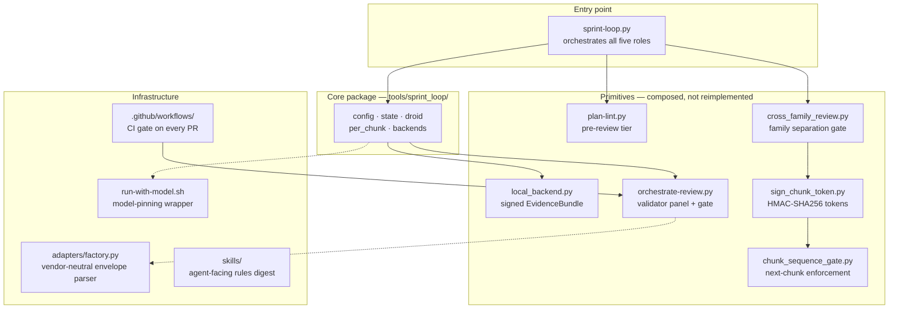

# Architecture

The repo is organized by **kind**, not by phase. Each phase's plans and prompts live under `planning/`, its committed evidence under `evidence/`, its scripts under `tools/`. This is deliberate: `planning/phase-3.2/` and `evidence/phase-3.2/` are two halves of one phase's record, and a reader can trace a finding from the plan that produced it to the evidence that backs it.

## Repository structure

```text
adversarial-sprint/
├── PRD.md                     full spec: problem, invariants, phases, evaluation design
├── AGENTS.md                  conventions for every agent working here
├── tools/                     the code
│   ├── OPERATING-RULES.md     operating discipline §1-§24, each rule with the incident behind it
│   ├── sprint-loop.py         Phase 4.5 loop runner entry point (1,544 lines)
│   ├── sprint_loop/           the runner package
│   │   ├── config.py          Config dataclass, model family map, layout roots
│   │   ├── state.py           pure-data state machine, family guard
│   │   ├── droid.py           droid exec wrapper, envelope parsing, telemetry
│   │   ├── backends.py        validation backend abstraction (local + CI stub)
│   │   ├── per_chunk.py       per-chunk inner loop: lock, RED, GREEN, evidence, validate
│   │   ├── chunk_close_banner.py  operator-eye visual signal (✅/⛔)
│   │   └── prompts/           pluggable role-prompt templates
│   ├── orchestrate-review.py  mechanical review pipeline
│   ├── plan-lint.py           deterministic pre-review tier (1,470 lines, 7 rules)
│   ├── cross_family_review.py refusal-at-parse cross-family gate
│   ├── chunk_sequence_gate.py refuses next chunk when prior token is missing
│   ├── sign_chunk_token.py    HMAC-SHA256 chunk-completion tokens
│   ├── run-with-model.sh      model-pinning enforcement wrapper
│   ├── run-review.sh          per-chunk review wrapper
│   ├── adapters/              vendor-neutral seam (Factory adapter today)
│   ├── conventions/           model discipline, skill distribution, review bundle
│   ├── phase-1-scripts/       lock.py, valid-red.py, verify-green.py
│   ├── phase-3.2-evidence/    local_backend.py, EvidenceBundle producer
│   ├── phase-5-scripts/       fire-design-review.sh, envelope-manifest.py
│   ├── fixtures/              probe rigs and forged-input test fixtures
│   └── KNOWN-ISSUES.md        what is broken, what is deferred, what is open
├── templates/                 canonical GROK → CHUNK → EXECUTE method + per-pilot overlay
├── skills/                    agent-facing skill assets (digest + index + rehydration)
├── planning/                  per-phase plans, prompts, run records, roadmap review
│   ├── phase-0/ through phase-5/
│   ├── layout-refactor/       the D1-D5A reorg that restructured the tree
│   └── evidence-hygiene/      evidence consolidation and cleanup
├── evidence/                  the build record: probes, envelopes, findings, signed tokens
│   ├── LEDGER.md              append-only review ledger
│   ├── phase-0/               probe evidence
│   ├── phase-4.5/             chunk tokens and build evidence
│   └── reviews/               per-chunk review bundles (sprint-keyed)
├── tests/                     233 tests over gates, runner, plan lint, repo layout
├── telemetry/                 runs.jsonl, findings.jsonl, SCHEMA.md (gitignored data)
└── .github/workflows/         CI: adversarial-sprint-ci.yml
```

## How the pieces connect

Four layers: entry point calls the core package, the core package composes the primitives, infrastructure wraps everything. Dashed lines are "used by" rather than "calls." The detailed flow of one chunk through these pieces is in [features](../features/index.md).



## The vendor seam

The adapter in `tools/adapters/factory.py` is the single place where Factory's envelope format is translated into a vendor-neutral shape. Gates assert on the neutral shape, not on Factory's field names. Swapping in another CLI (Codex, Claude Code, Ollama) is a new adapter file, not a rewrite of the gates. See `tools/adapters/README.md` for the contract.

## Evidence lives in the repo, not in `.factory/`

`.factory/` is gitignored as local tool state. Evidence written there would be invisible to git and would not travel between machines. The repo's own thesis - "assert on reality, not self-assessment" - requires the reality to be committed. `evidence/` is where it lives.

## The layout refactor

The repo was reorganized in chunks D1 through D5A. Phase directories that used to sit at the root (`phase-0/`, `phase-1/`, etc.) were moved to their taxonomy homes: plans under `planning/`, evidence under `evidence/`, scripts under `tools/`. A 45-row prefix table in `planning/PATH-REDIRECTS.md` maps every old path to its new location. The refactor was itself run through the adversarial sprint method - each chunk was spec'd, reviewed, and gated.

See [lore](../lore.md) for the full timeline and [patterns and conventions](../how-to-contribute/patterns-and-conventions.md) for the operating rules.
