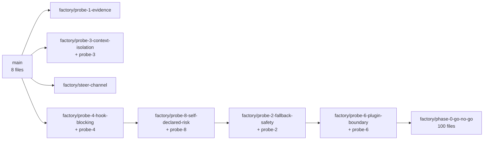
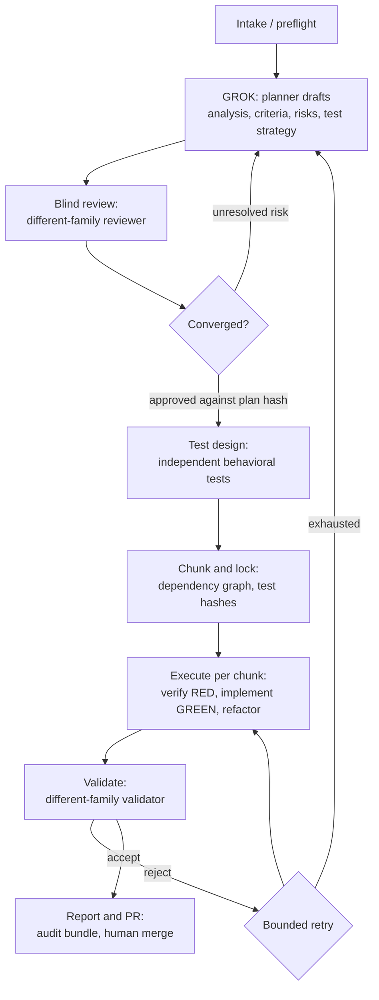
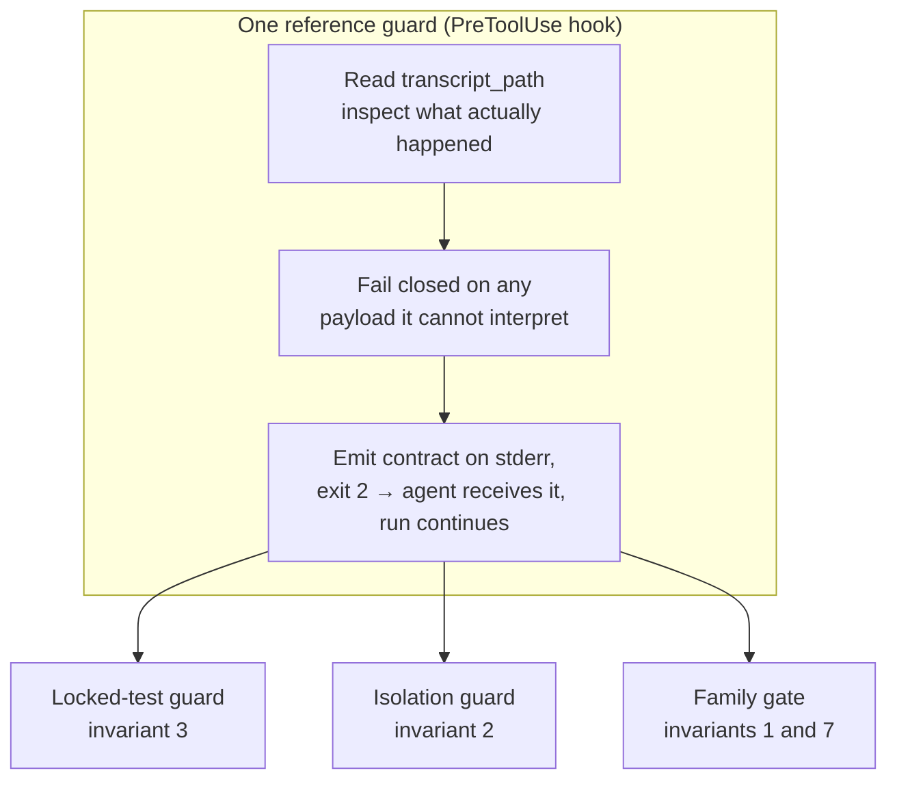

# Architecture

Two architectures matter in this repository, and confusing them is the most common way to misread it.

1. **The repository's own structure** — a spec, a method template, and probe evidence. This is what exists today.
2. **The system the spec describes** — the Adversarial Sprint plugin. This does not exist yet; Phase 0 was the gate deciding whether it can.

## Repository structure

```text
adversarial-sprint/
├── README.md                              entry point and one-page pitch
├── AGENTS.md                              conventions for every agent working here
├── PRD.md                                 full spec: problem, invariants, phases, evaluation
├── templates/
│   └── SPRINT-PLANNING-TEMPLATE.md        canonical GROK/CHUNK/EXECUTE method
└── phase-0/
    ├── README.md                          the eight probes and their verdicts
    ├── GO-NO-GO.md                        Phase 0 decision
    └── evidence/
        ├── README.md                      what a probe record must contain
        ├── probe-1/ … probe-8/            one directory per probe
        │   ├── README.md                  the finding, with reasoning
        │   ├── raw/                       captured stdout, exit codes, hook logs
        │   ├── rig/                       the hook scripts and configs under test
        │   └── run.sh                     re-runs every measurement
        └── …
```

There is no build, no dependency manifest, and no test suite in the conventional sense. The executable artifacts are the probe rigs: Python hook scripts and `run.sh` reproduction scripts. See [Getting started](./getting-started.md).

### Evidence lives in the repo, not in `.factory/`

PRD §9 nominates `.factory/adversarial-sprints/<run-id>/` as the default artifact path, but `.factory/` is gitignored here as local tool state, so evidence written there would be invisible to git. Phase 0's exit criteria require a *captured* run artifact, and §9 permits "another configured artifact path". `phase-0/evidence/` is that path. The reasoning is recorded in `phase-0/evidence/README.md`.

### Content is distributed across branches

Unusually, the repository's content depends on which branch you are on. Each probe was recorded on its own branch, and later probes were chained onto earlier ones so results accumulate:



`factory/phase-0-go-no-go` carries the most complete record, with one exception: **Probe 3's evidence exists only on `factory/probe-3-context-isolation`** and has not been merged into the chain. Nothing has landed on `main` beyond the initial commits, because `AGENTS.md` requires review before merge.

> **Branch consolidation pending.** This scattered state is cleanup debt from running the probes, not the intended structure. Consolidation onto a single reviewed line is planned, after which `main` becomes the place to read the complete record and this section will be revised.

The branch-per-author, branch-per-probe convention is described in [Development workflow](../how-to-contribute/development-workflow.md).

## The system the spec describes

The plugin composes existing Factory surfaces around a workflow gap. It does not replace Missions, Spec Mode, custom Droids, hooks, or CI.



Each stage is detailed in [Workflow](../method/workflow.md); the role and model policy is in [Roles and models](../method/roles-and-models.md).

### Enforcement, not suggestion

The distinguishing claim is that independence and evidence are **structural properties of the run**, not prompt instructions. Phase 0 tested whether the platform can actually deliver that, and the answer shaped the architecture significantly.



One primitive, three policies. This is the central architectural conclusion of Phase 0 and is documented in [The reference guard](../findings/reference-guard.md).

### What changed because of Phase 0

| Spec assumption | Phase 0 result | Architectural consequence |
|---|---|---|
| Missions orchestrate worker and validator stages | `droid exec --mission` performs no work ([Probe 1](../probes/probe-1-model-pinning.md)) | Command-orchestrated state machine instead; the §8 contingency |
| Mission flags pin per-role models | Flags exist but are `--mission`-only | One `droid exec --model <id>` per role ([Probe 2](../probes/probe-2-fallback-safety.md)) |
| Hooks block locked-test edits | True, but only via specific registration channels ([Probe 4](../probes/probe-4-hook-blocking.md)) | Guard must live in `settings.json` or a plugin, match `Execute`, and fail closed |
| Custom Droids give isolated context | True at the agent channel, false at the storage layer ([Probe 3](../probes/probe-3-context-isolation.md)) | Isolation needs an active guard, not just a Droid definition |
| Per-role cost attribution needs Missions | `usage.factory_credits` is per run | One invocation per role attributes cost directly |

## Trust boundaries

The system runs untrusted-ish model output against a real repository, so the boundaries matter. They are covered in [Security](../security.md), but in summary:

- **Model output is not trusted** to respect a policy stated in a prompt. [Probe 3](../probes/probe-3-context-isolation.md) and [Probe 4](../probes/probe-4-hook-blocking.md) both show cases where a model complied out of good manners, which is not enforcement.
- **The autonomy tier is not a security boundary** for an untrusted role, because it gates partly on a label the model supplies about its own command ([Probe 8](../probes/probe-8-self-declared-risk.md)).
- **Tool restriction is not path protection.** Disabling the `Edit` tool did not protect a file; the agent used a shell instead.
- **The session store is a shared surface.** Any agent with `Grep` can read a prior agent's transcript from `~/.factory/sessions/`.

## Key source files

| File | Purpose |
|---|---|
| `PRD.md` | Full specification: problem, hypotheses, invariants, workflow, phases, evaluation design |
| `README.md` | Project entry point and summary of the four core properties |
| `AGENTS.md` | Conventions binding every agent that works in the repo |
| `templates/SPRINT-PLANNING-TEMPLATE.md` | Canonical GROK → CHUNK → EXECUTE method, 666 lines |
| `phase-0/README.md` | The eight probes, their questions, and recorded verdicts |
| `phase-0/GO-NO-GO.md` | Phase 0 decision, invariant scorecard, build order |
| `phase-0/evidence/README.md` | Standard every probe record must meet |
| `phase-0/evidence/probe-4/reverify/rig/hook-protect2.py` | The fail-closed guard that holds against a shell bypass |
| `phase-0/evidence/probe-2/rig/hook-family-gate.py` | The family gate that aborts a wrong-model run before any tool acts |
