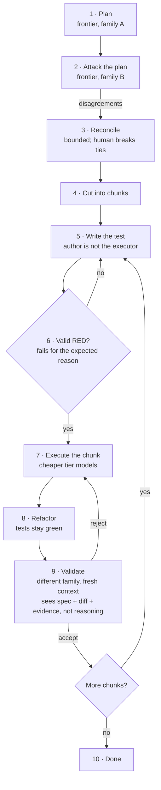
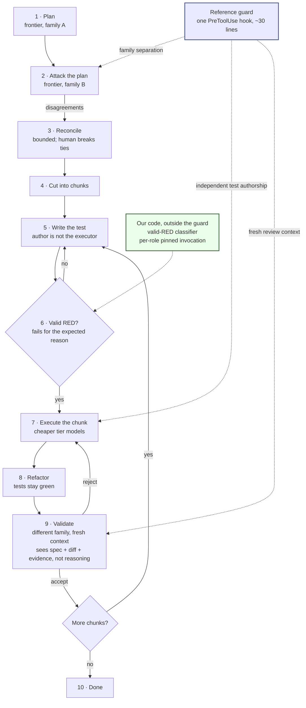

# Adversarial Sprint

A framework for getting better code out of coding agents, because quality comes from structural independence rather than a smarter model.

Two or more agents from **different model families** plan the work, attack each other's plan, cut it into chunks, and independently validate every chunk before the next one starts. No agent grades its own work. No agent reviewing a piece of work sees the reasoning of the agent that produced it. A chunk is done when a test written by someone else, locked by hash, and observed failing for the right reason now passes. Not when the executor says so.

## Why you should care

Coding agents fail quietly. They report success for work they did not do, and the report looks exactly like a report of work they did do.

That is not a hypothesis here. It is what happened:

- An agent given a real task that performed no work and exited 0
- A hook registered in the documented location that never loaded
- A cheap executor that clobbered the locked test instead of fixing the code
- Two frontier models that looked at the same failing test and returned opposite verdicts
- Accidentally giving Haiku the keys to drive a 5-chunk refactor (and no one noticed until the morning!)
- A forged transcript that passed every gate with zero real validation

Each one is reproducible from a command recorded in this repository. The full stories are in [lore](../lore.md), and the pattern is written up in [Silent green](../findings/silent-green.md).

If you run agents unattended, that is the real exposure. Not a bad diff you can see in review, but a green check you believe. Adversarial Sprint starts from the assumption that **a run's own account of itself is not evidence**, and builds the loop so that something other than the executor decides whether the work is done.

## How it works

One frontier model plans. A model from a different family attacks that plan. The disagreements are reconciled, the work is cut into chunks, and each chunk runs a test-first cycle whose result is checked by a model that did not write it.

Four properties carry the method, all enforced rather than suggested:

1. **Family separation.** The plan reviewer is not the planner's family. The validator is not the executor's family.
2. **Fresh review context.** The validator sees the spec, the diff, read-only repo state, and test evidence. It never sees the executor's reasoning.
3. **Independent test authorship.** The executor cannot write or modify the tests that judge it. Locked by content hash, enforced by a hook.
4. **Valid RED before GREEN.** Behavior-changing work cannot start until the intended assertion has run and failed for the expected reason.

Enforcement is layered: chunk close is gated by an HMAC-signed token bound to reviewer envelopes on disk, the author is never the verifier, and validators are checked for being more than each other's paraphrase. See [chunk token gates](../features/chunk-token-gates.md) for the enforcement architecture.

The same loop, with the enforcement layer visible:

What changes is that each handoff becomes a contract that something checks, rather than a discipline someone maintains. The guard is one roughly thirty-line `PreToolUse` hook that reads what actually happened and fails closed on any payload it cannot interpret.

## What it is not

Not a replacement for Factory Missions, Spec Mode, custom Droids, hooks, or CI. It composes those around a workflow gap. It makes no claim to be a correctness oracle: different model families are an independence control, not proof; tests are executable evidence, not truth; two reviewers agreeing means no known dispute, nothing more.

The value is a governed process that makes assumptions, disagreements, and evidence **visible**.

## Where to go next

- [Architecture](architecture.md) - how the repo is organized and how the pieces connect
- [Getting started](getting-started.md) - clone, install, run tests, fire a sprint
- [The method](../method.md) - the GROK, CHUNK, EXECUTE workflow and eight invariants
- [Findings](../findings/index.md) - the four headline discoveries and what they mean
- [How to contribute](../how-to-contribute/index.md) - how to jump in or adopt the method on your own project
