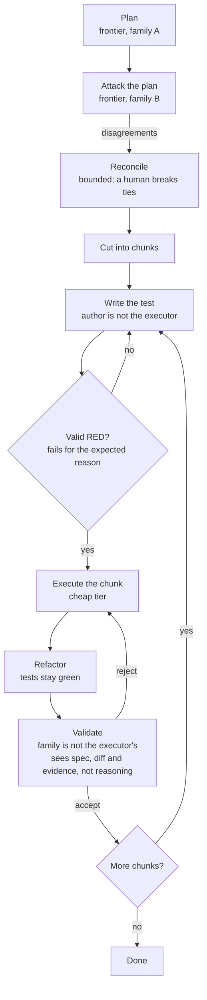
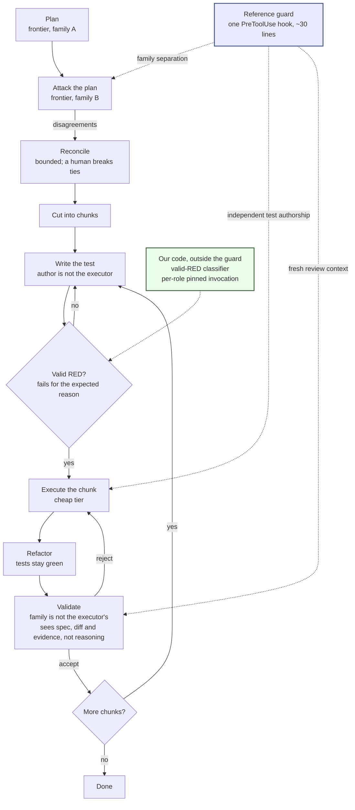

# Adversarial Sprint

**A framework for getting better code out of coding agents, because quality comes from structural independence rather than a smarter model.**

Two or more agents from **different model families** plan the work, attack each other's plan, cut it into chunks, and independently validate every chunk before the next one starts. No agent grades its own work, and no agent reviewing a piece of work is allowed to see the reasoning of the agent that produced it.

That is the primary claim and it is a claim about correctness. The measure for it is the hidden acceptance-test pass rate, which `PRD.md` §13 names as the primary external correctness measure. Spend is a separate question, handled further down as an allocatable lever rather than a second headline promise.

## Why you should care

Coding agents fail quietly. They report success for work they did not do, and the report looks exactly like a report of work they did.

That is not a hypothesis here. Four separate probes against a shipping product at a pinned version hit the same shape:

- a mission that performs no work and exits 0 ([Probe 1](../probes/probe-1-model-pinning.md))
- a hook registered in the documented location that is never loaded ([Probe 4](../probes/probe-4-hook-blocking.md))
- a model silently downgraded from maximum reasoning to none ([Probe 2](../probes/probe-2-fallback-safety.md))
- a run whose every tool call was denied, still exiting 0 with a plausible-looking answer ([Probe 2](../probes/probe-2-fallback-safety.md))

Each one is reproducible from a command recorded in this repository. The pattern is written up in [Silent green](../findings/silent-green.md).

If you run agents unattended, that is the real exposure. Not a bad diff you can see in review, but a green check you believe. Adversarial Sprint starts from the assumption that **a run's own account of itself is not evidence**, and builds the loop so that something other than the executor decides whether the work is done.

## How it works

One frontier model plans. A model from a different family attacks that plan. The disagreements are reconciled, the work is cut into chunks, and then each chunk runs a small test-first cycle whose result is checked by a model that did not write it.

### The method, run by hand today

This is the GROK, CHUNK and EXECUTE method in `templates/SPRINT-PLANNING-TEMPLATE.md`, the canonical copy this project packages. It has been run by hand for months and it works. Chunking is a defined stage there rather than a box invented for this page, and it carries a dependency graph in which independent chunks may run in parallel while dependent ones stay sequential. The diagram keeps one chunk in view for legibility; the full graph is in [Workflow](../method/workflow.md).

Nothing on this diagram is speculative. Every separation in it is something a person currently holds in their head and remembers to do.

Four properties carry the method, and all four are meant to be enforced rather than suggested:

1. **Family separation.** The plan reviewer is not the planner's family; the validator is not the executor's family. Two passes from one model family are one opinion twice.
2. **Fresh review context.** The validator sees the approved spec, the diff, read-only repository state, and test evidence. It never sees the executor's reasoning.
3. **Independent test authorship.** The executor cannot write or modify the tests that judge it. Locked by content hash, enforced by a hook.
4. **Valid RED before GREEN.** Behavior-changing work cannot start until the intended assertion has run and failed *for the expected reason*. A syntax error is not a RED.

Validation happens **per chunk, not at the end**. A rejected chunk is a cheap retry against a small diff, and the next chunk does not start on top of unvalidated work. The full set of eight runtime invariants is in [Invariants](../method/invariants.md), and the stage-by-stage walkthrough is in [Workflow](../method/workflow.md).

### The enforcement, and what the phases build

The same loop. What changes is that each handoff becomes a contract that something checks, rather than a discipline someone maintains.

One guard, three policies. That shape is the finding rather than a simplification of it: Phase 0's most useful constructive result is that independent test authorship, fresh review context and family separation collapse into a single `PreToolUse` hook of roughly thirty lines, differing only in what it inspects and what it refuses ([The reference guard](../findings/reference-guard.md)).

Two things sit outside the guard. One is the valid-RED classification. The other is per-role pinned invocation, and the diagram under-draws it deliberately: **pinning applies at every role invocation in the loop, not only at the RED gate.** Each role is a separate `droid exec` with its model named explicitly, so the property attaches to all five seats; the dotted line lands on one node purely to keep the picture readable.

**Where each contract actually stands.** These are not uniformly unbuilt, and the differences matter:

| Contract | State |
|---|---|
| Family separation | Platform primitive **verified** in Phase 0. Explicit `--model` pins resolve exactly and an invalid ID fails closed at exit 1 ([Probe 2](../probes/probe-2-fallback-safety.md)). |
| Locked tests | Platform primitive **verified**, conditionally. A hook blocks the executor's own edit and the run continues on the refusal, provided it is registered correctly and fails closed ([Probe 4](../probes/probe-4-hook-blocking.md)). |
| Fresh review context | **Enforceable, not default, and holed.** The executor's session is readable off disk with `Grep` alone, and independently via `droid search`. Isolation holds only if the guard blocks those paths ([Probe 3](../probes/probe-3-context-isolation.md)). |
| Valid RED, and the guard itself | **Our code, not yet written.** The platform will not classify a RED or detect its own silent degradation; that detection is ours to build. |

So the enforcement layer is part verified primitive and part unwritten code, and one of its contracts has a known hole with a known fix. What does not exist in any form is a measured result: no arm of the `PRD.md` §13 comparison has been run, under any configuration.

## Where the tokens go

**The claim in this section is not that the method costs less.** It is that spend stops being a single dial on one model and becomes something the design places deliberately.

The method spends *more* than a single-model run on planning, adversarial plan review, test design, and per-chunk validation. That is intentional. Those are the points where being wrong is expensive, because an error in the plan propagates into every chunk built on top of it, and an error the validator misses ships.

That front-loaded spend is what makes the cheapest seat safe. By the time any implementation code is written, the work has been planned, attacked by a model from a different family, cut into a bounded chunk with a declared complexity ceiling, and given a test that has already failed for the expected reason. The executor is not being asked to decide what to do. It fills a specified hole with a test watching. That is why the cheapest model in the loop is the one holding the only seat with implementation write access.

This argument is not back-fitted to justify the design. The canonical template states it as a standing principle, in those words: **"Low-token execution: plan once, execute in small chunks with minimal context"** (`templates/SPRINT-PLANNING-TEMPLATE.md`). The allocation came first and the method was built around it, well before this page existed to argue for it.

| Role | Default tier | Write access |
|---|---|---|
| Planner / orchestrator | Frontier | Read-only while planning |
| Plan reviewer | Frontier | Read-only |
| Test designer | Frontier or mid | Test files only |
| **Executor** | **Cheap / fast** | **Implementation files** |
| Validator | Mid / frontier | Read-only, plus test execution |

The escalation rule follows the same reasoning. An executor may be escalated one tier after a single failed attempt, but repeated escalation is treated as evidence that the *chunking* was wrong, so the chunk is re-cut rather than handed to a larger model ([Roles and models](../method/roles-and-models.md)). A bigger model is not the first lever reached for when something fails.

### The harness as a tuning instrument

Every seat in the loop takes a model family and a cost tier as parameters. Nothing in the design pins a particular assignment, so the same harness can run one task repeatedly across different seat configurations and read off what each configuration produced on both axes independently: correctness, via the hidden acceptance-test pass rate, and spend, attributed per role.

Framed that way, the three comparison runs in `PRD.md` §13 (a single frontier model that plans and reviews its own work; all-frontier separated roles; the role-tiered adversarial workflow) stop being a one-off A/B/C and become three sampled points on a surface the rig could sample more densely.

**None of this has been run.** There is no tradeoff curve, no sampled surface, and no result of any kind to report. A quality-versus-spend plot is an *output the instrument is designed to produce*, not a claim this project is making, and the two axes are deliberately kept separate rather than collapsed into a ratio: a ratio that improves tells you nothing about which of the two terms moved. This subsection describes what becomes measurable next, on the same terms as everything else on this page.

**What is claimed, and what is not.** The target in `PRD.md` §13 is at least 25% lower credit and token cost than an all-frontier run at no loss in hidden acceptance-test pass rate, and the PRD states it as a goal rather than a guaranteed outcome. That number has **not been measured**, because the pilot that would measure it has not been run. Nor has any other arm of the §13 comparison: no pilot task has been run end to end under any of the three configurations, so there is no baseline to compare against and no figure to quote in either direction.

What Phase 0 did establish is that it will be measurable. Per-role cost attribution was assumed to depend on Missions, which turned out to be broken; instead, `usage.factory_credits` is reported per run, so invoking once per role attributes cost cleanly (`phase-0/GO-NO-GO.md`). `PRD.md` §4 commits to making no cost claim at all if attribution proves unavailable, on the grounds that an unmeasured cost claim invites a question that cannot be answered. That commitment still stands, and it is why this section describes a mechanism and an instrument instead of a headline figure.

## Why this is not already solved

The primitives exist. Phase 0 confirmed that tool restrictions on a custom agent are genuinely enforced rather than merely requested ([Probe 3](../probes/probe-3-context-isolation.md)), that hooks can deterministically block a tool call ([Probe 4](../probes/probe-4-hook-blocking.md)), that an agent, a skill and a hook ship as a single install ([Probe 6](../probes/probe-6-plugin-boundary.md)), and that a model family gate can be enforced at invocation time ([Probe 2](../probes/probe-2-fallback-safety.md)).

What does not exist is the layer above them: anything that **sequences the roles and constrains what crosses the boundary between them**. The obvious candidate was Missions, and `droid exec --mission` performs no work while reporting success, which removed that path and forced the design to be command-orchestrated. The go/no-go puts it plainly: the wrapper owns the state machine, so this is our code, not a platform feature.

So the gap this project fills is not intelligence and not tooling. It is the **handoff** — a formal, enforced contract for what one agent hands the next, and what the next one is allowed to see. Today that handoff is a convention someone remembers to follow. The working version of it is already running by hand in this repository, where commits are the only baton between agents (`tools/wake-loop.md`).

*Scope note: Probe 1 tested `droid exec --mission`, the scriptable path. The interactive Missions flow was not tested, and no claim is made about it.*

## Roadmap

The north star is a **replayable demo of the method on one bounded pilot change**, with the manual harness at Phase 0.5 as the honest comparison arm.

| Phase | What it delivers | Status |
|---|---|---|
| **0 — Feasibility spike** | Eight probes and a go/no-go on platform capabilities | **Done, GO** |
| **0.5 — Manual baseline harness** | The smallest honest two-CLI harness; the §13 comparison arm and Act 1 of the demo | Not started |
| **1 — Test-evidence slice** | Valid-RED classification, test locking, RED → GREEN on the pilot | Not started |
| **2 — Adversarial planning slice** | Blind plan review, bounded reconciliation, human decision packets | Not started |
| **3 — Factory end-to-end** | The full loop on one pilot change, plus a replayable demo and the baseline comparison | Not started |
| **4 — Generalize** | A second stack and a portable Claude/Codex runtime | Not started |

Each phase carries written exit criteria in `PRD.md` §11. A phase is finished when those are met, not when it looks finished, which is the same standard the probe records hold themselves to.

Phase 0.5 is the one most easily misread as optional. It is the baseline arm the §13 evaluation already requires, and the PRD is explicit that it must not be strawmanned: if a two-CLI shell harness turns out to be nearly as good as the plugin, that is a finding worth having before a demo rather than during one.

## Where we are against it

**Only Phase 0 has been built.** Everything from 0.5 onward is specified and not started. No code exists for any of it, and there is no partial implementation of a later phase hiding anywhere in the tree.

There is deliberately no application code yet. The repository is currently a **build gate**: a full product spec (`PRD.md`), the canonical sprint method it packages (`templates/SPRINT-PLANNING-TEMPLATE.md`), and a set of executed probes that test whether the platform can enforce what the spec assumes. Plugin directories get created once the probes say the design is buildable, not before.

**Phase 0 is complete and the verdict is GO, with one mandatory design change:** build it command-orchestrated rather than Mission-native. See `phase-0/GO-NO-GO.md`, summarised in [Findings](../findings/index.md).

A probe is a **Phase-0-only device**: one feasibility question aimed at the platform, used solely to decide the build gate. Later phases deliver vertical slices measured against exit criteria, not probes. The project is not made of probes, and the eight below are scaffolding for the decision rather than the product.

| Probe | Question | Verdict |
|---|---|---|
| [1](../probes/probe-1-model-pinning.md) | Per-role model pinning | **BLOCKED** — `droid exec --mission` is a no-op that reports success |
| [2](../probes/probe-2-fallback-safety.md) | Fallback safety | **CONDITIONAL PASS** — family gate works; found a silent reasoning downgrade |
| [3](../probes/probe-3-context-isolation.md) | Custom Droid context isolation | **PASS / GAP** — tools genuinely restricted; transcript readable off disk |
| [4](../probes/probe-4-hook-blocking.md) | Deterministic hook blocking | **PASS** (conditional) — overturned an earlier BLOCKED verdict |
| 5 | Rejection routing | Unreached — blocked by Probe 1 |
| [6](../probes/probe-6-plugin-boundary.md) | Plugin distribution boundary | **PASS** — droid, skill and hook ship as one install |
| 7 | Usage attribution | Partially unblocked by Probe 2 |
| [8](../probes/probe-8-self-declared-risk.md) | Self-declared risk as a policy input | **PASS with caveat** — the tier gates on a self-report |

Every verdict is scoped to `droid` **0.186.0** on macOS. A version-less result cannot be rechecked later, so each probe record carries the CLI version, and a CLI upgrade invalidates the go/no-go until the probes are re-run. The primitives were re-checked six patch versions back and held; see [Cross-version validation](../findings/cross-version-validation.md).

## Early evidence for the core bet

The central claim, that a second model from a different family catches what the first one misses, has one early data point rather than a result. A pilot spec was reviewed by two models from different families. They agreed on the accept decision, overlapped on one defect, and each independently raised one the other did not.

It is a single unblinded sample on a specification rather than code, and all three findings were graded as nits by the reviewers themselves. It is written up honestly, including the reading that cuts against the hypothesis, in [First H1 observation](../findings/first-h1-evidence.md).

The design consequence of Phase 0 is [one reference guard](../findings/reference-guard.md) that inspects reality instead of trusting configuration, which follows directly from the platform's inability to fail loudly.

## A note on scope and honesty

The repository makes no claim to be a correctness oracle. Different model families are an independence control, not proof. Tests are executable evidence, not truth. Two reviewers agreeing means no known dispute and nothing more.

The same standard applies to the probe records. Negative results get the same treatment as positive ones, an overturned verdict is kept alongside its correction rather than quietly edited, and unmeasured things are listed as unmeasured. See [Patterns and conventions](../how-to-contribute/patterns-and-conventions.md) for how that standard is applied in practice, and [Open questions](../background/open-questions.md) for what is still unresolved.

## Where to start

| If you want to | Read |
|---|---|
| Understand the method being packaged | [Method](../method/index.md) → [Workflow](../method/workflow.md) |
| Know what the platform can actually enforce | [Findings](../findings/index.md) |
| See the reasoning behind the design | [Background](../background/index.md) |
| Re-run a probe and check a claim yourself | [Getting started](./getting-started.md) |
| See how the pieces fit together | [Architecture](./architecture.md) |
| Look up a term | [Glossary](./glossary.md) |
| Contribute, as a human or an agent | [How to contribute](../how-to-contribute/index.md) |
