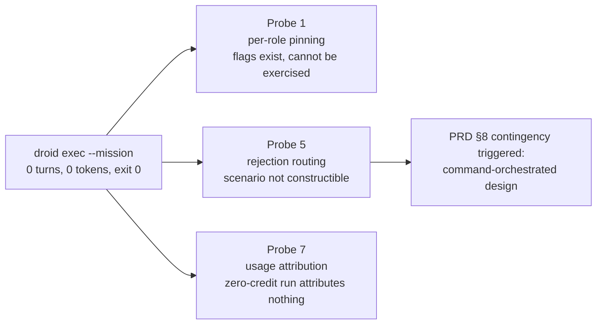

# Probe 1 — Per-role model pinning

**Verdict: BLOCKED. Probe 1 is not answered, and could not be reached.** The probe went looking for per-role model pinning and found something else: `droid exec --mission` performs no work and reports success. That single observation reshaped the design, blocked two other probes, and is the first of the four cases in [Silent green](../findings/silent-green.md).

| | |
|---|---|
| Question | Can the installed version pin distinct models to planner, reviewer, worker and validator roles? |
| Invariants at stake | [#1 family separation](../method/invariants.md), and by extension #7 explicit degradation |
| CLI under test | `droid` 0.186.0 |
| Scratch repo | `/tmp/mission-probe`, fresh `git init`, `README.md` committed |
| Record | `phase-0/evidence/probe-1/README.md` |
| Provenance | Transcribed from operator-run invocations. Raw stdout/stderr is **not** captured in the evidence directory — see [Reproduction gaps](#the-gaps-the-record-declares-on-itself). |

## The finding

```
cd /tmp/mission-probe          # fresh git repo, README.md committed
droid exec --mission --auto high --model claude-opus-5 "Add a one-line comment to README.md"
```

| Signal | Observed |
|---|---|
| `numTurns` | 0 |
| `input_tokens` | 0 |
| `credits` | 0 |
| exit code | **0** |

A concrete, achievable task, supplied as a positional prompt, in a real git repository, at the autonomy level required to perform it. Zero turns followed and the process exited successfully. `README.md` was never modified.

No worker or validator model flags were involved. This is the plainest mission invocation that could be expected to do something, which is what makes it a platform blocker rather than a misconfiguration on this side of the boundary.

## Why the benign explanations do not survive

Four readings would each make this unremarkable, and the record closes all four.

| Explanation | Why it is ruled out |
|---|---|
| **No prompt was supplied.** `droid exec --help` declares the prompt as an *optional* positional (`droid exec [options] [prompt]`), so a prompt-less invocation is legal and would be a dull reason to see zero turns. | A prompt was present and is quoted above. |
| **Nothing to work on.** | The working directory was a git repo with a committed `README.md`. |
| **Permission tier blocked the edit.** | `--auto high` cleared the tier needed to edit a tracked file. And a permission block is loud on this version: [Probe 3](./probe-3-context-isolation.md) shows it returning exit 1 with `is_error: true`. |
| **Model resolution failed.** | `-m, --model` already defaults to `claude-opus-5` at 0.186.0, so `--model claude-opus-5` was a no-op. The requested ID was the version default, not an unusual or possibly-unavailable one. |

## The surface exists; it could not be exercised

The per-role flags Probe 1 was written to test are present on 0.186.0. `--worker-model`, `--validator-model` and the matching `--*-reasoning-effort` options all appear in `--help`, documented as **"only valid with `--mission`"**.

So the capability is expressible on this version. What is untested is whether those flags resolve to the models named, because the mission that would exercise them does not run. That distinction is the accurate one-line summary of Probe 1: **the surface exists; it could not be exercised.**

Recording this as "Probe 1: no" would be wrong. A pinning test routed through a mission would have returned a meaningless pass — zero turns consume zero models, so any assertion about which model ran is vacuously satisfiable.

## Isolating the defect to `--mission`

A control run on the same CLI version, in the same scratch repo:

| Run | Command | `numTurns` | `input_tokens` | exit |
|---|---|---:|---:|---:|
| Control | `droid exec "reply ok"` | 1 | 2 | 0 |
| Mission | `droid exec --mission --auto high --model claude-opus-5 "Add a one-line comment to README.md"` | 0 | 0 | 0 |

The control consumed tokens and took a turn, so auth, model resolution and the LLM call path all work on this machine.

**`input_tokens: 0` is the load-bearing number.** Mission mode short-circuits before any model is called, rather than calling a model that then declines to act. That rules out prompt quality, model refusal and permission denial together, because none of those can produce a zero-token run. [Probe 3](./probe-3-context-isolation.md) later confirmed that choice of signal was right for a reason this record did not know at the time: its V6 run recorded `num_turns: 0` alongside 612 output tokens and 149 thinking tokens, so the turn counter is not a work signal on its own. Token usage is.

The record is candid that the comparison is strong rather than airtight. The control also drops `--auto high` and uses a trivial prompt instead of a file edit, so two variables moved alongside `--mission`. The single-variable control it names, and which has not been run:

```
droid exec --auto high "Add a one-line comment to README.md"
```

Same prompt, same autonomy, same cwd, `--mission` removed. One run and the isolation is complete.

## A methodological correction worth keeping

An earlier attempt at the surrounding isolation work used an operator-supplied codeword. That invalidated the test: a value the operator typed is already in the assistant's own context, so recovering it demonstrates nothing about what leaked from where. It was re-run with a secret the executor **invented** itself, kept out of every file and extracted into a vault without ever being printed. That discipline is described in full on [Probe 3](./probe-3-context-isolation.md), which is where it became load-bearing.

The record draws a second, related line about its own evidence. Two agents working in separate contexts converged on the same discriminating experiment and hit the same missing-`timeout` footgun on macOS. That is a mild positive signal about experiment design and nothing more:

> Convergence on *what to test* is not replication of *what was seen*.

## The exit code is the finding

Zero turns is a bug. **Exit 0 on zero turns is the finding.**

A run that performs no work and reports success is exactly what [invariant #7](../method/invariants.md) exists to prevent, and the same shape [Probe 2](./probe-2-fallback-safety.md) was written to catch in the model-fallback path. Any gate built on "the mission completed" is vacuous against this behaviour: an orchestrator trusting the exit code would mark a chunk complete having executed nothing, and the zero-credit reading means a cost-based sanity check would not catch it either.

This probe is the cleanest instance of the pattern in Phase 0 — no work, no tokens, no credits, no error, exit 0. The others are recorded together in [Silent green](../findings/silent-green.md). The operational rule that follows is stated in that page and applies to everything the orchestrator consumes: **assert on turns and token usage, not on exit status.**

## Blast radius

Three probes route through a working Mission, and one root cause blocks all three.



Probe 5 is the one that mattered most. PRD §8 already carried a contingency: if Missions cannot route a rejection back to retry or re-plan, Phase 3 is redesigned around a command-orchestrated state machine with Factory as the execution substrate, and that redesign lands before Phase 2 starts. A mission surface that does not execute at all is a stronger trigger for that branch than the routing failure §8 anticipated. The [architecture](../overview/architecture.md) that came out of the Phase 0 gate is the result.

Probe 7 turned out to be only partially blocked — see [Probes](./index.md), where the `usage.factory_credits` field in the plain `droid exec` envelope reopens per-role cost attribution without needing missions at all.

Probes 2, 3, 4 and 6 require no Mission and were unaffected.

## Per-role pinning is still achievable

The blocked probe should not be read as a blocked capability. Under the command-orchestrated design each role is its own `droid exec` invocation with its own `--model`, which sidesteps the mission surface entirely:

- [Probe 2](./probe-2-fallback-safety.md) confirms `--model <id>` resolves exactly on the plain exec path, and that the *effective* ID is readable per assistant message from `message.modelId` in the session store rather than inferred from the flag.
- [Probe 3](./probe-3-context-isolation.md)'s addendum established that reading method, and used it to close this record's own resolved-model-ID gap: `claude-opus-5` at reasoning effort `high` throughout.

So [invariant #1](../method/invariants.md) is enforceable. It is enforced by the orchestrator issuing one pinned invocation per role and checking the resolved IDs afterwards, not by mission flags.

## The gaps the record declares on itself

Measured against the evidence standard in `phase-0/evidence/README.md`:

| Requirement | Status |
|---|---|
| Prompt handling | **Closed.** Positional prompt supplied and quoted. |
| Working directory | **Closed.** `/tmp/mission-probe`, fresh git repo, `README.md` committed. |
| Model availability | **Closed.** Requested ID is the version default. |
| Model reachable at all | **Closed.** Control run took a turn and consumed tokens. |
| Defect scoped to mission mode | **Mostly closed.** Control versus mission above, with the residual confound named and the closing command written out. |
| Raw stdout/stderr | **Open.** Every signal was transcribed from operator observation, not captured to the evidence directory. |
| Resolved model ID | **Closed by the Probe 3 addendum.** `claude-opus-5` at effort `high`, read from `message.modelId`. |
| Assertion on the side effect | **Open.** The strongest available evidence is that `README.md` was never modified — an observable outcome, rather than the system reporting on itself. |

None of the open items undermines the finding. All of them are needed before it is cited externally, and this is the one probe in Phase 0 that does not meet the repo's own bar. It is recorded as failing that bar rather than quietly upgraded, which is the point of writing the standard down.

## Related

- [Silent green](../findings/silent-green.md) — this probe is case one of four
- [Probe 2](./probe-2-fallback-safety.md) — pinning and family separation on the path that does work
- [Probe 3](./probe-3-context-isolation.md) — closed this record's resolved-model-ID gap, and shows the permission layer failing loudly where the mission layer does not
- [Probe 4](./probe-4-hook-blocking.md) — unaffected by this block, and the probe that decided the design
- [Probes](./index.md) — Probe 5 and Probe 7, both downstream of this finding
- [Architecture](../overview/architecture.md) · [Invariants](../method/invariants.md) · [Glossary](../overview/glossary.md)
