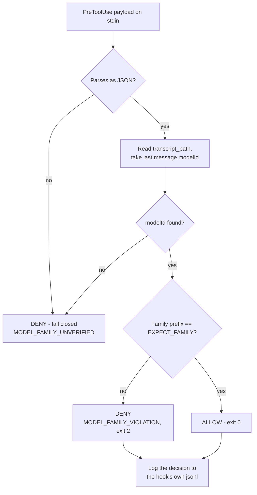

# Probe 2 — Fallback safety

**Verdict: CONDITIONAL PASS.** The abort mechanism is buildable and was demonstrated. Getting there turned up a genuine silent-degradation defect in the platform.

| | |
|---|---|
| Question | Can the plugin resolve *effective* model IDs at runtime and abort before a family-violating fallback? |
| Invariants at stake | [#1 family separation](../method/invariants.md), [#7 explicit degradation](../method/invariants.md) |
| CLI under test | `droid` 0.186.0 |
| Host | macOS (darwin 24.6.0) |
| Scratch repo | `/tmp/probe-2/repo`, throwaway `git init`, one file |
| Record | `phase-0/evidence/probe-2/README.md` |
| Rig | `phase-0/evidence/probe-2/rig/hook-family-gate.py` |
| Reproduction | `phase-0/evidence/probe-2/run.sh` — 9 `droid exec` runs |
| Raw captures | `phase-0/evidence/probe-2/raw/` |

The short answer is yes, with a hook, and the answer arrives somewhere unexpected. Two things qualify the pass: `--model auto` makes the family unknowable before the session exists, and an unsupported `--reasoning-effort` silently resolves to `off`.

## Where the resolved model is, and is not

| Surface | Carries the resolved model? |
|---|---|
| `droid exec -o json` result envelope | **No.** Keys are `type`, `subtype`, `is_error`, `duration_ms`, `num_turns`, `session_id`, `result`, `usage`. `usage` carries `input_tokens`, `output_tokens`, `cache_read_input_tokens`, `cache_creation_input_tokens`, `factory_credits`, `thinking_tokens` — and no model field. Checked on all 9 runs. |
| Session transcript, `message.modelId` | **Yes**, plus `message.reasoningEffort`. Per-message, so a mid-run change would be visible. |
| Session transcript, **startup context** | **Yes** — the environment block injected before the first turn carries a `Model:` line, for example `Model: GPT-5.4 Mini`. |

The third row is the load-bearing one. It means the effective model is knowable **before any tool call executes**, not merely after the run finishes, which is what makes a pre-action gate possible at all. It also means the agent is told its own model, which is worth remembering when reasoning about what a validator can infer about its counterpart.

The absence from the result envelope is the real gap. A caller that only reads `-o json` cannot tell which model ran. Attribution requires reaching into `~/.factory/sessions/`, which is undocumented for this purpose and which [Probe 3](./probe-3-context-isolation.md) showed is also a confidentiality problem. Invariant #7 wants degradation to be explicit *to the caller*; today it is merely discoverable.

## Explicit pinning is honest

| Test | Requested | Resolved | Exit | Verdict |
|---|---|---|---|---|
| T1 | `--model definitely-not-a-real-model-9x` | — | **1** | fails closed |
| T4 | `--model gpt-5.4-mini` | `gpt-5.4-mini` / `high` | 0 | exact |
| T3b | `--model claude-haiku-4-5-20251001 -r high` | `claude-haiku-4-5-20251001` / `high` | 0 | exact |
| **T3** | `--model claude-haiku-4-5-20251001 -r xhigh` | `claude-haiku-4-5-20251001` / **`off`** | **0** | ***silent degradation*** |
| T2 ×2 | `--model auto` | `gpt-5.6-luna` / `medium` (both runs) | 0 | resolved, not predictable |

T1 exits 1 and prints the full valid list with no substitution:

```
Invalid model: definitely-not-a-real-model-9x

Available built-in models:
  auto, claude-fable-5, claude-opus-5, claude-opus-5-fast, ... gpt-5.4-mini, ... grok-4.5

No custom models configured. Add them to ~/.factory/settings.json
```

So pinning itself is trustworthy: bad IDs stop the run, good IDs resolve exactly. The danger is in the two places where resolution is delegated.

### The `-r xhigh` defect

Haiku 4.5 advertises `[off, low, medium, high]`. `xhigh` is not in that list. Asking for it does not error, and it does not clamp to the nearest supported value (`high`) — it resolves to **`off`**, the weakest setting available, at exit 0 with nothing printed.

The request was for maximum reasoning. The delivery was none. A validator pinned at `-r xhigh` against a model that does not support it would run with reasoning disabled, indefinitely, with no signal. T3b is the control: one flag value different, resolves exactly as asked. The flag works; the *invalid* case is what degrades silently. This is the failure invariant #7 exists to prevent, and it is a case of [silent green](../findings/silent-green.md) in the configuration layer rather than the enforcement layer.

The advertised list per model is available for free from `droid exec --help`, captured in `phase-0/evidence/probe-2/raw/model-ids-0.186.0.txt`. Validating against it belongs in the plugin's config loader.

### `--model auto` is the family risk

`auto` resolved to `gpt-5.6-luna` on both runs, so it is not random on this host, but the caller cannot know the family before the session exists. A config that pins the executor to `claude-opus-5` and leaves the validator on `auto` would satisfy invariant #1 today by luck. A router change, a capacity event, or a different prompt could put both roles in the same family with no signal. **`auto` is unusable for role-pinned work.** Pass explicit IDs.

## The family gate — T5, T6, T7

`phase-0/evidence/probe-2/rig/hook-family-gate.py` is a `PreToolUse` hook that reads `transcript_path` from its stdin payload, extracts `message.modelId`, compares the family prefix against `EXPECT_FAMILY`, and exits 2 on mismatch. It fails closed: if the model cannot be determined, it denies. Registered via the `hooks` key in `.factory/settings.json`, which [Probe 4](./probe-4-hook-blocking.md) established as the only channel the CLI actually reads.



| Test | Gate expects | Run resolved to | Tool calls | Outcome |
|---|---|---|---|---|
| **T5** | `claude` | `gpt-5.4-mini` | `Execute`, `LS` | **both denied**, `is_error: true` on each |
| **T6** | `claude` | `claude-opus-5` | `Execute` | **allowed**, normal `tool_result` |
| T7 | `claude` | `gpt-5.6-luna` (via `auto`) | `Execute` ×2 | **both denied** |

One variable between T5 and T6 — the resolved model — and the gate's decision follows it. The denial reaches the agent as a tool result:

```
Error: MODEL_FAMILY_VIOLATION: run resolved to 'gpt-5.4-mini' (effort 'high'),
expected family 'claude'. Aborting before any tool acts.
```

T7 is the operationally useful one: it catches the `auto` router landing a run in the wrong family, before the first tool acts. Its hook log survives in `phase-0/evidence/probe-2/raw/hooklog-family-T7.jsonl`:

```json
{"expected_family": "claude", "resolved_effort": "medium", "resolved_model": "gpt-5.6-luna", "tool_name": "Execute", "transcript_readable": true, "verdict": "deny"}
{"expected_family": "claude", "resolved_effort": "medium", "resolved_model": "gpt-5.6-luna", "tool_name": "Execute", "transcript_readable": true, "verdict": "deny"}
```

So the capability the probe asked for exists. Not as a pre-flight caller-side check, but as a per-tool-call gate that fires before any tool has an effect. For a plugin that is close enough to the requirement: no file is written and no command runs under a wrong-family model.

## The trap

**T5 exited 0 with a confident, correct-looking final answer while every single tool call was denied.**

```
num_turns=3   is_error=False   exit=0
result: `a.txt`
```

The gate fired four times. The run reported success. The answer was even right, and the model did not fabricate it: the startup context block includes `% ls` output, so it answered from context it was handed at session start rather than from the tool calls it was refused.

A hook can block every action a run takes without changing the run's exit code or making the final summary look wrong, because startup context is enough to produce a plausible answer to a shallow question. An orchestrator that gates on `exit_code == 0` and reads `result` would conclude T5 succeeded. It must instead read the hook's own log, or check `is_error` on individual tool results in the transcript.

Note also that `MODEL_FAMILY_VIOLATION` never reached the final `result` text, unlike Probe 4 where the agent quoted `SPEC_OR_TEST_BLOCKED` verbatim. Whether a block surfaces in the summary is up to the model. Do not rely on the agent to relay a block.

This is the fourth appearance of the [silent green](../findings/silent-green.md) shape in Phase 0, after the mission no-op ([Probe 1](./probe-1-model-pinning.md)), the storage leak (the Probe 3 addendum), and the misregistered hook (Probe 4). It is the platform's default failure mode, and anything built here has to assume it.

## Design impact

1. **Pin explicit model IDs. Never `auto` for a role.** Invalid IDs fail closed and valid ones resolve exactly, so pinning is trustworthy; delegation to the router is not.
2. **Validate `--reasoning-effort` against the model's advertised list before invoking.** Do not pass an unsupported value and assume clamping — T3 resolves it to `off`. This check belongs in the config loader.
3. **Ship the family gate as defense in depth**, reading `modelId` from `transcript_path` and failing closed. It is roughly 30 lines and it is the same primitive as Probe 4's locked-test guard and Probe 3's isolation hook — see [the reference guard](../findings/reference-guard.md), one hook, three policies.
4. **Never trust `exit 0` or the `result` string.** Assert on the hook log and on per-tool `is_error`. T5 is the demonstration.
5. **Record the resolved model in run evidence** by reading the session store, since the envelope will not tell you. This should be a helper the plugin owns rather than something repeated per probe.

## Limits

| | |
|---|---|
| Not tested | A **real** fallback. No quota exhaustion, capacity error, or server-side substitution was induced. T2/T5 use `auto` and an explicit cross-family ID as *proxies*. "The gate catches a genuine mid-run downgrade" is inferred from "the gate reads `modelId` per message," not observed. Inducing a real fallback needs a quota-exhausted account or vendor cooperation. |
| Not tested | Whether `modelId` can change **mid-session**. The hook re-reads on every tool call and takes the last value, so it would catch it, but no run exhibited a change. |
| Not tested | Custom / BYOK models (`custom:` prefix). No `custom_models` entries existed on this machine, and a BYOK endpoint substituting a model server-side is the most plausible real-world silent fallback. |
| Not tested | `SessionStart` / `Stop` hook events, which might allow a true pre-flight abort instead of a per-tool-call one. Only `PreToolUse` was exercised, here and in Probe 4. |
| Sample | T2 ran twice and resolved identically. Two samples do not establish that `auto` is deterministic, and no recommendation depends on it. |
| Reasoning-effort scope | T3 tested one model with one unsupported value. Whether every unsupported value on every model degrades to `off` is unverified — but one reproducible instance is enough to stop trusting the flag. |

## Related

- [Probe 4](./probe-4-hook-blocking.md) — supplied the registration channel and the fail-closed discipline this gate is built on
- [Probe 8](./probe-8-self-declared-risk.md) — the companion finding: there a self-reported label is trusted, here a downgraded reasoning effort is invisible. Both are cases of stated configuration differing from what actually ran.
- [Probe 1](./probe-1-model-pinning.md) — stays BLOCKED; per-role pinning is achieved instead by one `droid exec` per role with an explicit `--model`, gated by this hook
- [Probe 3](./probe-3-context-isolation.md) — the session store this gate reads is the same store that leaks
- [Silent green](../findings/silent-green.md) · [The reference guard](../findings/reference-guard.md)
- [Invariants](../method/invariants.md) · [Glossary](../overview/glossary.md) · [Probes index](./index.md)
