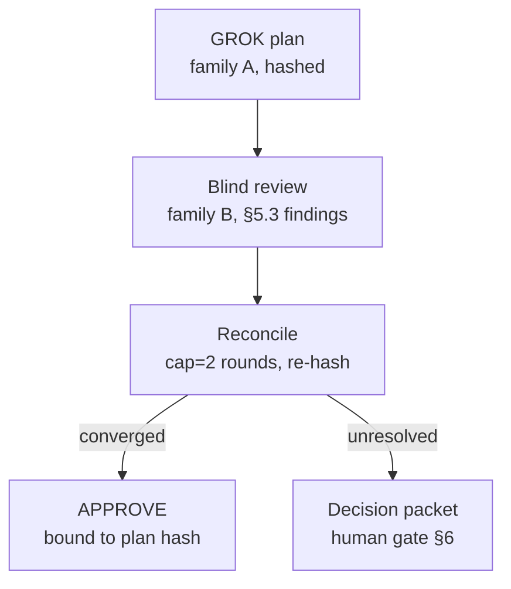

# Phase 2 — Brief (draft, pre-review)

**Status:** DRAFT on `factory/phase-2-slice`. Not yet cross-family reviewed.
No planner run, no reviewer run, and no slice code lands until this brief
returns ACCEPT or ACCEPT-WITH-NITS from a Grok + Gemini panel (PRD §17.2).

**Author family:** Factory-family (Droid). The panel therefore excludes
Codex-class per PRD §17.2 (stated for the recipe even though the same-family
constraint does not bind a Factory-family author); standing non-author-family
options are `grok-4.5` (xAI) and `gemini-3.1-pro-preview` (google).

This brief is the Phase 2 deliverable required *before* any slice work. It
resolves which "Phase 2" we are building, then lays out scope, the slice
surface, exit criteria, expected failure/escalation classes, panel
composition, the finding + telemetry-row formats, the reviewer-context
decision, dependencies on Phase 1 artifacts, and the open decisions the panel
must adjudicate.

---

## 0. Which "Phase 2" — reconciling two definitions

Two live definitions of "Phase 2" exist and they do not match. This must be
resolved in writing before proposing a slice, or a reviewer reading against
the PRD will flag the whole document as a spec deviation.

- **PRD §11 Phase 2 — "Adversarial planning slice."** Deliverable: blind plan
  review, structured findings, bounded reconciliation, oversight policy, and
  human decision packets. Exit: one real plan reaches a hash-bound approval or
  a correctly escalated non-convergence state.
- **The Phase-2 kickoff handoff** reframes Phase 2 as "the next vertical slice"
  and offers three candidate scopes (a/b/c, §1 below), none of which is the
  planning slice.

**Decision: build the PRD §11 adversarial planning slice.** Reasons, in order
of weight:

1. **The PRD is the source of truth; the handoff is advisory.** The handoff
   itself states the scope is "genuinely open" and that the previous instance
   never committed. When an advisory steer conflicts with the authoritative
   document, the document wins. A framework whose whole ethos is "no silent
   spec deviation" cannot open a phase by quietly re-scoping it.
2. **Reviewer-calibration is already assigned to Phase 5.** PRD §11's Phase 5
   scope list contains, near-verbatim, the kickoff's Option (b): *"cross-family
   calibration artifacts (where the two reviewers diverge, why, and what
   `first_seen_in_panel_position` says)."* Doing calibration as Phase 2 would
   relocate Phase-5 work and collide with the document twice (Phase 2 = planning
   AND calibration = Phase 5).
3. **Only the planning slice is on the critical path.** Phase 3 is "connect
   planning, test design, Mission execution, validator blocking…". The planning
   loop is the next product brick toward Phase 3. Options (a)/(b)/(c) are
   side-quests (hook hardening or measurement) that do not advance the product.
4. **The valuable insight from Option (b) is not lost.** The planning slice's
   blind review naturally produces `first_seen_in_panel_position` data; this
   brief records that as an *input* to Phase 5 calibration (§7), without making
   calibration the Phase 2 deliverable.

---

## 1. The three kickoff options, and why each is deferred

Described so the panel can challenge the scope decision, not merely rubber-stamp
it.

### Option (a) — second Werkzeug slice, different failure class
A second vertical slice in the QuantumBank scenario pressing a different
lockable surface (fixture-level, integration-test, or fuzz-harness locks).
**Deferred:** it re-tests the *lock surface* Phase 1 already drove to
ACCEPT-WITH-NITS across three rounds; marginal yield on the core claim is low,
and it is mostly hook-layer hardening (Phase 5 territory).

### Option (b) — reviewer-calibration stress slice
Seed known defects, measure whether both families catch each at first round.
**Deferred:** this is explicitly Phase 5 scope (§0 reason 2). Its output is a
measurement matrix, not product behavior. The `first_seen_in_panel_position`
signal it targets is captured as a by-product of the planning slice instead
(§7).

### Option (c) — cross-directory hook reachability
Stress whether `locked-test-guard.py` holds when the executor routes around
the directory (symlinks, out-of-tree temp writes, cross-directory moves).
**Deferred:** the clearest Phase 5 hardening item of the three; promoting it
here would collapse the Phase 2 / Phase 5 boundary the PRD draws deliberately.

---

## 2. Scope — the adversarial planning slice

Build and demonstrate the planning half of the loop end to end, on one real
plan. This is the first time the framework exercises **GROK → blind review →
reconcile → approve-or-escalate** as connected stages with hashed artifacts.



### 2.1 GROK — the plan (PRD §5.2)
A planner (frontier, family A) drafts a plan document for one bounded
QuantumBank change containing: current state / root cause; affected public
behaviors and likely files; assumptions and open questions; a risk table
(severity, probability, impact, mitigation, review trigger); acceptance
criteria as observable outcomes; a test strategy across the relevant test
boundaries; and a rollback strategy. The plan is written to `plan-v1.md` and
its content is SHA-256 hashed — every subsequent review and the final approval
bind to an exact plan hash.

### 2.2 Single-blind review (PRD §5.3)
A reviewer from a **different family** sees the plan document and read-only
repository evidence, but **not** the planner's private reasoning and **not** a
competing review. It emits findings in the §5.3 schema (§6 below). This is
single-blind by design (not double-blind): the reviewer reads the plan, so it
inherits the plan's framing — calling it "blind" would overstate independence.

### 2.3 Reconciliation (PRD §5.3)
Findings are dispositioned; the plan may be revised and re-reviewed, capped at
`max_review_rounds` (**default 2**, per §5.3 — a tuning knob with a human
escape hatch, left at the PRD default for this slice). Convergence requires:
no open blocker/high finding; every factual/semantic/scope/test-gap finding
carries a recorded disposition; acceptance criteria, rollback, and test
strategy are internally consistent; and the reviewer returns `APPROVE` against
that exact plan hash.

### 2.4 Oversight + decision packets (PRD §6)
The slice exercises the `oversight` gate table (high/medium/low) for *when* a
human is pulled in, and produces a **decision packet** on escalation: what
changed, why the run paused, the competing positions, the evidence, the cost
of delay, and the available actions. Unknown/ambiguous finding classifications
fail *toward* review, never auto-dismissal.

### 2.5 Objective (LOCKED — D1 resolved)
The plan targets a **read-only user profile page** in QuantumBank: a new
`GET /profile` route that renders the currently-authenticated user's
`username`, `email`, `full_name`, and address. Scope constraints (deliberately
narrow, per PRD §10 "bounded to one service"):

- **Session-scoped, no ID parameter** — it renders `session["user_id"]`'s own
  profile only. This sidesteps the account-detail IDOR surface rather than
  re-treading it.
- **Read-only** — no edit form, no write path, no nav-link change in v1.

Grounded schema facts (from `models.py:128`): the `users` table has
`id, username, email (unique, not null), full_name, created_at`; there is **no
`address` column** and **no password field** (login is username-only,
`api/login.py:16`). There is no `get_user_by_id` helper, no `/profile` route,
and no `profile.html` — so this is clean greenfield.

Despite being "simple", the change carries real boundaries that make the plan
non-trivial to review (the point of a planning slice):

1. **Auth boundary** — `/profile` must require `session["user_id"]`; an
   unauthenticated request redirects to login (mirroring `/dashboard`,
   `/account`). This is the mandatory error path per PRD §10.
2. **Output contract** — render only the intended fields, never internal
   identifiers or unintended columns (over-exposure boundary).
3. **The `address` design fork** — `address` does not exist in the schema. The
   plan must propose one of:
   - **(a) Add a nullable `address` column** — but note this touches **both**
     backends: `_create_sqlite_schema` (`models.py:126`) **and**
     `_apply_postgres_schema` (`models.py:114`), plus `_convert_query` at
     `models.py:53`, plus the seed at `models.py:428`, plus NULL rendering for
     pre-existing rows in both. Not trivial.
   - **(b) Static / config-constant address now, with a TODO to migrate to the
     DB in a later sprint.** Least scope; the product owner has explicitly
     approved this fallback if the column work is more than low-effort.
   - **(c) Introduce a DAO / repository layer** and route the address change
     through it. Grounded fact: **no DAO exists today** — data access is
     module-level functions in `models.py` — so this is a real reorg, larger
     than a 2-4 chunk slice. Flag it as a *future-sprint* option, not this
     slice's default.

   **Product-owner steer:** prefer the **least-scope** option that still
   displays Picard's address. Static/config (b) is acceptable with a migration
   TODO; add the column (a) only if genuinely low-effort given the two-schema
   duplication; the DAO reorg (c) is a later sprint, not this slice. The
   planner still owns the recommendation and the panel critiques it — this is
   exactly the kind of scope/design decision a plan review exists to stress.

Chunk sketch (2–4): model getter (`get_user_by_id`/`get_user_profile`) →
route + template (`api/profile.py`, `templates/profile.html`) → optional
schema/seed for `address` → tests (auth-required, field-presence,
no-over-exposure).

**Demo seed identity (product input).** The single demo user's profile should
render as **Jean-Luc Picard**: `full_name = "Jean-Luc Picard"`,
`email = "jpicard@starfleet.fed"`, `address = "Captain's Quarters, Deck 9,
USS Enterprise NCC-1701-D"`. The seed insert lives at `models.py:428`
(`INSERT INTO users (username, email, full_name) …`). Because a themed
**address must be displayed** and no `address` column exists, this is a real
product requirement that feeds the address fork above — but it does **not**
pre-decide the *how*: the planner still chooses the storage mechanism (nullable
column vs. config constant vs. profile table) and the panel critiques it. The
requirement is "an address is shown", not "add a column".

---

## 3. Reviewer-context decision — fresh, always (this phase)

**Phase 2 stance: fresh minimal-context reviewers, always.** The reviewer is
given *artifacts* (the approved/hashed plan, the risk table, prior findings and
their dispositions, read-only repo state), never a prior reviewer's session or
transcript. Grounding:

- Invariant #2 (fresh review context) and §5.7 (validator runs fresh, no
  transcript/self-assessment).
- §2 failure table: "self-review theater" and "correlated blind spots" both
  trace to reusing priors and framing.
- §13: hidden tests stay out of *every* agent's context, "including the
  validator's."

The knowledge worth carrying (what the plan promised, what risks were accepted)
is transmitted as **structured artifacts**, not by reusing a live session —
that gives the continuity without the anchoring/commitment bias.

### 3.1 Logged open decision, deferred to Phase 5 (D2)
Fresh-vs-reuse also has a **cost** dimension, and it only flips under two
conditions:

- **Cold cache:** a long human-gate gap expires the prompt-cache TTL, so a
  fresh reviewer re-pays full input price to re-ingest its slice (vs. cheap
  `cache_read` when rounds run back-to-back — Phase 1 spent ~3.4M tokens
  "most of which is `cache_read`").
- **Huge relevant slice:** a monorepo where even the touched surface is large,
  so targeted re-reads are themselves expensive.

Plan of record: **do not guess — measure.** Phase 3 must log `cache_read_tokens`
and `input_tokens` per run (the schema already carries both) so any flip point
is empirical. The **session-reuse / artifact-injection-depth knob** is parked
for **Phase 5** exploration once there is enough telemetry to decide; it is not
built now. Note also the §7 gotcha: reuse is sometimes *not even permissible* —
the plan reviewer (≠ planner family) and the validator (≠ executor family) gate
on different family constraints, so the same agent cannot always fill both
seats.

---

## 4. Exit criteria

Phase 2 is done when **all** hold (framed so a clean escalation is a valid
outcome, not a failure — PRD §13):

1. **A hashed plan exists.** `phase-2/plan-v1.md` (and any `plan-vN.md`
   revisions) with a recorded SHA-256 per version.
2. **A real blind-review pass is captured.** A different-family reviewer
   `droid exec` with explicit `--model` and reviewer `--enabled-tools`
   (incl. `Execute`), envelope saved to `phase-2/build-evidence/` in the same
   shape as `phase-1/build-evidence/*.json`, findings recorded in the §5.3
   schema.
3. **Reconciliation ran and terminated correctly** within `max_review_rounds`,
   ending in exactly one of:
   - **APPROVE bound to a specific plan hash** (converged), or
   - **a correctly escalated non-convergence decision packet** (§6 shape).
   Both are legitimate passes.
4. **Oversight behaved per policy** — the escalation (if any) matched the
   configured `oversight` level's gate.
5. **A fresh `droid-wiki/overview/` entry** describes the Phase 2
   build-review-find loop, same shape as `meta-narrative.md`, recording the
   `first_seen_in_panel_position` data as a Phase-5 calibration input.
6. **Cross-family review of the slice returns ACCEPT / ACCEPT-WITH-NITS**
   (this brief and the produced artifacts); REJECT forces another round.

Per PRD §13, "models disagree at least once" is **not** a success gate — a
plan that converges cleanly with few findings is valid data, not a failure to
manufacture conflict.

---

## 5. Expected failure / escalation classes

Pre-registered so the panel can check the brief anticipated them:

- **F-plan-1 — Non-convergence within 2 rounds.** The reviewer holds a
  blocker/high finding the planner will not resolve. Expected handling: escalate
  a decision packet (this is a *correct* exit, not a bug).
- **F-plan-2 — Plan-hash drift.** A revision changes the plan but a stale hash
  is cited in the approval. The hash binding must be recomputed each round; the
  approval must name the exact hash it blesses.
- **F-plan-3 — Disposition skipped.** A factual/semantic/scope/test-gap finding
  is left without a recorded disposition. PRD §9 warns the disposition ledger is
  human-burden and easily skipped; convergence must *require* every such finding
  carry a disposition.
- **F-plan-4 — Reviewer tooling blocker.** Phase 1 Round-1: Gemini refused to
  judge because `Execute` was absent from `--enabled-tools`. The reviewer set
  here **must** include `Execute` (PRD §17.5, read-only shell-out for
  `git show`). Called out again in the review prompt.
- **F-plan-5 — Over-specified plan anchors the executor.** A plan that
  prescribes a full implementation would anchor later chunks and make tests
  mirror the code (PRD §5.5). The plan must state outcomes and interfaces, not
  a line-by-line implementation.
- **F-plan-6 — Oversight misfire.** The run pauses when policy said proceed, or
  proceeds when policy said pause. The §6 gate table is the oracle.

---

## 6. Finding schema (PRD §5.3)

Blind-review findings use the PRD §5.3 schema verbatim:

```json
{
  "id": "F-001",
  "severity": "blocker|high|medium|low",
  "category": "semantic|factual|test-gap|scope|operability|style",
  "plan_section": "string",
  "claim": "string",
  "evidence": ["path:line or command/result"],
  "recommended_change": "string",
  "risk_if_ignored": "string",
  "status": "open|accepted|rejected|superseded",
  "disposition_rationale": "string"
}
```

Convergence rule (§2.3) reads directly off `severity` and `status`: no
`open` blocker/high, and every factual/semantic/scope/test-gap finding has a
non-`open` status with a `disposition_rationale`.

---

## 7. Panel composition

Per PRD §17.2 / §17.5 and the commit-body recipe:

- **Author:** Factory-family (Droid, orchestrator). The orchestrator conducts;
  it does not occupy a role seat.
- **Planner seat (THIS run): PINNED to `claude-opus-5` (anthropic).** A pinned
  planner is fully compliant with *current* `main` §17.1 (no dependency on the
  unmerged convention amendment) and is family-distinct from both pinned
  reviewers (xAI, Google), so separation is guaranteed with no collision-guard
  needed tonight. This is the lowest-risk choice for an unattended, zero-buffer
  budget run.
- **Planner seat (future, once the amendment lands): auto-router with recorded
  attribution.** `--auto` is permitted at seats where **no family invariant
  binds**, provided the resolved model is attributed post-hoc (the
  attribution-vs-enforcement refinement on
  `factory/convention-model-discipline-v2`). A **collision guard** then runs
  after resolution: if the resolved planner family collides with a standing
  reviewer, that reviewer is swapped to a non-colliding fallback. **The guard
  fails closed:** if the resolved planner family is `unknown` or otherwise
  cannot be *proved* distinct from every reviewer (PRD §4: `unknown` cannot
  satisfy a hard separation constraint), the run **stops** rather than
  proceeding on an unprovable separation — it does not merely swap on the two
  known colliding families. (Grok round-1 major.)
- **Standing review panel:** `grok-4.5` (xAI) + `gemini-3.1-pro-preview`
  (google), **pinned** so family separation vs. the planner is guaranteed
  *before* the run — the same pair Phase 1 used, keeping results comparable to
  the Phase-1 divergence baseline. Reviewer/validator seats stay pinned because
  a family invariant *does* bind there (§17.2).
- **Fallback:** `claude-opus-4-8` (anthropic) if a standing model is
  unavailable or the collision guard fires; recorded in
  `phase-2/KNOWN-ISSUES.md` when used.
- **Reviewer tool surface:** `--enabled-tools Read,Glob,Grep,LS,Execute`, run
  at `--auto medium` (read-only autonomy gates the `Execute` tool entirely, so
  `Execute` needs ≥ medium; the reviewer still cannot edit files because no
  editor tool is enabled). `Execute` is mandatory (F-plan-4). This was learned
  live: at read-only autonomy the reviewer exits `num_turns:0` with
  "insufficient permission to proceed".
- **Planner tool surface:** `Read,Glob,Grep,LS,Execute` (read-only on the
  **pilot** repo) **plus `Create,Edit`** scoped to writing the plan artifact
  (`phase-2/plan-v1.md`) in *this* repo. The planner is a GROK/planning seat,
  **not** an executor — it must **not** modify pilot code, so it does not get
  the full executor editor set (`ApplyPatch`/`MultiEdit` and pilot-write are
  withheld). (Grok round-1 major.) The plan states outcomes and interfaces, not
  an implementation (F-plan-5).
- Every invocation records its resolved model (PRD §17.1 attribution); the
  pinned planner and reviewers pass `--model` explicitly via
  `tools/run-with-model.sh`.

---

## 8. Planned telemetry-row format

Rows stay git-ignored (PRD §17.3/§17.4); only the shape is planned. All rows
carry `schema_version: "v1"` + `ts` front-matter (matches `telemetry/SCHEMA.md`
unchanged — no schema bump).

### runs.jsonl (one per `droid exec`)
```
{ "schema_version":"v1", "ts":"<iso>",
  "run_id":"r-<role>-2026-08-<dd>-<n>", "phase":"phase-2",
  "branch":"factory/phase-2-slice", "role":"planner|reviewer",
  "model_id":"<id>", "provider":"<p>", "family":"<fam>",
  "providerLock":"<p>", "apiProviderLock":"<p>",
  "num_turns":<int>, "input_tokens":<int>, "output_tokens":<int>,
  "cache_read_tokens":<int>, "duration_ms":<int>, "is_error":false,
  "decision":"APPROVE|REJECT|null",
  "reviewer_panel":["grok-4.5","gemini-3.1-pro-preview"],
  "review_target_branch":"factory/phase-2-slice",
  "envelope_path":"phase-2/build-evidence/<role>-envelope.json" }
```
`cache_read_tokens` is recorded explicitly to feed the D2 fresh-vs-reuse cost
question.

### findings.jsonl (one per finding a reviewer surfaces)
Carries `first_seen_in_panel_position` as the calibration key routed to
Phase 5:
```
{ "schema_version":"v1", "ts":"<iso>", "finding_id":"F-p2-<id>",
  "phase":"phase-2", "surface":"plan-v1.md#<section>",
  "category":"correctness|security|...", "severity":"blocking|major|minor|nit",
  "source_role":"reviewer", "source_run_id":"<runs row>",
  "source_model_id":"<id>", "source_family":"<fam>",
  "panel_size_at_surfacing":2, "first_seen_in_panel_position":<0|1|2>,
  "verdict_blocking_total":<int> }
```

### Commit-body trailers
Every commit carries `Telemetry-row: telemetry/runs.jsonl:<id>`. Reviewer
passes add `Findings: <count>: <ids>` (0 is legitimate closure). Disposition
trailers appear only on commits closing prior findings. Per
`commit-body-recipe.md`, every **role-bearing** commit also carries the
mandatory `Model: <resolved-id>` and `Role: planner|reviewer` lines, and
reviewer-pass commits additionally carry `Reviewer-panel:
grok-4.5,gemini-3.1-pro-preview` (recorded even after any collision-guard
swap). (Grok round-1 minor.)

### Severity / category crosswalk (§5.3 ⇄ telemetry/SCHEMA.md)
The §5.3 finding vocabulary and the `telemetry/SCHEMA.md` enums are **mapped,
not forked** — telemetry rows always persist the SCHEMA.md enum, with the
planner-review label preserved in `raw_text_first_240`. (Grok round-1 major.)

| §5.3 review label | → `telemetry/SCHEMA.md` `severity` |
|---|---|
| blocker | `blocking` |
| high | `major` |
| medium | `minor` |
| low | `nit` |

Category: §5.3 semantic/scope/spec labels map onto SCHEMA.md
`correctness|security|performance|readability|spec-deviation`; anything without
a clean target uses `other` with the original label retained in
`raw_text_first_240`. No `schema_version` bump.

---

## 9. Artifact layout (PRD §9)

```
phase-2/
  README.md                 # this brief
  plan-v1.md ... plan-vN.md  # hashed plan history
  findings.md / findings.jsonl-shape   # §5.3 findings + dispositions (rows gitignored)
  decision-packets/          # §6 escalation packets, if any
  build-evidence/            # droid exec envelopes (planner + reviewers)
  reviews/round-1-prompt.md  # cross-family review prompt for THIS brief
  KNOWN-ISSUES.md            # bugs/fallbacks found during the slice
```

---

## 10. Dependencies on Phase 1 artifacts

| Phase 1 artifact | Use in Phase 2 |
|---|---|
| `phase-1/build-evidence/*.json` | Envelope shape Phase 2 envelopes must match. |
| `telemetry/SCHEMA.md` | Row format in §8 is that schema, unchanged. |
| `tools/run-with-model.sh` + `tools/conventions/commit-body-recipe.md` | Invocation discipline + commit-body format, unchanged. |
| `droid-wiki/overview/meta-narrative.md` | Template for the Phase 2 wiki entry; source of the divergence baseline. |
| PRD §5.2-5.3 / §6 / §9 / §13 / §17 | The workflow, oversight, artifact, evaluation, and model-discipline contracts this slice implements. |
| `phase-1/hooks/locked-test-guard.py` | Untouched in Phase 2 (planning has no locked-test write path yet). |

No Phase-5 inventory (`tools/exec-cadence.sh`, `exec-cadence.md`) is promoted
or routed through. `Execute` calls are direct, per the kickoff operating rules.

---

## 11. First actions once this brief is ACCEPTED (not before)

Gated on cross-family review:

1. Planner run (auto + record, §7) drafts `plan-v1.md` for the `/profile`
   objective (§2.5); hash it; run the collision guard.
2. Fire the blind reviewer (pinned, different family); capture envelope +
   §5.3 findings.
3. Reconcile (≤2 rounds); land APPROVE-bound-to-hash or an escalated decision
   packet.
4. Write the `droid-wiki/overview/` Phase 2 entry (with the
   `first_seen_in_panel_position` calibration input for Phase 5).
5. Submit the slice for cross-family review; iterate to ACCEPT / ACCEPT-WITH-NITS.

### 11.1 Overnight autonomy + resilience (this run)
This slice is authorized to run **unattended to the human plan-approval gate**.
Operating parameters, recorded for audit:
- **Oversight:** `low` for the automated stages; the §6 human **plan-approval**
  gate is preserved (never self-approved — that would void the invariant the
  framework exists to enforce).
- **Rate-limit resilience:** each role call is checkpointed to an on-disk
  observable outcome (hashed plan, captured envelope, committed finding). On a
  **retryable** failure (rate-limit / usage-exhausted), the run sleeps ~45 min
  and retries, bounded to ~6 attempts (~4.5 h, enough to cross one 5-hour
  window reset), then stops with a checkpointed report. **Non-retryable**
  failures (bad model id / auth) stop immediately. This is a **narrow,
  user-authorized deviation** from the "retry OFF for active phases" rule
  (`tools/conventions/exec-cadence.md`); it is scoped to rate-limit backoff on
  role calls and does **not** promote `exec-cadence.sh` or enable its cache.

---

## 12. Panel decisions (round-1 cross-family review — RESOLVED)

Both reviewers ran on brief v1 (envelopes in `build-evidence/`):
**Grok-4.5 = ACCEPT-WITH-NITS** (3 majors + nits), **Gemini-3.1-Pro = ACCEPT**
(0 findings). No blocker/high from either family → **the brief is ACCEPTED**;
Grok's majors are folded into this v2 as improvements.

- **D1 — RESOLVED (both ACCEPT).** Objective locked to the read-only `/profile`
  page (§2.5); the `address` fork stays a planner decision.
- **D2 — RESOLVED (both ACCEPT).** Fresh-reviewer-always for Phase 2; reuse /
  artifact-injection-depth knob deferred to Phase 5, contingent on logged
  `cache_read_tokens`.
- **D3 — RESOLVED (both ACCEPT).** §0 scope stands: Move 1 planning slice;
  calibration stays Phase 5.
- **D4 — RESOLVED (both ACCEPT).** `max_review_rounds` = 2 (PRD default).
- **D5 — RESOLVED (both ACCEPT, with tightening).** Model-policy refinement is
  sound. For **this** run the planner is **pinned to `claude-opus-5`** (§7), so
  it is compliant with current `main` §17.1 regardless of whether the
  convention amendment merges; the auto-router + collision-guard path is the
  documented future default once the amendment lands.

### 12.1 Round-1 finding dispositions
| Finding (Grok) | Sev | Disposition |
|---|---|---|
| Collision guard incomplete for `unknown`/unprovable family | major | **FIXED** §7 — guard fails closed / stops the run. |
| Planner given full executor editor set + pilot write | major | **FIXED** §7 — planner read-only on pilot + `Create,Edit` scoped to `plan-v1.md` only. |
| §17.1 amendment not hard-gated on `main` | major | **FIXED** §7 — planner pinned this run, so no dependency on the amendment. |
| Severity/category schema fork vs `SCHEMA.md` | major/minor | **FIXED** §8 — crosswalk table added, no schema bump. |
| Missing `Model:`/`Role:`/`Reviewer-panel:` commit lines | minor | **FIXED** §8 — recorded on all role-bearing commits. |
| F-plan-4 residual operator-error risk; telemetry gitignore; overnight backoff; exit criteria | nits | **ACK** — prompt template is source of truth; §11.1 backoff kept as a disclosed narrow deviation. |

— droid, Phase-2 driver, brief **v2 (round-1 reconciled)** on
`factory/phase-2-slice`

---

## 13. Plan-v1 review outcome (Phase 2 exit reached)

`plan-v1.md` (`Plan-hash: sha256:72eccff5…`) was reviewed single-blind by the
cross-family panel:

- **gemini-3.1-pro-preview → APPROVE** (0 findings).
- **grok-4.5 → APPROVE** (0 blocking/high; 3 medium + 3 low, all accepted as
  amendments A1–A5 in `phase-2/findings.md`).

**Both families APPROVE with zero blocking/high**, so the PRD §11 Phase 2 exit
criterion — *"one real plan reaches a hash-bound approval"* — is **satisfied**.
plan-v1 is frozen at its hash; the non-blocking amendments travel with it into
Phase 3 as binding acceptance criteria (`findings.md`).

**Current state: awaiting the human plan-approval gate (PRD §6).** The panel's
technical approval is complete; final approval to proceed to Phase 3 (execution)
is the human's, by design — the framework never self-approves the plan gate.

Note (KNOWN-ISSUES): blind plan review required `--auto high` (not `medium`) —
the reviewer's first verification step reached for a binary (`sqlite3` on the
pilot DB), which `medium` gates. Reviewers remain unable to edit files (no editor
tool enabled); `high` only widens `Execute`.
